**Mục đích của tài liệu**
Tài liệu này được xây theo hướng từ nền tảng đến nghiên cứu. Mục tiêu cuối cùng là có thể tự thiết kế, tạo, kiểm tra và đánh giá dữ liệu tổng hợp cho các bài toán thị giác máy tính liên quan đến con người.
**Quy tắc trình bày**
- Một khái niệm mới phải được giải thích trước khi được dùng như kiến thức đã biết.
- Ưu tiên câu văn thông thường; chỉ dùng tên chuyên môn khi tên đó giúp đọc tài liệu, đọc mã hoặc đọc bài báo sau này.
- Mỗi phần phải trả lời ba câu hỏi: *nó là gì*, *vì sao cần nó*, và *nó đi vào hệ thống dữ liệu của chúng ta ở đâu*.
- Mỗi phần kết thúc bằng bài kiểm tra đầu ra. Nếu chưa vượt qua bài kiểm tra đó thì chưa cần sang phần kế tiếp.
# Phần giới thiệu — Nền tảng hình học để mô tả một thế giới 3 chiều
## 1. Phần này dùng để làm gì?
Unity có thể cho ta đặt một nhân vật, di chuyển nhân vật, xoay camera và đọc ra nhiều con số. Nếu chỉ cần dựng một cảnh để nhìn bằng mắt, ta có thể thao tác trực tiếp mà chưa hiểu hết các con số đó.
Nhưng khi dùng Unity để **sinh dữ liệu**, cách làm này không đủ. Ta phải biết chính xác một con số đang mô tả điều gì, được đo từ đâu, theo hướng nào và có thể đổi sang cách mô tả khác như thế nào.
Ví dụ, giả sử Unity báo vị trí đầu gối của nhân vật là `(0.4, 1.1, 2.7)`. Ba số này **không tự mang ý nghĩa đầy đủ**. Ta còn phải biết:
- điểm bắt đầu để đo nằm ở đâu;
- ba hướng dùng để đo là hướng nào;
- con số đang được tính so với toàn bộ cảnh hay so với một bộ phận khác;
- đơn vị đang được hiểu như thế nào;
- dữ liệu đó cần được chuyển sang cách biểu diễn nào trước khi đưa cho chương trình học máy.
Phần giới thiệu xây nền để trả lời được các câu hỏi trên.
### Kết quả cần đạt sau Phần giới thiệu
Sau khi hoàn thành phần này, bạn phải có thể:
1. Nhìn ba số `(x, y, z)` và giải thích chúng chỉ có ý nghĩa khi đi kèm một cách đo cụ thể.
2. Phân biệt **một vị trí** với **một hướng di chuyển** dù Unity có thể dùng cùng một kiểu dữ liệu để chứa cả hai.
3. Giải thích sự khác nhau giữa vị trí tính theo toàn bộ cảnh và vị trí tính theo một đối tượng cha.
4. Giải thích điều gì xảy ra khi một đối tượng cha di chuyển, xoay hoặc đổi kích thước.
5. Biết Unity quy ước chiều dương của ba trục như thế nào.
6. Hiểu vì sao dữ liệu xuất từ Unity phải ghi rõ cách đo nếu muốn dùng lại ở Python, PyTorch hoặc một công cụ khác.
---
# 2. Bắt đầu từ “không gian 3 chiều”
## 2.1. “Chiều” nghĩa là gì?
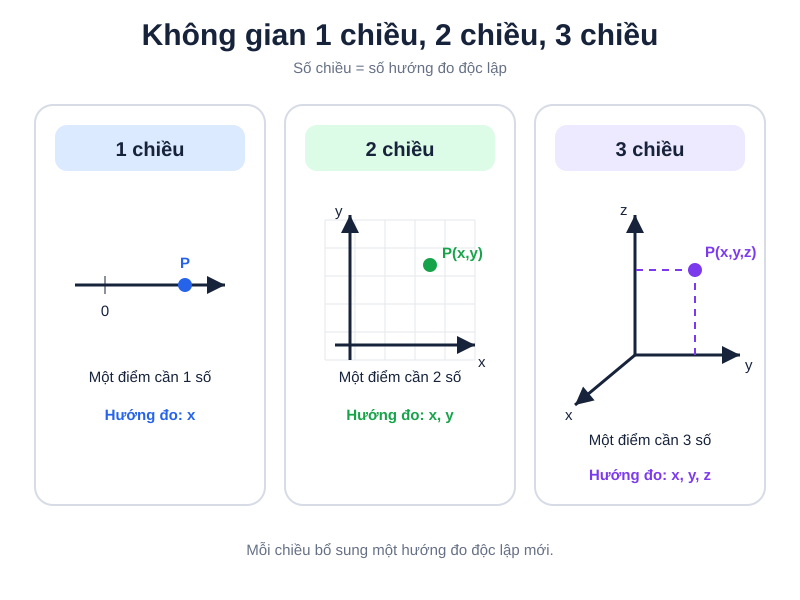
*Hình trực quan: một chiều, hai chiều và ba chiều tương ứng với số hướng đo độc lập tăng dần.*
Ta gọi một hướng đo độc lập là một **chiều**.
Một đường thẳng chỉ cần một số để mô tả vị trí. Ta có thể gọi đó là không gian một chiều.
Một mặt phẳng cần hai số độc lập để mô tả vị trí. Ta có thể gọi đó là không gian hai chiều.
Một thế giới có thêm khả năng đi lên hoặc đi xuống cần ba số độc lập. Ta gọi đó là **không gian ba chiều**, thường viết ngắn là **3D**.
Trong tài liệu này, từ **3D** từ đây về sau có nghĩa là một không gian mà vị trí cần ba giá trị độc lập để mô tả.
Ta thường đặt tên ba hướng đo là:
- `x`;
- `y`;
- `z`.
Tên `x`, `y`, `z` chỉ là quy ước. Điều quan trọng là mỗi tên phải gắn với một hướng xác định.
## 2.2. Một điểm
Một **điểm** là một vị trí cụ thể trong không gian.
Hãy tưởng tượng một chấm rất nhỏ đánh dấu tâm của khớp gối. Chấm đó là một điểm.
Điểm chưa phải là ba con số. Điểm là vị trí thực sự mà ta muốn mô tả. Ba con số chỉ là **cách ghi lại vị trí đó**.
Đây là phân biệt rất quan trọng:
> **Vị trí tồn tại trước; các con số là cách chúng ta mô tả vị trí.**
Một điểm có thể được mô tả bằng những bộ số khác nhau nếu ta thay đổi cách đo.
## 2.3. Gốc
Để nói một điểm cách đâu bao xa, ta cần chọn một điểm bắt đầu.
Điểm bắt đầu này được gọi là **gốc**.
Trong một cách đo ba chiều, gốc thường được ghi là:
`(0, 0, 0)`
Điều này không có nghĩa rằng gốc là “trung tâm thật sự của thế giới”. Nó chỉ có nghĩa rằng chúng ta **chọn** điểm đó làm nơi bắt đầu đo.
Ví dụ:
- ta có thể chọn giữa sân làm gốc;
- cũng có thể chọn vị trí đứng ban đầu của người lính làm gốc;
- hoặc chọn phần hông của nhân vật làm gốc cho một cách đo riêng của cơ thể.
Cả ba đều có thể đúng nếu được định nghĩa rõ.
## 2.4. Trục
Từ gốc, ta cần xác định các hướng dùng để đo.
Mỗi đường có hướng như vậy được gọi là một **trục**.
Trong không gian ba chiều, ta thường dùng ba trục:
- trục `x`;
- trục `y`;
- trục `z`.
Mỗi trục có hai phía:
- phía được chọn là chiều dương;
- phía ngược lại là chiều âm.
Ví dụ, nếu ta quy ước `x` dương là sang phải thì:
- `x = 2` nghĩa là nằm về phía phải của gốc;
- `x = -2` nghĩa là nằm về phía trái của gốc.
## 2.5. Tọa độ
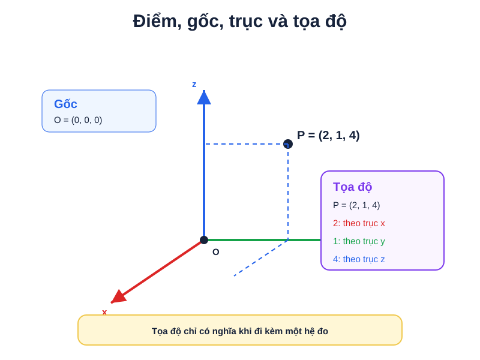
*Hình trực quan: tọa độ của một điểm được đọc theo từng trục kể từ gốc đã chọn.*
Sau khi có gốc và các trục, ta có thể mô tả một điểm bằng ba số.
Ba số đó được gọi là **tọa độ** của điểm.
Ví dụ:
`P = (2, 1, 4)`
có thể được đọc theo cách đơn giản là:
- từ gốc đi 2 đơn vị theo chiều dương của trục `x`;
- đi 1 đơn vị theo chiều dương của trục `y`;
- đi 4 đơn vị theo chiều dương của trục `z`.
Chữ `P` ở đây chỉ là tên ta đặt cho điểm.
## 2.6. Hệ tọa độ
Ta vừa cần:
- một gốc;
- ba trục;
- chiều dương của từng trục;
- cách hiểu đơn vị.
Toàn bộ bộ quy tắc đó được gọi là một **hệ tọa độ**.
Từ đây về sau, “hệ tọa độ” có nghĩa là **bộ quy tắc dùng để biến một vị trí trong không gian thành các con số**.
Đây là ý tưởng quan trọng nhất của phần đầu.
### Một điểm có thể có nhiều bộ tọa độ
### Hình minh họa — vật không đổi, cách đo thay đổi
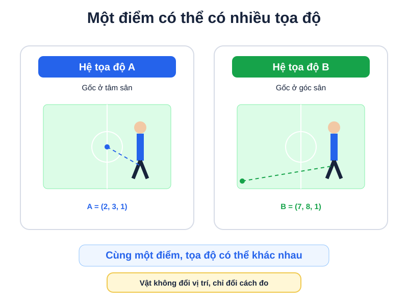
*Hình trực quan: cùng một người ở cùng vị trí thật nhưng nhận bộ tọa độ khác khi đổi gốc đo.*
Giả sử một người đứng cách tâm sân 5 m về phía trước.
Nếu gốc nằm ở tâm sân, vị trí người đó có thể được mô tả là một bộ số nào đó.
Nếu ta chuyển gốc tới góc sân, người đó không hề di chuyển nhưng bộ số mô tả vị trí sẽ thay đổi.
Do đó:
> **Tọa độ thay đổi không nhất thiết có nghĩa là vật đã di chuyển. Có thể chỉ là cách đo đã thay đổi.**
Điều này xuất hiện liên tục trong dữ liệu 3D.
---
# 3. Vị trí và hướng là hai thứ khác nhau
## 3.1. Vì sao cần tách hai khái niệm này?
Giả sử ta có hai câu:
- “Đầu gối nằm tại `(1, 2, 3)`.”
- “Đi từ đầu gối sang phải `(1, 0, 0)`.”
Cả hai đều chứa ba số, nhưng ý nghĩa khác nhau hoàn toàn.
Câu thứ nhất mô tả **một điểm**.
Câu thứ hai mô tả **một hướng kèm độ lớn**.
Để đọc tài liệu toán, đồ họa và mã Unity sau này, ta cần một tên ngắn cho loại thứ hai.
## 3.2. Vector
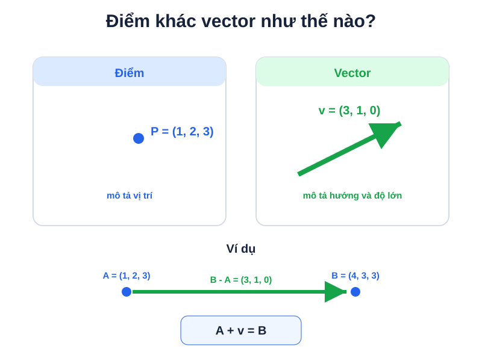
*Hình trực quan: điểm trả lời “ở đâu”, còn vector trả lời “đi theo hướng nào và bao xa”.*
Một **vector** là một đại lượng có:
- hướng;
- độ lớn.
Ta có thể hình dung vector như một mũi tên.
Ví dụ:
`v = (1, 0, 0)`
nếu `x` dương là sang phải thì vector này có thể được hiểu là “đi sang phải 1 đơn vị”.
Vector không nhất thiết phải chỉ vào một vị trí cụ thể trong thế giới. Nó mô tả **sự thay đổi từ một vị trí này sang vị trí khác**, hoặc đơn giản là một hướng.
Từ đây về sau, khi dùng từ **vector**, ta chỉ dùng với nghĩa trên.
## 3.3. Hai điểm tạo ra một vector
Giả sử:
`A = (1, 1, 1)`
và:
`B = (4, 2, 1)`
Ta muốn biết phải đi từ `A` như thế nào để tới `B`.
Ta lấy tọa độ của `B` trừ tọa độ của `A`:
`B - A = (3, 1, 0)`
Kết quả `(3, 1, 0)` là một vector.
Nó nói rằng từ `A`:
- đi thêm 3 đơn vị theo `x`;
- đi thêm 1 đơn vị theo `y`;
- không thay đổi theo `z`.
## 3.4. Một điểm cộng một vector tạo ra một điểm mới
Nếu:
`A = (1, 1, 1)`
và ta di chuyển theo:
`v = (3, 1, 0)`
thì vị trí mới là:
`A + v = (4, 2, 1)`
Đây là mô hình toán học rất đơn giản cho việc di chuyển một đối tượng.
## 3.5. Cạm bẫy trong Unity: cùng là ba số nhưng ý nghĩa có thể khác
Unity có một kiểu dữ liệu tên là `Vector3`.
**Kiểu dữ liệu** ở đây chỉ có nghĩa là khuôn mà chương trình dùng để lưu một loại giá trị.
`Vector3` là khuôn lưu ba số có tên `x`, `y`, `z`.
Tên `Vector3` dễ khiến người mới nghĩ rằng mọi `Vector3` đều là vector theo đúng nghĩa toán học. Không phải vậy.
Unity có thể dùng `Vector3` để chứa:
- vị trí;
- hướng;
- kích thước;
- tốc độ;
- ba góc quay được hiển thị trong cửa sổ chỉnh sửa.
Do đó khi đọc mã, không được chỉ nhìn kiểu `Vector3`. Phải nhìn **ý nghĩa của biến**.
Ví dụ:
```c#
Vector3 kneePosition;
Vector3 moveDirection;
```
Cả hai cùng được chứa bằng ba số, nhưng biến đầu tiên mô tả một điểm còn biến thứ hai mô tả hướng di chuyển.
### Quy tắc cho pipeline dữ liệu
Khi xuất dữ liệu, không nên chỉ ghi:
```json
[0.3, 1.0, 2.4]
```
Mà phải ghi đủ ngữ cảnh, ví dụ về mặt ý tưởng:
```json
{
  "meaning": "left_knee_position",
  "coordinate_system": "world",
  "value": [0.3, 1.0, 2.4]
}
```
Ta chưa cần quan tâm cấu trúc tệp ở đây. Điểm cần nhớ là **ba số một mình là chưa đủ**.
---
# 4. Hai cách đo quan trọng nhất trong Unity
Trước khi nói về hai cách đo, ta cần định nghĩa ba khái niệm của Unity.
## 4.1. Scene
Một **Scene** trong Unity là vùng làm việc chứa các đối tượng tạo thành một cảnh 3D.
Từ đây về sau, ta gọi ngắn là **cảnh**.
Ví dụ một cảnh có thể chứa:
- mặt đất;
- nhân vật;
- camera;
- đèn;
- tường;
- các vật cản.
## 4.2. GameObject
Một **GameObject** là một đối tượng cơ bản nằm trong cảnh Unity.
Một nhân vật có thể là một GameObject lớn chứa nhiều GameObject con. Một camera cũng là một GameObject. Một điểm đánh dấu khớp gối cũng có thể được biểu diễn bằng một GameObject.
Từ đây về sau, “đối tượng Unity” có thể được hiểu là GameObject nếu không nói khác đi.
## 4.3. Component
Một **Component** là một phần được gắn vào GameObject để lưu dữ liệu hoặc cung cấp hành vi.
Ta chưa cần học toàn bộ hệ thống Component. Trong phần này chỉ cần một Component đặc biệt: `Transform`.
## 4.4. Transform
`Transform` là Component mà mọi GameObject đều có. Nó lưu những thông tin cốt lõi về cách đối tượng nằm trong cảnh:
- vị trí;
- hướng quay;
- mức phóng to hoặc thu nhỏ;
- quan hệ cha-con với đối tượng khác.
Từ đây về sau, ta dùng từ **Transform** với nghĩa chính xác này.
### Sơ đồ — Scene, GameObject, Component và Transform
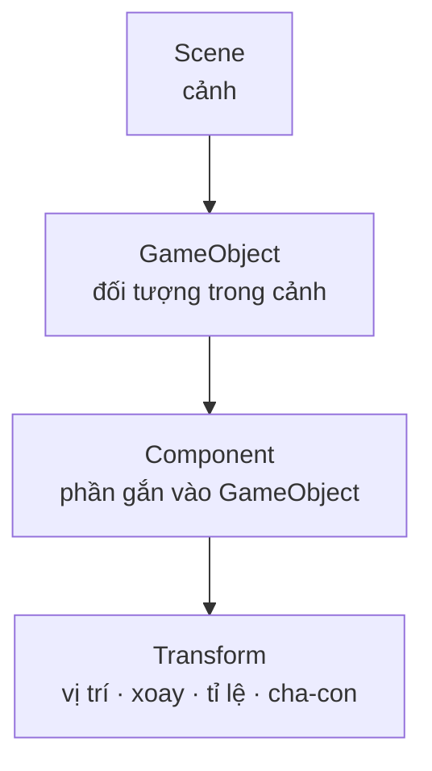
```mermaid
graph TD
    S["Scene<br>cảnh"] --> G["GameObject<br>đối tượng trong cảnh"]
    G --> C["Component<br>phần gắn vào GameObject"]
    C --> T["Transform<br>vị trí · xoay · tỉ lệ · cha-con"]
```
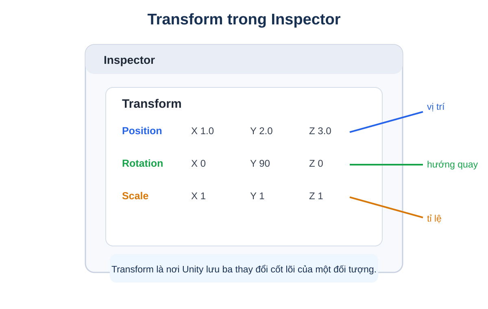
*Hình giao diện: Transform trong Inspector nối trực tiếp Position, Rotation và Scale với nơi bạn nhìn thấy chúng trong Unity.*
## 4.5. World space
Unity cần một hệ tọa độ chung cho toàn bộ cảnh.
Hệ tọa độ chung đó được gọi là **world space**.
Ta sẽ gọi bằng tiếng Việt là **hệ tọa độ toàn cảnh**.
Gốc của hệ tọa độ toàn cảnh là `(0, 0, 0)` của cảnh.
Nếu một đối tượng không có đối tượng cha, vị trí của nó có thể được hiểu trực tiếp theo hệ tọa độ toàn cảnh.
## 4.6. Parent và child
Unity cho phép một đối tượng được đặt “bên dưới” một đối tượng khác trong quan hệ cấu trúc.
Đối tượng phía trên được gọi là **parent**, tức **đối tượng cha**.
Đối tượng phía dưới được gọi là **child**, tức **đối tượng con**.
Ví dụ với cơ thể người:
- phần thân có thể là cha của cánh tay;
- cánh tay trên có thể là cha của cẳng tay;
- cẳng tay có thể là cha của bàn tay.
Quan hệ này cho phép khi phần trên di chuyển thì các phần phía dưới đi theo.
### Sơ đồ — một chuỗi cha-con của cơ thể
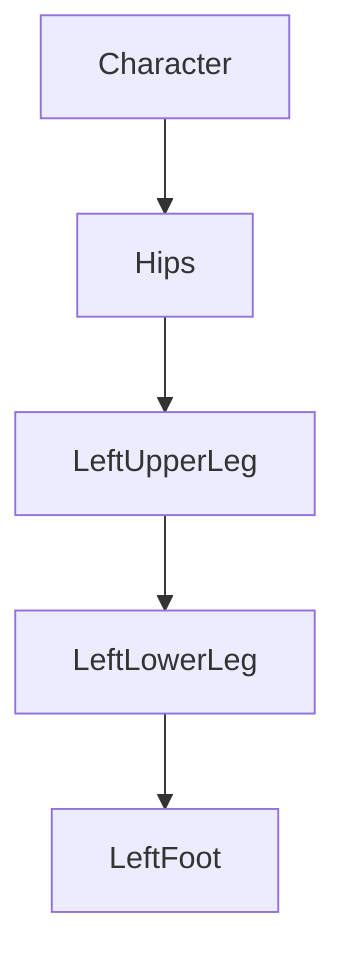
```mermaid
graph TD
    R["Character"] --> H["Hips"]
    H --> U["LeftUpperLeg"]
    U --> L["LeftLowerLeg"]
    L --> F["LeftFoot"]
```
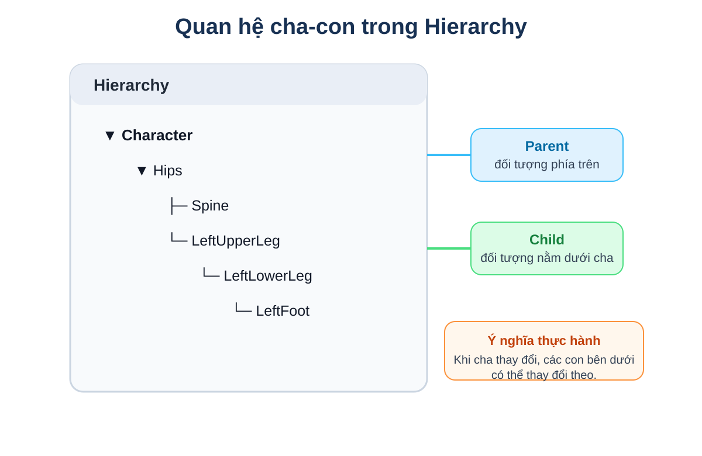
*Hình giao diện: Hierarchy cho biết trực tiếp đối tượng nào là cha và đối tượng nào nằm bên dưới nó.*
## 4.7. Local space
Khi một đối tượng có cha, ta có thể mô tả vị trí của nó **so với cha**, thay vì so với toàn bộ cảnh.
Cách đo này được gọi là **local space**.
Ta sẽ gọi là **hệ tọa độ cục bộ**.
Ví dụ:
- vị trí bàn tay theo toàn bộ cảnh có thể thay đổi khi cả người bước đi;
- vị trí bàn tay so với cẳng tay có thể thay đổi ít hơn nhiều.
Đây là lý do hệ tọa độ cục bộ rất hữu ích khi mô tả cơ thể và chuyển động.
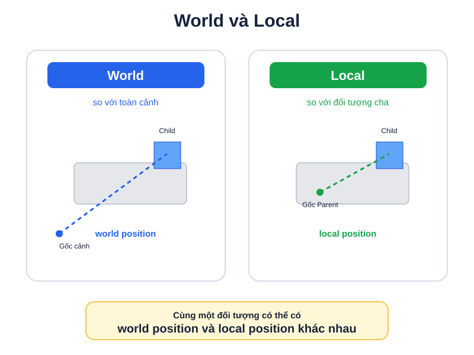
*Hình trực quan: cùng một đối tượng con có thể mang vị trí toàn cảnh và vị trí cục bộ khác nhau.*
## 4.8. Ví dụ cụ thể
Giả sử nhân vật đứng tại:
`(10, 0, 0)`
trong hệ tọa độ toàn cảnh.
Ta đặt một điểm đánh dấu khớp vai làm đối tượng con của nhân vật. Điểm đó nằm cách gốc của nhân vật 0.5 đơn vị sang phải và 1.5 đơn vị lên trên.
Vị trí cục bộ của vai có thể là:
`(0.5, 1.5, 0)`
Nếu nhân vật đi từ `x = 10` sang `x = 20`, điểm vai đi theo.
Khi đó:
- vị trí của vai trong hệ tọa độ toàn cảnh thay đổi;
- vị trí của vai trong hệ tọa độ cục bộ của nhân vật có thể vẫn là `(0.5, 1.5, 0)`.
Đây là khác biệt mà pipeline dữ liệu bắt buộc phải hiểu.
## 4.9. `position` và `localPosition`
Sau khi đã hiểu hai hệ tọa độ trên, ta mới gắn chúng với mã Unity.
Trong `Transform`:
- `position` biểu diễn vị trí theo hệ tọa độ toàn cảnh;
- `localPosition` biểu diễn vị trí so với đối tượng cha.
Ví dụ:
```c#
Vector3 worldPosition = transform.position;
Vector3 localPosition = transform.localPosition;
```
Không nên xuất hai giá trị này mà không ghi rõ loại nào đang được dùng.
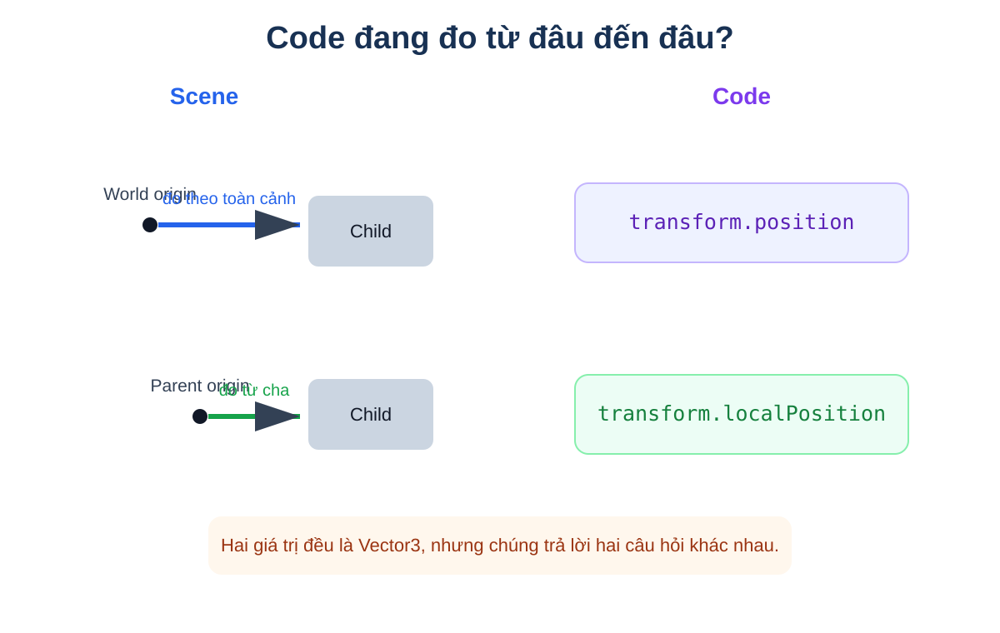
*Hình nối code với Scene: **`position`** đo từ gốc toàn cảnh, còn **`localPosition`** đo từ gốc của đối tượng cha.*

<table fit-page-width="true" header-row="true">
<tr>
<td></td>
<td>`position`</td>
<td>`localPosition`</td>
</tr>
<tr>
<td>Đo từ đâu?</td>
<td>Gốc toàn cảnh</td>
<td>Gốc của đối tượng cha</td>
</tr>
<tr>
<td>Khi cha di chuyển</td>
<td>Thường thay đổi</td>
<td>Có thể giữ nguyên nếu quan hệ tương đối không đổi</td>
</tr>
<tr>
<td>Dùng khi</td>
<td>Cần biết vị trí trong toàn cảnh</td>
<td>Cần biết vị trí tương đối trong cấu trúc cha-con</td>
</tr>
</table>

### Một lỗi rất nguy hiểm
Giả sử frame 1 ta xuất `localPosition`, nhưng frame 2 một đoạn mã khác lại xuất `position`.
Các tệp vẫn chứa ba số hợp lệ. Chương trình đọc dữ liệu có thể không báo lỗi. Nhưng tập dữ liệu đã bị trộn hai cách đo khác nhau.
Đây là loại lỗi nguy hiểm hơn lỗi chương trình dừng chạy, vì pipeline có thể chạy hết mà kết quả học máy vẫn sai.
---
# 5. Di chuyển: thay đổi vị trí
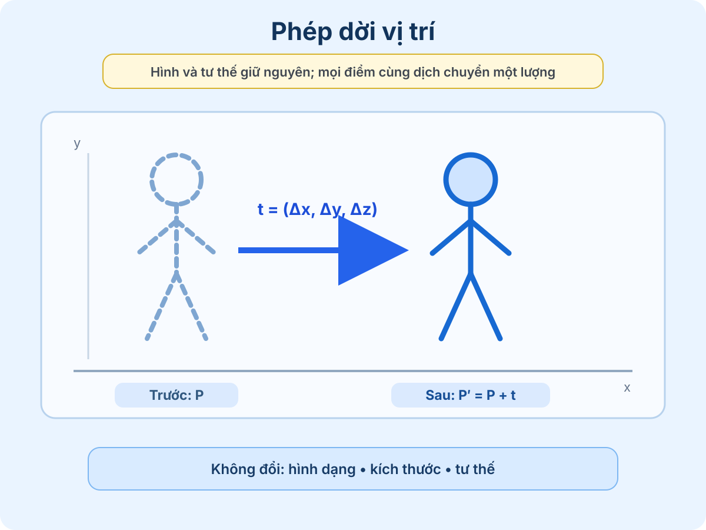
*Hình trực quan: phép dời vị trí làm mọi điểm dịch chuyển cùng một vector nhưng không tự làm đổi hình dạng hay kích thước.*
## 5.1. Translation
Khi một điểm hoặc một đối tượng được dời từ vị trí này sang vị trí khác mà chưa xét đến việc xoay hay đổi kích thước, phép thay đổi đó được gọi là **translation**.
Trong tài liệu này, ta gọi đơn giản là **phép dời vị trí**.
Nếu điểm ban đầu là:
`P = (1, 2, 3)`
và ta dời nó bằng vector:
`t = (4, 0, -1)`
thì vị trí mới là:
`P' = P + t = (5, 2, 2)`
Dấu `'` trong `P'` chỉ có nghĩa là “phiên bản mới của P sau khi thay đổi”.
## 5.2. Vì sao phép dời vị trí quan trọng với dữ liệu người?
Giả sử hai người thực hiện cùng một động tác:
- người A đứng ở giữa sân;
- người B đứng lệch sang phải 3 m.
Nếu ta dùng trực tiếp vị trí theo toàn bộ cảnh, toàn bộ khớp của hai người sẽ khác nhau thêm khoảng 3 m theo một hướng, dù tư thế cơ thể có thể gần như giống nhau.
Do đó tùy bài toán, ta có thể cần loại bỏ ảnh hưởng của vị trí chung trước khi so sánh chuyển động.
Ta chưa thực hiện bước xử lý đó ở đây. Chỉ cần hiểu nguồn gốc của vấn đề: **vị trí toàn cảnh chứa cả thông tin về tư thế lẫn nơi người đó đang đứng**.
---
# 6. Thay đổi kích thước
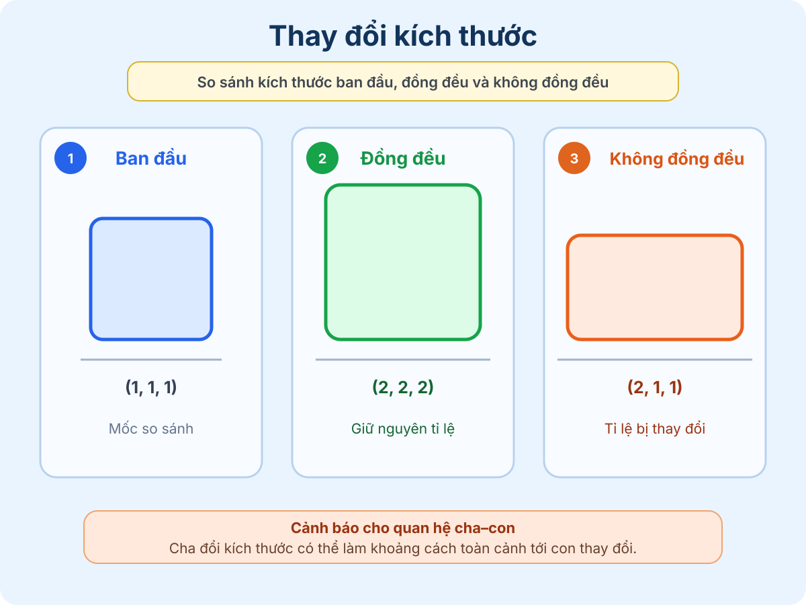
*Hình trực quan: thay đổi đồng đều giữ tỉ lệ, còn thay đổi không đồng đều làm tỉ lệ giữa các trục khác đi.*
## 6.1. Scale
Khi ta làm một đối tượng lớn hơn hoặc nhỏ hơn dọc theo một hoặc nhiều trục, thay đổi đó được gọi là **scale**.
Ta gọi là **thay đổi kích thước**.
Ví dụ:
`(1, 1, 1)`
có thể được hiểu là giữ nguyên kích thước ban đầu.
`(2, 2, 2)`
có thể được hiểu là tăng gấp đôi theo cả ba trục.
`(2, 1, 1)`
có nghĩa là chỉ tăng theo trục `x`.
## 6.2. Thay đổi đồng đều và không đồng đều
Nếu ba giá trị thay đổi giống nhau, ví dụ `(2, 2, 2)`, ta gọi là **thay đổi đồng đều**.
Nếu các giá trị khác nhau, ví dụ `(2, 1, 0.5)`, ta gọi là **thay đổi không đồng đều**.
Tên này được đưa ra để sau này khi đọc tài liệu Unity ta hiểu họ đang nói gì.
## 6.3. Vì sao cần cẩn thận với đối tượng cha?
Nếu một đối tượng cha bị tăng kích thước, vị trí của đối tượng con trong hệ tọa độ toàn cảnh cũng có thể thay đổi.
Ví dụ rất đơn giản:
- con nằm cách cha 1 đơn vị theo `x` trong hệ tọa độ cục bộ;
- cha tăng kích thước theo `x` lên gấp 2;
- khoảng cách quan sát được trong hệ tọa độ toàn cảnh có thể thành 2 đơn vị.
Do đó khi sinh dữ liệu nhân vật, không thể chỉ nhìn `localPosition` của một khớp rồi giả định nó luôn tương ứng trực tiếp với cùng khoảng cách trong toàn cảnh.
Unity cũng nêu rõ rằng thay đổi kích thước của các đối tượng tổ tiên ảnh hưởng đến cách vị trí cục bộ được chuyển thành vị trí toàn cảnh.
---
# 7. Xoay một đối tượng

*Hình khái niệm: Euler angles và quaternion có thể mô tả cùng một hướng cuối nhưng ý nghĩa của các con số hoàn toàn khác nhau.*
## 7.1. Rotation
Khi một đối tượng thay đổi hướng nhưng không nhất thiết thay đổi vị trí gốc của nó, ta gọi thay đổi đó là **rotation**.
Ta gọi là **phép xoay**.
Để mô tả một phép xoay, tối thiểu ta cần biết:
- xoay quanh hướng nào;
- xoay bao nhiêu.
## 7.2. Góc
Mức độ xoay được đo bằng **góc**.
Trong giao diện Unity, góc thường được hiển thị bằng **độ**.
Một vòng tròn đầy đủ là `360°`.
Một nửa vòng là `180°`.
Một phần tư vòng là `90°`.
Ký hiệu `°` ở đây nghĩa là đơn vị độ.
Có một đơn vị đo góc khác thường xuất hiện trong toán và thư viện lập trình, nhưng ta chưa cần dùng ở phần này.
## 7.3. Xoay quanh một trục
Trong không gian 3D, ta có thể xoay quanh từng trục.
Ví dụ, nếu `y` là hướng lên:
- xoay quanh `y` có thể làm nhân vật quay mặt sang trái hoặc phải;
- xoay quanh `x` có thể làm một đối tượng ngả trước hoặc sau tùy cách nó đang được đặt;
- xoay quanh `z` tạo ra một kiểu xoay khác.
Không nên học thuộc ba câu trên như định nghĩa tuyệt đối về chuyển động cơ thể. Ý nghĩa trực quan còn phụ thuộc vào hướng ban đầu của đối tượng.
## 7.4. Euler angles
Có một cách mô tả hướng quay bằng ba con số: một góc liên quan đến `x`, một góc liên quan đến `y`, và một góc liên quan đến `z`.
Cách biểu diễn này được gọi là **Euler angles**.
Ta sẽ gọi là **bộ ba góc Euler**.
Unity hiển thị hướng quay của `Transform` theo cách gần với bộ ba góc Euler vì nó dễ chỉnh bằng tay.
Điểm cần nhớ lúc này:
> Ba góc quay không đơn giản giống như ba tọa độ vị trí. Thứ tự thực hiện các phép xoay có thể làm kết quả cuối cùng khác nhau.
Ta chưa cần học cách tính chi tiết trong phần này.
## 7.5. Quaternion
Unity lưu hướng quay bên trong bằng một cách khác có bốn giá trị. Cách biểu diễn đó được gọi là **quaternion**.
Ở phần này chỉ cần biết ba điều:
1. quaternion là một cách lưu hướng quay;
2. nó không phải là vị trí và cũng không phải bốn góc độc lập;
3. Unity dùng nó bên trong vì nó thuận tiện hơn cho nhiều phép tính xoay liên tiếp.
Ta sẽ học quaternion sâu hơn khi thực sự cần tính toán chuyển động và nội suy hướng quay. Không nên cố “đọc” bốn giá trị quaternion bằng mắt như đọc `(x, y, z)` của vị trí.
## 7.6. Một cảnh báo quan trọng cho dataset
Nếu muốn xuất hướng quay của khớp, ta phải ghi rõ:
- hướng quay đang được tính theo toàn cảnh hay theo cha;
- cách biểu diễn là bộ ba góc Euler hay quaternion;
- thứ tự giá trị;
- đơn vị nếu dữ liệu dùng góc.
Nếu thiếu các thông tin này, dữ liệu rất dễ bị hiểu sai khi chuyển sang một thư viện khác.

*Hình tổng hợp: khi đối tượng cha dời vị trí, xoay hoặc đổi kích thước, đối tượng con chịu ảnh hưởng theo quan hệ cha-con.*
---
# 8. Transform thực chất đang mô tả ba thay đổi lớn
Sau khi đã định nghĩa vị trí, phép dời vị trí, phép xoay và thay đổi kích thước, ta có thể nhìn lại `Transform` rõ hơn.
Một `Transform` mô tả chủ yếu ba việc:
1. đối tượng nằm ở đâu;
2. đối tượng đang quay theo hướng nào;
3. đối tượng lớn nhỏ thế nào so với kích thước ban đầu.
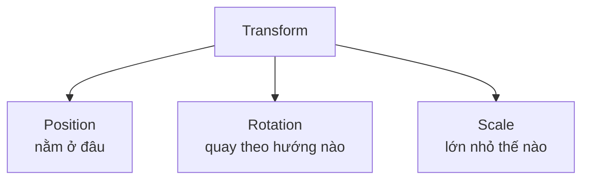
```mermaid
graph TD
    T["Transform"] --> P["Position<br>nằm ở đâu"]
    T --> R["Rotation<br>quay theo hướng nào"]
    T --> S["Scale<br>lớn nhỏ thế nào"]
```
Ba nhóm thay đổi này thường được gọi chung là **transformation**.
Để tránh nhầm với `Transform` là tên Component của Unity, trong tài liệu này ta dùng cụm **phép biến đổi hình học** khi nói về ý tưởng toán học.
Từ đây về sau:
- `Transform` viết hoa và đặt trong mã là Component của Unity;
- **phép biến đổi hình học** là thao tác thay đổi vị trí, hướng hoặc kích thước của hình trong không gian.
---
# 9. Quan hệ cha-con tạo thành một chuỗi phép biến đổi
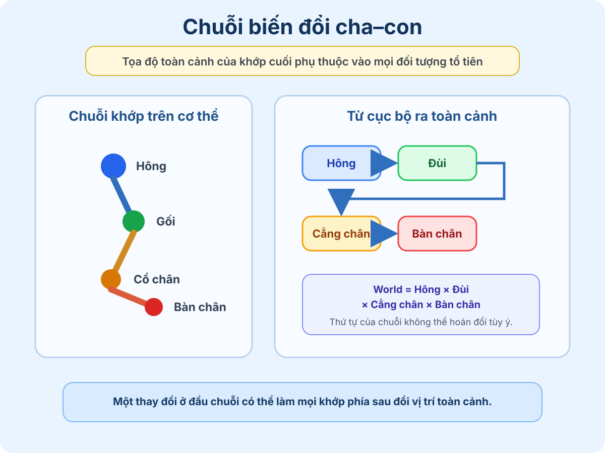
*Hình chuỗi biến đổi: vị trí toàn cảnh của một khớp ở cuối chuỗi phụ thuộc vào mọi phép biến đổi của các đối tượng tổ tiên.*
Đây là phần đặc biệt quan trọng đối với bộ xương người.
## 9.1. Một ví dụ cơ thể
Xét cấu trúc đơn giản:
```text
Body
└── UpperArm
    └── Forearm
        └── Hand
```
Ta gọi đây là một **cây cha-con**: mỗi phần bên dưới có một phần cha trực tiếp.
Nếu `UpperArm` quay, `Forearm` và `Hand` đi theo.
Nếu `Forearm` quay, `Hand` đi theo nhưng `UpperArm` không bị quay theo bởi phép thay đổi của con.
Điều này cho phép một cơ thể chuyển động bằng cách ghép nhiều thay đổi nhỏ ở từng khớp.
## 9.2. Local rotation
Ta đã định nghĩa “cục bộ” là tính so với cha.
Do đó **local rotation** có nghĩa là hướng quay của đối tượng được mô tả so với hướng của cha.
Ta gọi là **hướng quay cục bộ**.
Với bộ xương người, hướng quay cục bộ thường có ý nghĩa trực tiếp hơn cho việc mô tả một khớp vì nó nói bộ phận con đang quay như thế nào so với bộ phận cha.
## 9.3. World rotation
Tương tự, **world rotation** là hướng quay của đối tượng khi nhìn theo hệ tọa độ toàn cảnh.
Ta gọi là **hướng quay toàn cảnh**.
Hướng quay toàn cảnh của bàn tay phụ thuộc vào nhiều phần phía trên nó.
Một cách trực giác:
`hướng bàn tay trong toàn cảnh`
phụ thuộc vào:
`hướng thân + hướng cánh tay trên + hướng cẳng tay + hướng bàn tay`
Dấu `+` ở đây chỉ mang nghĩa “kết hợp”, không phải phép cộng số thông thường.
## 9.4. Ancestor
Khi một đối tượng nằm phía trên một đối tượng khác trong cây cha-con, không nhất thiết là cha trực tiếp, ta gọi nó là **ancestor**.
Ta gọi là **đối tượng tổ tiên**.
Ví dụ với `Hand`:
- `Forearm` là cha trực tiếp;
- `UpperArm` là một tổ tiên;
- `Body` cũng là một tổ tiên.
Khái niệm này cần thiết vì thay đổi ở bất kỳ tổ tiên nào cũng có thể ảnh hưởng đến vị trí và hướng toàn cảnh của đối tượng con.
---
# 10. Ma trận: cách máy tính gom nhiều phép tính lại
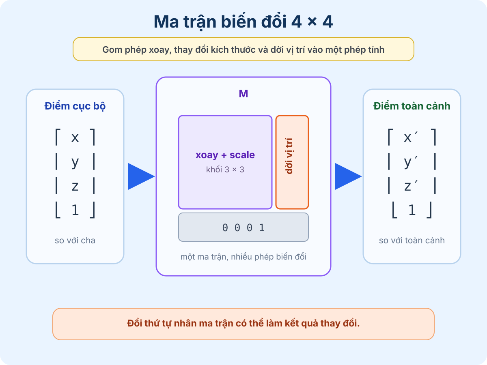
*Hình khái niệm: ma trận 4 × 4 gom phép xoay, thay đổi kích thước và dời vị trí để đổi một điểm cục bộ sang điểm toàn cảnh.*
Phần này chỉ giới thiệu đủ để chuẩn bị cho phần camera sau này.
## 10.1. Matrix
Một bảng số được sắp thành hàng và cột được gọi là **matrix**.
Ta gọi là **ma trận**.
Ví dụ:
```text
1 0 0
0 1 0
0 0 1
```
là một ma trận có ba hàng và ba cột.
Không phải mọi bảng số đều tự nhiên có ý nghĩa. Ý nghĩa đến từ cách ta quy ước sử dụng nó.
Trong hình học 3D, ma trận có thể được dùng để mô tả một phép biến đổi một cách gọn và có thể tính lặp lại bằng cùng một quy tắc.
## 10.2. Vì sao không cứ viết công thức trực tiếp?
Ta hoàn toàn có thể viết riêng:
- công thức xoay;
- công thức đổi kích thước;
- công thức dời vị trí.
Nhưng pipeline 3D thường phải làm nhiều phép biến đổi nối tiếp nhau.
Dùng ma trận cho phép máy tính ghép nhiều bước thành một dạng thống nhất.
Ý tưởng cần nhớ:
```text
điểm ban đầu
→ áp dụng phép biến đổi
→ điểm mới
```
và ma trận là một cách chuẩn để mã hóa phép biến đổi đó.
## 10.3. Ma trận không phải là mục tiêu học thuộc
Ở giai đoạn này không cần thuộc công thức của mọi ma trận quay.
Mục tiêu là hiểu:
> Khi sau này ta thấy một ma trận đổi từ hệ tọa độ A sang hệ tọa độ B, nó đang đóng vai trò như một “bộ hướng dẫn tính toán” để đổi cách mô tả của cùng một điểm.
Đây là tư duy quan trọng hơn việc học thuộc các ô số.
---
# 11. Vì sao phép dời vị trí làm xuất hiện thêm một con số
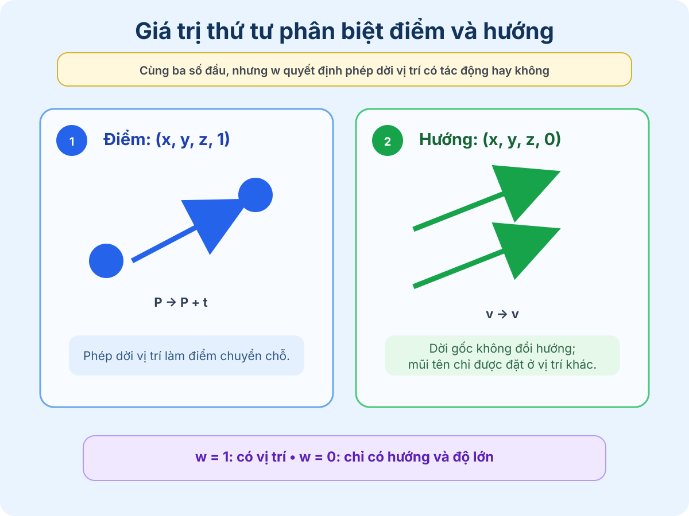
*Hình trực quan: giá trị thứ tư bằng 1 cho điểm và bằng 0 cho hướng, nhờ đó phép dời vị trí chỉ tác động lên điểm.*
## 11.1. Vấn đề
Một ma trận ba hàng ba cột rất thuận tiện để mô tả xoay và đổi kích thước trong 3D.
Nhưng phép dời vị trí không ghép vào cùng dạng đó một cách trực tiếp nếu ta chỉ giữ ba giá trị `(x, y, z)`.
Để có một cách biểu diễn thống nhất, đồ họa máy tính thường thêm một giá trị thứ tư.
## 11.2. Homogeneous coordinates
Cách thêm một giá trị phụ để có thể gộp phép dời vị trí với các phép biến đổi khác được gọi là **homogeneous coordinates**.
Ta gọi là **tọa độ đồng nhất**.
Một điểm 3D:
`(x, y, z)`
thường có thể được viết mở rộng thành:
`(x, y, z, 1)`
trong cách biểu diễn này.
Ở đây số `1` không phải là “chiều không gian thứ tư”. Nó là một giá trị phụ giúp phép tính có dạng thuận tiện hơn.
Một vector chỉ hướng thường có thể được mở rộng thành:
`(x, y, z, 0)`
Sự khác nhau giữa `1` và `0` giúp phép dời vị trí tác động lên điểm nhưng không làm thay đổi một hướng thuần túy theo cùng cách.
Đây cũng là một lý do toán học sâu hơn cho việc **điểm và vector không phải cùng một khái niệm**, dù ban đầu cả hai có thể được ghi bằng ba số.
## 11.3. Ma trận 4 × 4
Một ma trận có bốn hàng và bốn cột được gọi ngắn là **ma trận 4 × 4**.
Trong đồ họa 3D, dạng này được dùng rất nhiều vì nó có thể chứa trong cùng một cấu trúc thông tin để:
- xoay;
- đổi kích thước;
- dời vị trí.
Ta chưa cần tự nhân ma trận bằng tay ở đây. Sang phần camera, ta sẽ dùng ý tưởng này để đi từ vị trí trong thế giới tới vị trí nhìn từ camera.
---
# 12. Quy ước trục của Unity
Bây giờ ta đã hiểu thế nào là hệ tọa độ nên mới đủ cơ sở để nói về quy ước riêng của Unity.
Unity dùng quy ước:
- `+x`: sang phải;
- `+y`: lên trên;
- `+z`: về phía trước.
Unity gọi hệ này là **left-handed coordinate system**.
Ta gọi là **hệ tọa độ tay trái**.
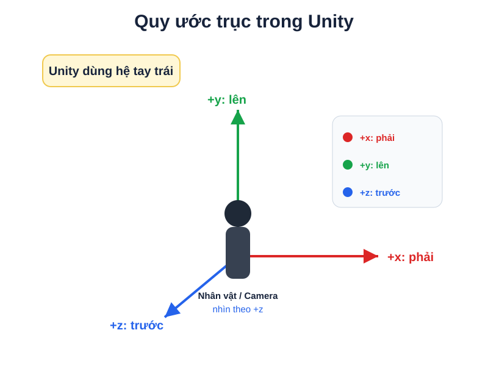
*Hình trực quan: quy ước chiều dương của ba trục trong Unity.*
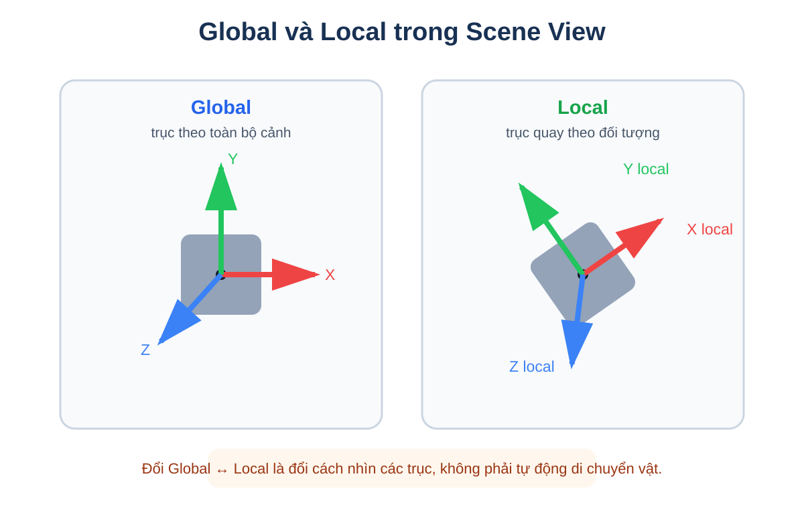
*Hình Scene View: Global giữ trục theo toàn cảnh; Local xoay trục theo chính đối tượng.*
Tên “tay trái” dùng để phân biệt cách định hướng ba trục và chiều xoay với một quy ước khác gọi là hệ tay phải. Trong phần này chưa cần ghi nhớ mẹo bàn tay. Điều quan trọng đối với dataset là biết Unity đang dùng quy ước nào.
### Tại sao việc này rất quan trọng?
Không phải mọi phần mềm 3D và thư viện học máy đều dùng cùng quy ước.
Do đó một điểm có vẻ như:
`(x, y, z)`
trong Unity có thể cần:
- đổi dấu một trục;
- đổi chỗ hai trục;
- hoặc thực hiện một phép đổi hệ tọa độ đầy đủ
trước khi được dùng đúng trong công cụ khác.
Không được suy luận rằng “cùng có x, y, z thì cùng hệ tọa độ”.
---
# 13. Một đơn vị trong Unity nghĩa là bao nhiêu?
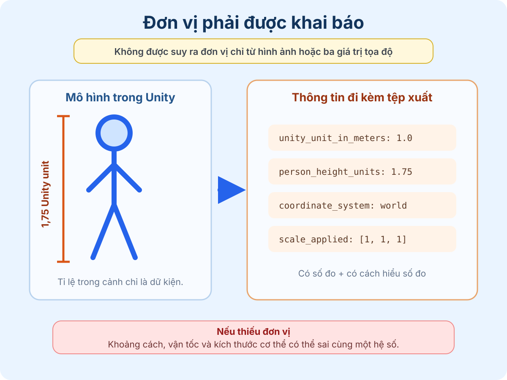
*Hình kiểm tra dữ liệu: đơn vị, chiều cao mô hình, hệ tọa độ và kích thước áp dụng phải được ghi rõ trong thông tin mô tả đi kèm.*
Unity sử dụng “unit” như đơn vị trong cảnh.
Trong nhiều hệ thống vật lý của Unity, quy ước thực hành phổ biến là **1 Unity unit tương ứng khoảng 1 mét**.
Điều này đặc biệt hữu ích khi ta làm dữ liệu cơ thể người.
Ví dụ, nếu người cao khoảng 1.75 m mà mô hình import vào Unity lại cao 175 unit, ta đang có chênh lệch rất lớn về tỷ lệ.
Tỷ lệ sai có thể ảnh hưởng đến:
- khoảng cách camera;
- tốc độ chuyển động;
- thông số vật lý;
- độ sâu;
- dữ liệu 3D xuất ra.
Do đó mỗi pipeline dataset cần có một quy ước đơn vị rõ ràng và kiểm tra mô hình sau khi import.
---
# 14. Liên hệ trực tiếp với synthetic dataset
Ta đã đủ từ vựng để mô tả một frame dữ liệu 3D một cách nghiêm túc.

*Hình tổng quan: dữ liệu khớp trong Unity phải đi qua cách đo, phép biến đổi và bước xuất kèm thông tin mô tả trước khi trở thành dữ liệu cho Python/PyTorch.*
## 14.1. Ví dụ: khớp gối trái
Giả sử tại một thời điểm, Unity cho ta vị trí đầu gối trái.
Không nên nghĩ dữ liệu chỉ là:
`(0.42, 0.51, 1.82)`
Ta cần trả lời ít nhất:
1. Đây là điểm nào?
2. Bộ số đang dùng hệ tọa độ nào?
3. Gốc ở đâu?
4. Ba trục hướng theo đâu?
5. Đơn vị là gì?
6. Đây là vị trí toàn cảnh hay cục bộ?
7. Nếu là cục bộ thì cha là đối tượng nào?
8. Frame này thuộc nhân vật nào?
9. Nếu đưa sang công cụ khác thì có cần đổi hệ tọa độ không?
## 14.2. Mẫu suy nghĩ đúng
Thay vì:
> “Tôi export joint position.”
hãy nghĩ:
> “Tôi export vị trí của một khớp, được mô tả trong một hệ tọa độ đã định nghĩa, với đơn vị và quan hệ cha-con đã xác định.”
Sự khác nhau về cách nghĩ này là ranh giới giữa “lấy được số ra khỏi Unity” và “tạo dữ liệu có thể kiểm chứng”.
## 14.3. Vì sao cần cả vị trí toàn cảnh và cục bộ?
Không phải lúc nào cũng cần xuất cả hai, nhưng chúng phục vụ mục đích khác nhau.
**Vị trí toàn cảnh** thuận tiện khi cần:
- biết người đang ở đâu trong cảnh;
- so với camera;
- tính đường đi của toàn cơ thể;
- tạo nhãn 3D gắn với môi trường.
**Vị trí cục bộ** thuận tiện khi cần:
- mô tả cấu trúc bên trong cơ thể;
- giảm ảnh hưởng của việc cả người di chuyển trong cảnh;
- kiểm tra quan hệ giữa các phần cha-con;
- lưu một số dạng chuyển động tương đối.
Không có lựa chọn “luôn đúng”. Phải chọn theo câu hỏi mà dữ liệu cần trả lời.
---
# 15. Các lỗi tư duy phải loại bỏ ngay từ đầu
## Lỗi 1 — “Ba số là đủ để biết vị trí”
Sai.
Phải biết hệ tọa độ.
## Lỗi 2 — “`Vector3` nghĩa là vector toán học”
Sai.
`Vector3` chỉ là kiểu chứa ba số. Ý nghĩa phụ thuộc vào biến đang mô tả gì.
## Lỗi 3 — “`localPosition` và `position` chỉ khác tên”
Sai.
Chúng mô tả vị trí theo hai cách đo khác nhau.
## Lỗi 4 — “Nếu con không thay đổi `localPosition` thì vị trí thật của nó không đổi”
Sai.
Cha hoặc một tổ tiên có thể di chuyển, xoay hoặc đổi kích thước, khiến vị trí toàn cảnh của con thay đổi.
## Lỗi 5 — “Cùng x, y, z thì phần mềm nào cũng hiểu giống nhau”
Sai.
Các phần mềm có thể chọn hướng trục và quy ước khác nhau.
## Lỗi 6 — “Euler angle là ba tọa độ của phép xoay”
Không nên hiểu như vậy.
Nó là một cách mô tả phép xoay bằng ba góc, và thứ tự thực hiện phép xoay có ảnh hưởng.
## Lỗi 7 — “Quaternion có bốn số nên là bốn góc”
Sai.
Bốn giá trị đó cùng tạo thành một cách biểu diễn một hướng quay.
## Lỗi 8 — “Nếu hình nhìn đúng trong Unity thì dữ liệu chắc chắn đúng”
Sai.
Một cảnh có thể nhìn hoàn toàn bình thường trong cửa sổ Unity nhưng tệp xuất ra dùng nhầm hệ tọa độ, sai đơn vị hoặc sai quan hệ cha-con.
---
# 16. Bài thực hành bắt buộc
Mục tiêu của bài này không phải viết code dài. Mục tiêu là chứng minh bạn thực sự hiểu cách mô tả vị trí.
## Bài 1 — World và local
Tạo trong Unity:
```text
Parent
└── Child
```
Đặt:
- `Parent` tại một vị trí khác `(0,0,0)`;
- `Child` có một vị trí cục bộ dễ đọc, ví dụ `(1,0,0)`.
Viết script in ra:
```c#
Debug.Log(transform.position);
Debug.Log(transform.localPosition);
```
Sau đó:
1. di chuyển `Parent`;
2. không chỉnh `Child`;
3. ghi lại hai giá trị của `Child`;
4. giải thích vì sao một giá trị đổi còn giá trị kia có thể giữ nguyên.
## Bài 2 — Ảnh hưởng của xoay cha
Giữ `Child` ở vị trí cục bộ `(1,0,0)`.
Xoay `Parent`.
Trước khi chạy, tự dự đoán `Child` sẽ đi đâu trong toàn cảnh.
Sau đó mới quan sát kết quả.
Yêu cầu không chỉ nói “nó đi theo cha”. Phải giải thích:
> tọa độ cục bộ của `Child` vẫn mô tả cùng vị trí so với trục của `Parent`, nhưng các trục của `Parent` đã đổi hướng so với toàn cảnh.
## Bài 3 — Ảnh hưởng của thay đổi kích thước cha
Giữ `Child.localPosition = (1,0,0)`.
Đổi kích thước `Parent` theo `x` từ `1` thành `2`.
Quan sát khoảng cách toàn cảnh giữa cha và con.
Viết kết luận bằng lời của bạn.
## Bài 4 — Điểm và hướng
Trong script, tạo:
```c#
Vector3 pointA = new Vector3(1f, 2f, 3f);
Vector3 pointB = new Vector3(4f, 4f, 3f);
Vector3 direction = pointB - pointA;
```
Không cần học cú pháp C# trong bài này. Chỉ cần trả lời:
- `pointA` đại diện cho gì?
- `pointB` đại diện cho gì?
- `direction` đại diện cho gì?
- vì sao ba biến đều dùng `Vector3` nhưng ý nghĩa không giống nhau?
## Bài 5 — Mini exporter
Tạo một GameObject đại diện cho một khớp.
Mỗi frame, ghi ra ít nhất:
```text
frame index
world position
local position
parent name
```
**Frame** ở đây nghĩa là một thời điểm rời rạc trong chuỗi hình ảnh hoặc chuỗi mô phỏng. Ví dụ chạy ở 30 frame mỗi giây nghĩa là mỗi giây được chia thành 30 thời điểm để ghi dữ liệu.
Sau khoảng 100 frame:
- kiểm tra số lượng dòng;
- kiểm tra vị trí có thay đổi đúng như chuyển động nhìn thấy không;
- thử di chuyển đối tượng cha và xem hai loại vị trí phản ứng khác nhau thế nào.
---
# 17. Bài kiểm tra đầu ra của Phần giới thiệu
Chưa cần sang phần camera nếu chưa trả lời chắc được các câu sau mà không tra tài liệu.
- [ ] Tại sao `(1,2,3)` một mình chưa đủ để mô tả một vị trí?
- [ ] Điểm và vector khác nhau ở đâu?
- [ ] Hệ tọa độ là gì?
- [ ] Gốc và trục có vai trò gì?
- [ ] Hệ tọa độ toàn cảnh là gì?
- [ ] Hệ tọa độ cục bộ là gì?
- [ ] `Transform.position` và `Transform.localPosition` khác nhau thế nào?
- [ ] Vì sao thay đổi đối tượng cha có thể làm vị trí toàn cảnh của con thay đổi?
- [ ] Phép dời vị trí, phép xoay và thay đổi kích thước khác nhau thế nào?
- [ ] Vì sao Unity dùng `Vector3` không có nghĩa rằng mọi giá trị đó đều là vector theo nghĩa toán học?
- [ ] Ma trận được dùng để làm gì trong bối cảnh này?
- [ ] Tọa độ đồng nhất thêm giá trị thứ tư để giải quyết vấn đề gì?
- [ ] Unity quy ước chiều dương của `x`, `y`, `z` như thế nào?
- [ ] Vì sao dữ liệu từ Unity có thể cần đổi hệ tọa độ trước khi dùng trong công cụ khác?
### Điều kiện đạt
Phần giới thiệu được coi là hoàn thành khi bạn có thể:
1. giải thích các câu trên bằng lời của mình;
2. chạy đủ năm bài thực hành;
3. tạo được mini exporter;
4. tự phát hiện được ít nhất một trường hợp trong đó `localPosition` giữ nguyên nhưng `position` thay đổi;
5. mô tả chính xác hệ tọa độ đang dùng trong tệp xuất.
---
# 18. Liên kết sang phần kế tiếp
Sau Phần giới thiệu, ta đã có thể nói chính xác:
> “Một điểm 3D đang được mô tả trong một hệ tọa độ cụ thể.”
Phần tiếp theo sẽ thêm **camera**.
Khi đó câu hỏi chuyển thành:
> “Nếu đã biết vị trí 3D của một khớp, camera nhìn thấy nó ở đâu trên ảnh 2D?”
Để trả lời, phần kế tiếp sẽ xây lần lượt các khái niệm về camera, mặt phẳng ảnh, tiêu cự, thông số bên trong camera, vị trí camera trong thế giới và phép chiếu 3D xuống 2D.
**Chưa sinh phần kế tiếp cho đến khi Phần giới thiệu được duyệt.**
---
# 19. Nguồn đối chiếu chính cho các quy ước Unity trong phần này
- Unity Manual — *Rotation and orientation in Unity*: xác nhận Unity dùng hệ tọa độ tay trái, với `+x` sang phải, `+y` lên trên và `+z` về phía trước.
- Unity Manual — *Transform component*: xác nhận `Transform` lưu vị trí, hướng quay, kích thước và quan hệ cha-con; các giá trị của đối tượng con được đo tương đối so với cha.
- Unity Scripting API — `Transform.localPosition`: xác nhận `localPosition` là vị trí so với cha và thay đổi kích thước của các đối tượng tổ tiên ảnh hưởng đến vị trí toàn cảnh được tính ra.
[Kiến trúc toàn sách — 26 chương](../roadmap.md)
[Chương 1 — Từ bài toán thị giác đến một mẫu dữ liệu có thể kiểm chứng](01-verifiable-data-sample.md)
[Chương 2 — Cùng một điểm cơ thể trong nhiều hệ tọa độ](02-coordinate-frames.md)
