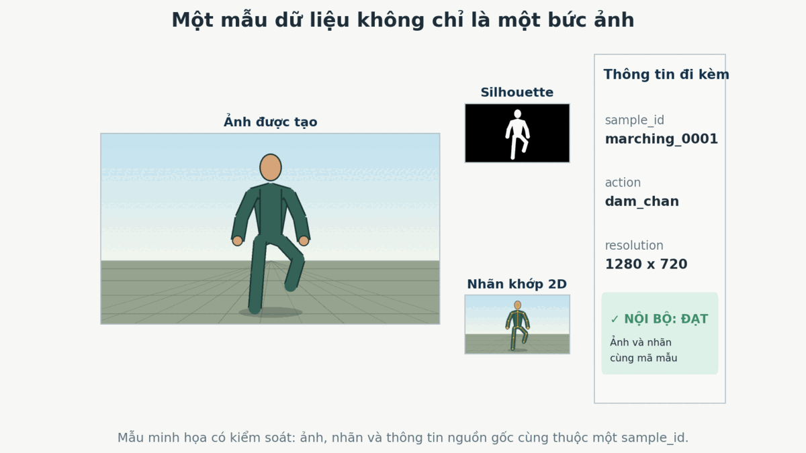
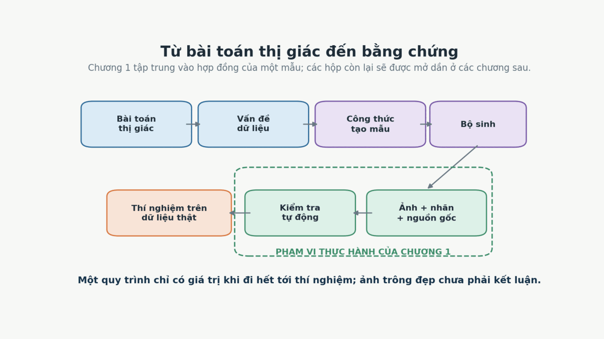
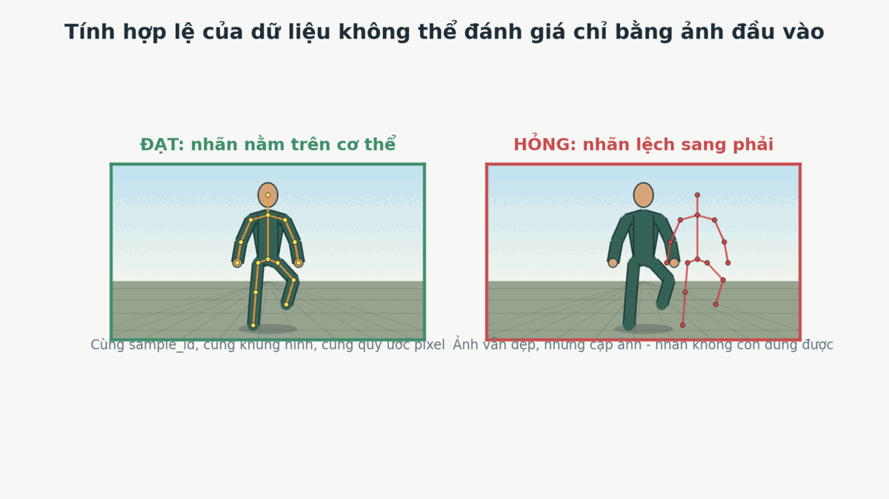
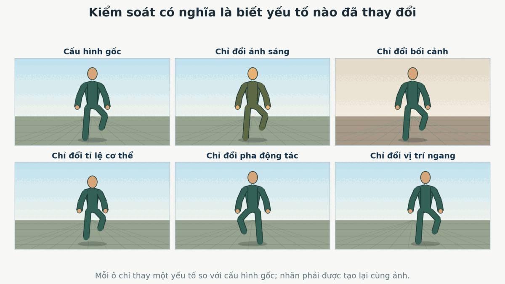
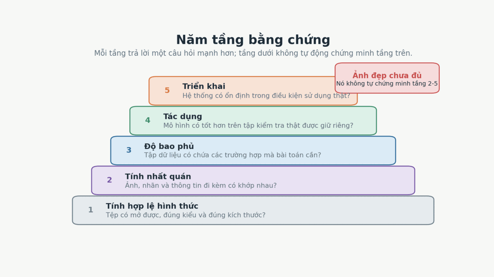

# Chương 1. Từ bài toán thị giác đến một mẫu dữ liệu có thể kiểm chứng

> **Đầu ra cuối chương:** tạo được một mẫu dữ liệu tối thiểu gồm ảnh, ảnh nhị phân đánh dấu vùng người, tệp chứa vị trí các khớp trên ảnh và thông tin đi kèm; chạy được chương trình kiểm tra; chương trình phải chấp nhận mẫu đúng và từ chối một mẫu có nhãn bị lệch.
>
> **Cần biết trước:** đọc và chạy được Python cơ bản. Chương này chưa yêu cầu kiến thức về đồ họa 3D, camera, mô hình cơ thể người hoặc huấn luyện mạng nơ-ron.

## 1.1 Một bức ảnh đẹp có phải là dữ liệu tốt không?

Hãy tưởng tượng ta muốn huấn luyện một hệ thống quan sát người đang **dậm chân**. Ta mở một thư mục dữ liệu và thấy một bức ảnh người được tạo bằng phần mềm 3D. Nhân vật nằm giữa khung hình, tư thế rõ ràng, nền sạch và ánh sáng dễ nhìn.

Nếu chỉ nhìn bức ảnh, ta có thể nói quá trình tạo ảnh đã hoạt động. Nhưng ta chưa thể nói mẫu dữ liệu đó dùng được để huấn luyện mô hình.

Mô hình không chỉ nhận bức ảnh. Nó còn cần câu trả lời đúng đi kèm với bức ảnh. Câu trả lời dùng để dạy hoặc đánh giá mô hình được gọi là **nhãn** (*label*). Nếu nhiệm vụ là tìm vị trí các khớp, ta cần nhãn vị trí khớp. Nếu nhiệm vụ là tách người khỏi nền, ta cần nhãn cho biết vùng nào thuộc về người. Một ảnh chỉ dùng hai vùng, thường là người màu trắng và nền màu đen, được gọi là **silhouette**. Nếu nhiệm vụ là phân biệt các pha của động tác, ta cần biết bức ảnh thuộc pha nào. Một bức ảnh trông hợp lý nhưng đi cùng nhãn sai sẽ dạy mô hình một quan hệ sai.

Hình 1.1 cho thấy sản phẩm tối thiểu mà chương này sẽ xây. Hãy quan sát bốn phần: ảnh, silhouette, các điểm khớp và khối thông tin bên phải. Trường `sample_id` là mã nhận diện dùng để nối các tệp thuộc cùng một mẫu. Phần nào trong bốn phần có thể bị bỏ mà ta vẫn kiểm tra được toàn bộ mẫu?



*Hình 1.1 - Một mẫu minh họa cho động tác dậm chân. Ảnh chỉ là một thành phần; các nhãn và thông tin dùng để nhận diện, tái tạo và kiểm tra mẫu phải đi cùng nó.*

Không phần nào trong bốn phần là thừa đối với mục tiêu của ví dụ. Ảnh là dữ liệu mô hình có thể quan sát. Silhouette và các điểm khớp là những câu trả lời ta muốn mô hình học. Khối thông tin bên phải cho biết các tệp thuộc về cùng một mẫu nào và chúng đã được tạo trong điều kiện nào.

Từ đây, ta gọi toàn bộ nhóm tệp cùng mô tả **một trường hợp quan sát** là một **mẫu dữ liệu** (*data sample*). Trong chương này, một mẫu không đồng nghĩa với một tệp ảnh.

> **Giới hạn của hình minh họa:** nhân vật trong Hình 1.1 được vẽ bằng code để ta kiểm tra chính xác vị trí của từng điểm. Đây không phải ảnh xuất từ Unity và không phải bằng chứng rằng phong cách hình ảnh này giúp mô hình hoạt động trên video thật.

## 1.2 Bức tranh tổng thể: ta đang xây một mắt xích nào?

Trước khi mở phần mềm 3D hoặc chọn mô hình học máy, ta cần biết dữ liệu nằm ở đâu trong toàn bộ quá trình giải quyết bài toán. Hình 1.2 tóm tắt đường đi mà tài liệu này sẽ theo.



*Hình 1.2 - Đường đi từ bài toán thị giác đến bằng chứng. Chương 1 chỉ mở hai hộp màu xanh lá: cấu trúc của một mẫu và phép kiểm tra tự động cho mẫu đó.*

Hình bắt đầu bằng điều hệ thống phải làm, không bắt đầu bằng Unity. Từ nhiệm vụ đó, ta xác định dữ liệu đang thiếu điều gì. Chỉ sau khi biết phần thiếu, ta mới thiết kế cách tạo mẫu, dùng một bộ sinh để tạo ảnh và nhãn, rồi kiểm tra kết quả. Cuối cùng, tập dữ liệu phải được đưa vào một thí nghiệm có dữ liệu thật được giữ riêng.

Đường đi này ngăn một sai lầm phổ biến: tạo thật nhiều ảnh trước, rồi mới tìm xem chúng có thể giải quyết bài toán nào.

### 1.2.1 Bài toán thị giác là đầu vào và kết quả mong muốn

Trong tài liệu này, **bài toán thị giác máy tính lấy con người làm trung tâm** (*human-centric computer vision problem*) là một nhiệm vụ trong đó máy tính nhận ảnh hoặc video có con người và phải tạo ra một kết quả liên quan đến người đó.

Ví dụ:

- nhận một khung hình và trả về vùng cơ thể người;
- nhận một khung hình và trả về vị trí các khớp;
- nhận một đoạn video và xác định động tác;
- nhận chuỗi chuyển động và ước lượng mức độ thực hiện đúng động tác.

Mô tả “tôi muốn làm nhận dạng động tác” vẫn còn quá rộng. Một bài toán đủ rõ phải trả lời ít nhất bốn câu hỏi:

1. Đầu vào là ảnh, silhouette hay video?
2. Đầu ra là tên động tác, vị trí khớp, góc khớp hay điểm số?
3. Hệ thống sẽ gặp những người, góc nhìn và bối cảnh nào khi sử dụng thật?
4. Ta dùng phép đo nào để quyết định hệ thống tốt hơn hay kém hơn?

Nếu bốn câu hỏi này chưa có câu trả lời, chưa đủ căn cứ để quyết định loại dữ liệu tổng hợp cần tạo.

### 1.2.2 Vấn đề dữ liệu là phần đang cản bài toán

Sau khi mô tả nhiệm vụ, ta tìm **vấn đề dữ liệu** (*data problem*): một thiếu hụt hoặc sai lệch cụ thể trong dữ liệu khiến mô hình không thể học hoặc không thể được đánh giá đáng tin cậy.

Với bài toán quan sát động tác dậm chân, vấn đề có thể là:

- video thật có người nhưng không có vị trí khớp chính xác ở từng khung hình;
- các trường hợp thực hiện sai hiếm hơn nhiều so với trường hợp đúng;
- góc camera, chiều cao cơ thể hoặc điều kiện ánh sáng không đủ đa dạng;
- thu thập video thật làm phát sinh rủi ro riêng tư;
- nhãn điểm số chỉ có ở mức toàn video, trong khi mô hình cần biết lỗi xuất hiện lúc nào;
- tập kiểm tra không đại diện cho điều kiện triển khai.

Những vấn đề này khác nhau và không thể được giải quyết bằng cùng một nút “Generate”. Ví dụ, tạo thêm nhân vật 3D không tự động tạo ra quy tắc chấm điểm đúng. Tạo silhouette có thể giảm lượng thông tin nhận dạng trong đầu vào, nhưng không tự chứng minh toàn bộ quy trình đã bảo vệ riêng tư. Tạo hàng triệu ảnh cũng không bù được một định nghĩa nhãn sai.

### 1.2.3 Dữ liệu tổng hợp là dữ liệu được tạo theo một quy trình có chủ đích

Ta cần ảnh và nhãn nhưng không muốn phụ thuộc hoàn toàn vào việc quay người thật rồi gán nhãn thủ công. Ta có thể mô tả một con người, động tác, bối cảnh và cách quan sát bằng chương trình, sau đó để chương trình tạo ra kết quả.

Trong tài liệu này, **dữ liệu tổng hợp** (*synthetic data*) là dữ liệu được tạo bởi một quy trình có thể điều khiển, thay vì được lấy trực tiếp từ một quan sát thật rồi gán nhãn hoàn toàn bằng tay.

Định nghĩa này mang tính vận hành cho tài liệu. Nó bao gồm ảnh được dựng từ cảnh 3D, silhouette được tạo từ hình học đã biết và nhãn khớp được tính từ trạng thái của nhân vật. Nó không có nghĩa mọi pixel đều phải “giả”: một cảnh có thể trộn tài sản 3D, ảnh nền thật và nhiều nguồn chuyển động khác nhau.

Điểm quan trọng nằm ở khả năng điều khiển và biết nguồn gốc của kết quả. Nếu không biết yếu tố nào đã tạo ra mẫu, ta mất một trong những lợi ích chính của dữ liệu tổng hợp.

## 1.3 Synthetic data chỉ có ý nghĩa sau khi có yêu cầu dữ liệu

Giả sử mục tiêu cuối cùng là đánh giá động tác quân sự từ silhouette để giảm thông tin nhận dạng. Ta chưa cần thiết kế toàn bộ hệ thống ngay. Trước hết, hãy chuyển mục tiêu thành những thông tin mà dữ liệu phải cung cấp.

| Yêu cầu của bài toán | Dữ liệu phải chứa | Khó khăn khi chỉ dùng dữ liệu thật | Điều dữ liệu tổng hợp có thể hỗ trợ | Điều chưa được chứng minh |
| --- | --- | --- | --- | --- |
| Tách người khỏi nền | Ảnh và silhouette khớp từng pixel | Gán nhãn thủ công tốn thời gian | Xuất silhouette cùng lúc với ảnh | Silhouette tổng hợp có giống lỗi của silhouette thật không |
| Tìm vị trí khớp | Vị trí khớp theo từng khung hình | Khớp bị che, nhãn 3D khó đo | Lấy vị trí từ trạng thái nhân vật | Mô hình học từ nhân vật 3D có chuyển sang người thật không |
| Nhận biết pha động tác | Chuỗi khung hình và thời điểm của từng pha | Nhãn thời gian dễ lệch giữa người gán | Điều khiển chính xác thời điểm của chuyển động mẫu | Chuyển động mẫu có phản ánh biến thiên của người thật không |
| Học trường hợp hiếm | Đủ ví dụ lỗi hoặc góc nhìn hiếm | Khó yêu cầu người thật lặp lỗi nguy hiểm | Tạo lại một cấu hình nhiều lần | Tần suất tổng hợp có phản ánh tần suất thật không |
| Giảm dùng video thật | Ít phụ thuộc vào người tham gia thật | Có rủi ro riêng tư và chi phí xin phép | Tạo người và bối cảnh ảo | Toàn bộ hệ thống đã đáp ứng yêu cầu pháp lý hay đạo đức hay chưa |

Bảng này cố ý tách “có thể hỗ trợ” khỏi “đã chứng minh”. Dữ liệu tổng hợp cho ta một công cụ tạo điều kiện quan sát và nhãn. Nó không tự bảo đảm mô hình sẽ tốt hơn.

Các công trình trước đây cho thấy hướng tiếp cận này có thể tạo ra nhãn phong phú. [SURREAL](https://arxiv.org/abs/1701.01370) dựng người từ chuyển động 3D và cung cấp tư thế, ảnh độ sâu cùng mặt nạ phân vùng. [PeopleSansPeople](https://arxiv.org/abs/2112.09290) tạo các cảnh có người với camera và ánh sáng được đặt bằng tham số, rồi xuất hộp bao, mặt nạ phân vùng và điểm khớp. [AGORA](https://arxiv.org/abs/2104.14643) xây các cảnh nhiều người để cung cấp tham chiếu 3D chi tiết trong những tình huống khó đo trực tiếp. Tuy nhiên, mỗi kết quả thực nghiệm chỉ có giá trị trong cấu hình và bài toán mà công trình đó đã kiểm tra; không được dùng một kết quả thành công làm bằng chứng cho mọi quy trình dữ liệu tổng hợp. Các nguồn gốc được liệt kê ở cuối chương.

### 1.3.1 Khi nào chưa nên tạo dữ liệu tổng hợp?

Chưa nên bắt đầu xây bộ sinh nếu một trong các điều sau chưa rõ:

- đầu ra của mô hình chưa được định nghĩa;
- nhãn cần học chưa có quy tắc tạo hoặc quy tắc chấm đáng tin cậy;
- không có tập dữ liệu thật độc lập để đánh giá;
- vấn đề thực tế là lỗi mô hình, lỗi thước đo hoặc lỗi triển khai chứ không phải thiếu dữ liệu;
- chi phí mô phỏng yếu tố quan trọng cao hơn chi phí thu thập dữ liệu thật;
- ta không biết yếu tố nào của thế giới thật có thể ảnh hưởng đến kết quả.

Synthetic data là một phương án giải quyết vấn đề dữ liệu, không phải điểm xuất phát mặc định của mọi bài toán thị giác.

## 1.4 Một mẫu dữ liệu phải có hợp đồng rõ ràng

Hãy quay lại Hình 1.1. Để một ảnh, một silhouette và một tệp điểm khớp thực sự thuộc về cùng một mẫu, ta cần một quy tắc có thể kiểm tra. Ta gọi tập quy tắc đó là **hợp đồng của mẫu** (*sample contract*).

Hợp đồng tối thiểu của ví dụ gồm:

1. mọi tệp dùng cùng `sample_id`;
2. ảnh và silhouette có cùng chiều rộng, chiều cao;
3. silhouette chỉ dùng hai giá trị: nền và người;
4. điểm được đánh dấu là nhìn thấy phải nằm trong khung ảnh;
5. trong ví dụ tối giản này, điểm nhìn thấy phải nằm trên silhouette;
6. thông tin đi kèm ghi rõ quy ước pixel và điều kiện tạo mẫu;
7. cùng một cấu hình và cùng mã tái tạo phải cho phép thử tạo lại cùng một mẫu.

Điều kiện số 5 chưa phải quy tắc phổ quát. Trong dữ liệu thật, một khớp có thể bị che nhưng vẫn được gán vị trí, và định nghĩa “nhìn thấy” thay đổi theo bộ nhãn. Ta dùng điều kiện này vì ví dụ Chương 1 không có che khuất và mọi điểm đều được đặt trên phần cơ thể đang nhìn thấy.

### 1.4.1 Ảnh, nhãn và thông tin đi kèm

Giá trị mà mô hình nhận vào được gọi là **đầu vào** (*input*). Câu trả lời đi kèm mà ta muốn mô hình dự đoán được gọi là **nhãn** (*label*). Trong ví dụ này:

- `frame_0001.png` là đầu vào dạng ảnh;
- `silhouette_0001.png` là nhãn vùng người;
- `keypoints_2d.json` là nhãn vị trí khớp trên ảnh.

Ta còn cần các dữ kiện mô tả chính dữ liệu, chẳng hạn kích thước ảnh, tên động tác và quy ước trục pixel. Các dữ kiện mô tả dữ liệu được gọi là **thông tin đi kèm** (*metadata*).

Khi chương trình có lựa chọn ngẫu nhiên, một con số được dùng để khởi tạo quá trình đó được gọi là **mã khởi tạo ngẫu nhiên** (*random seed*, sau đây gọi tắt là `seed`). Cùng code, phiên bản và `seed` giúp ta thử tạo lại cùng một kết quả. Trong mini-lab, `seed` điều khiển một biến đổi màu nhỏ của bối cảnh và chương trình kiểm tra việc tạo lại ảnh. `Seed` một mình chưa đủ nếu các thành phần khác đã thay đổi.

Cuối cùng, ta cần biết mẫu do chương trình nào tạo, phiên bản nào và với `seed` nào. Phần ghi lại nguồn và quá trình tạo được gọi là **thông tin nguồn gốc** (*provenance*). Trong ví dụ nhỏ này, thông tin nguồn gốc nằm bên trong `metadata.json`.

Tệp điểm còn phải nói rõ có bao nhiêu điểm, tên và ý nghĩa của từng điểm. Bộ quy tắc đó được gọi là **lược đồ nhãn** (*label schema*). Trường `schema` trong ví dụ dùng giá trị `chapter01_custom_15` để nói đây là bộ 15 điểm riêng của chương, không phải một chuẩn bên ngoài.

| Tệp | Vai trò | Điều tối thiểu cần kiểm tra |
| --- | --- | --- |
| `frame_0001.png` | Ảnh đầu vào | Mở được và có kích thước `1280 x 720` |
| `silhouette_0001.png` | Nhãn vùng người | Cùng kích thước với ảnh, chỉ có giá trị `0` và `255`, không rỗng |
| `keypoints_2d.json` | Nhãn khớp 2D | Đúng `sample_id`, đúng lược đồ nhãn và điểm hợp lệ |
| `metadata.json` | Mô tả và nguồn gốc | Đúng đường dẫn, kích thước, cấu hình, seed và quy ước pixel |

`JSON` là một định dạng văn bản dùng các cặp tên - giá trị và các danh sách lồng nhau. Ta dùng nó vì con người đọc được và Python có thể kiểm tra trực tiếp.

### 1.4.2 Một biểu diễn tối thiểu bằng JSON

Đoạn dưới đây là nội dung rút gọn từ `metadata.json` đã được chương trình của chương tạo ra.

```json
{
  "sample_id": "marching_0001",
  "task": ["silhouette", "pose_2d"],
  "frame": {
    "path": "frame_0001.png",
    "width": 1280,
    "height": 720
  },
  "labels": {
    "silhouette": "silhouette_0001.png",
    "keypoints_2d": "keypoints_2d.json"
  },
  "factors": {
    "action": "dam_chan",
    "body_variant": "demo_A",
    "view": "front_oblique",
    "lighting": "soft_day"
  },
  "provenance": {
    "generator": "chapter_01_schematic",
    "generator_version": "1.0",
    "seed": 7
  },
  "pixel_convention": {
    "origin": "top_left",
    "x_positive": "right",
    "y_positive": "down"
  }
}
```

Đoạn JSON không chứa chính ảnh hoặc nhãn. Nó tạo liên kết rõ ràng giữa các tệp và giải thích cách đọc chúng. Nếu bỏ `pixel_convention`, cặp số `(100, 200)` vẫn tồn tại nhưng người đọc không biết điểm bắt đầu đo nằm ở đâu và chiều dương đi theo hướng nào.

Chương này chỉ ghi nhận quy ước pixel như một phần của hợp đồng. Cách các điểm 3D trở thành điểm trên ảnh sẽ được mở ở các chương sau.

### 1.4.3 Một biểu diễn toán học đủ dùng

Ta cần một cách viết ngắn để nói rằng cùng một cấu hình tạo ra ảnh, nhãn và thông tin đi kèm. Gọi:

- `G` là chương trình tạo dữ liệu;
- `r` là công thức tạo một mẫu, gồm nhân vật, động tác, bối cảnh, cấu hình quan sát và `seed`;
- `x` là ảnh đầu vào;
- `y` là tập nhãn;
- `m` là thông tin đi kèm.

Khi đó ta viết:

$$
G(r) = (x, y, m).
$$

Đây không phải mô hình học máy. `G` chỉ là cách viết gọn cho toàn bộ chương trình tạo mẫu. Ý quan trọng là `x`, `y` và `m` phải được sinh từ cùng một `r`. Nếu ảnh dùng khung hình thứ 100 nhưng nhãn dùng khung hình thứ 101, các tệp vẫn mở được nhưng hợp đồng đã bị phá.

Một số kiểm tra hình thức có thể viết ngắn như sau:

$$
\operatorname{id}(x) = \operatorname{id}(y) = \operatorname{id}(m),
$$

$$
\operatorname{size}(x) = \operatorname{size}(\text{silhouette}).
$$

Phương trình đầu yêu cầu ảnh, nhãn và thông tin cùng nhận diện một mẫu. Phương trình sau yêu cầu mỗi pixel trong silhouette có một vị trí tương ứng trên ảnh.

Hai phương trình này là điều kiện cần cho ví dụ, nhưng chưa đủ để kết luận nhãn đúng. Hai tệp có thể cùng kích thước nhưng nhãn vẫn bị dịch sang phải 220 pixel.

## 1.5 Nhãn được tạo tự động không có nghĩa là nhãn tự động đúng

Trong cảnh 3D, chương trình biết nhân vật nằm ở đâu và bộ phận nào tạo ra từng pixel. Vì vậy, nhiều nhãn có thể được tính cùng lúc với ảnh thay vì vẽ lại bằng tay. Đây là một lợi ích lớn của synthetic data.

Tuy nhiên, từ “biết” ở đây chỉ đúng nếu toàn bộ đường đi từ trạng thái cảnh đến tệp nhãn được cài đặt đúng. Một camera dùng quy ước khác, một khung hình bị lệch thời gian, một tên khớp bị ánh xạ sai hoặc một bộ đệm ảnh được đọc trễ đều có thể tạo ra nhãn sai.

Trong nhiều tài liệu, nhãn sinh từ trạng thái đã biết của mô phỏng được gọi là **nhãn tham chiếu** (*ground truth*). Tên gọi này không nên được hiểu là “sự thật tuyệt đối”. Nó là giá trị tham chiếu theo mô hình và quy ước đã chọn. Nếu mô hình cơ thể, quy tắc gắn khớp hoặc mô phỏng che khuất không phản ánh mục tiêu thật, nhãn vẫn có thể không phù hợp với bài toán dù được xuất hoàn toàn tự động.

Hình 1.3 giữ nguyên bức ảnh và cố ý dịch toàn bộ nhãn khớp sang phải. Hãy chỉ ra vì sao kiểm tra “tệp tồn tại”, “JSON đọc được” và “điểm vẫn nằm trong ảnh” đều chưa đủ.



*Hình 1.3 - Hai ảnh đầu vào giống nhau. Bên phải, các điểm vẫn nằm trong ảnh nhưng không còn nằm trên cơ thể, vì vậy cặp ảnh - nhãn đã hỏng.*

Phần bên phải có thể vượt qua ba kiểm tra yếu: tệp mở được, số lượng điểm đúng và các điểm chưa ra ngoài khung. Chỉ khi đối chiếu nhãn với silhouette hoặc chồng nhãn lên ảnh, lỗi mới lộ ra.

Đây là lý do hệ thống cần cả kiểm tra bằng số và kiểm tra bằng hình. Kiểm tra bằng số chạy được trên toàn bộ tập dữ liệu. Kiểm tra bằng hình giúp phát hiện những sai lệch mà ta chưa viết thành quy tắc.

## 1.6 Mini-lab: tạo và bắt lỗi một mẫu dữ liệu

Mini-lab dùng một người được vẽ bằng các đoạn thẳng và đa giác. Cách vẽ này cố ý không che giấu hình học, nên ta biết chính xác silhouette và điểm khớp phải nằm ở đâu. Toàn bộ chương trình nằm trong [`code/chapter_01_demo.py`](code/chapter_01_demo.py).

### 1.6.1 Môi trường đã kiểm thử

Chương trình đã được chạy với:

- Python `3.12.13`;
- Pillow `12.3.0`;
- Matplotlib `3.10.8`.

Từ thư mục chứa Chương 1, chạy:

```bash
python3 code/chapter_01_demo.py
```

Chương trình thực hiện bốn việc:

1. tạo ảnh, silhouette, nhãn khớp và `metadata.json`;
2. kiểm tra mẫu đúng;
3. tạo một tệp điểm khớp bị dịch sang phải;
4. xác nhận bộ kiểm tra từ chối tệp lỗi.

### 1.6.2 Phần kiểm tra cốt lõi

Đoạn dưới đây giữ phần cốt lõi của hàm kiểm tra. Bản đầy đủ còn kiểm tra `sample_id`, silhouette rỗng và tạo các hình của chương.

```python
from pathlib import Path
import json
from PIL import Image


def validate_sample(sample_dir: Path, keypoints_filename: str):
    metadata = json.loads(
        (sample_dir / "metadata.json").read_text(encoding="utf-8")
    )
    frame = Image.open(sample_dir / metadata["frame"]["path"])
    mask = Image.open(sample_dir / metadata["labels"]["silhouette"])
    keypoints = json.loads(
        (sample_dir / keypoints_filename).read_text(encoding="utf-8")
    )

    expected_size = (
        metadata["frame"]["width"],
        metadata["frame"]["height"],
    )
    assert frame.size == expected_size
    assert mask.size == expected_size
    assert set(mask.get_flattened_data()) <= {0, 255}
    assert mask.getbbox() is not None

    width, height = expected_size
    for point in keypoints["points"]:
        if point["visible"] != 1:
            continue

        x, y = point["x"], point["y"]
        assert 0 <= x < width and 0 <= y < height

        radius = 5
        overlap = any(
            mask.getpixel((px, py)) > 0
            for px in range(max(0, x - radius), min(width, x + radius + 1))
            for py in range(max(0, y - radius), min(height, y + radius + 1))
        )
        assert overlap, f"{point['name']} does not overlap the silhouette"
```

Hàm không so sánh màu của ảnh với màu của người. Nó dùng silhouette như một tham chiếu hình học tối thiểu. Với mỗi điểm nhìn thấy, hàm tìm một pixel thuộc người trong bán kính 5 pixel. Bán kính cho phép sai số nhỏ do cách vẽ đường và làm tròn tọa độ.

Đây là một **lựa chọn thiết kế của mini-lab**, không phải chuẩn chung cho mọi bộ điểm khớp. Khi có khớp bị che hoặc lược đồ nhãn định nghĩa điểm nằm sâu trong cơ thể, quy tắc phải được thay đổi.

### 1.6.3 Output thật

Lần chạy dùng để tạo chương này cho kết quả:

```text
PASS frame and labels share size 1280x720
PASS silhouette is binary and non-empty
PASS 15 visible keypoints are inside the image and silhouette
PASS sample_id is consistent across files
PASS seed and config reproduce the frame
EXPECTED FAILURE: head does not overlap the silhouette
PASS generated 5 chapter figures
CHAPTER_01_SAMPLE_OK
```

Bốn dòng đầu chứng minh mẫu đúng đã vượt qua các điều kiện mà ta viết. Dòng `EXPECTED FAILURE` chứng minh lỗi cố ý đã bị phát hiện. Dòng cuối chỉ được in khi cả hai việc đều xảy ra.

Output này **không chứng minh** dữ liệu giúp mô hình nhận biết động tác thật. Nó chỉ chứng minh bộ tệp minh họa tuân theo hợp đồng nội bộ của Chương 1.

## 1.7 Kiểm soát không có nghĩa là thay đổi mọi thứ ngẫu nhiên

Một lợi thế của dữ liệu tổng hợp là ta có thể thay đổi từng yếu tố tạo mẫu. Nhưng khả năng thay đổi không đồng nghĩa với việc mọi thay đổi đều hữu ích.

Ta gọi một đại lượng được đặt trước khi tạo mẫu, chẳng hạn ánh sáng, bối cảnh, tỉ lệ cơ thể hoặc pha động tác, là một **yếu tố điều khiển** (*controlled factor*). Nếu ghi lại giá trị của các yếu tố này, ta có thể biết vì sao hai mẫu khác nhau.

Hình 1.4 giữ cấu hình gốc ở ô trên bên trái. Mỗi ô còn lại chỉ thay đổi một yếu tố. Hãy so sánh cách đọc hình này với một tập sáu ảnh được tạo ngẫu nhiên nhưng không lưu cấu hình.



*Hình 1.4 - Mỗi ô thay một yếu tố so với cấu hình gốc: ánh sáng, bối cảnh, tỉ lệ cơ thể, pha động tác hoặc vị trí ngang.*

Khi chỉ thay một yếu tố, ta có thể tạo một thí nghiệm có kiểm soát: giữ mọi thứ khác cố định và đo ảnh hưởng của yếu tố đang xét. Khi tạo tập huấn luyện lớn, ta có thể thay nhiều yếu tố cùng lúc, nhưng vẫn phải lưu công thức tạo mẫu để phân tích lại.

Một phương pháp phổ biến là chủ động tạo nhiều biến thể về màu, ánh sáng, góc nhìn hoặc hình dạng để mô hình không phụ thuộc quá mức vào một phong cách mô phỏng. Phương pháp này thường được gọi là **ngẫu nhiên hóa miền** (*domain randomization*). [Công trình của Tobin và cộng sự](https://arxiv.org/abs/1703.06907) cho thấy cách này có thể chuyển một bộ phát hiện vật thể từ mô phỏng sang robot thật trong bài toán cụ thể của họ.

Kết quả đó không tạo ra định lý rằng “càng ngẫu nhiên càng tốt”. Nếu phạm vi biến đổi bỏ sót điều kiện thật, mô hình vẫn có thể thất bại. Nếu biến đổi tạo ra quá nhiều mẫu không hợp lý, mô hình có thể học một bài toán khác. PeopleSansPeople cũng trình bày một bộ sinh có thể điều khiển bằng tham số và phân tích các biến thể, nhưng hiệu quả của từng phạm vi vẫn phải được đo bằng thí nghiệm đích.

Trong tài liệu này, mọi yếu tố điều khiển lớn sẽ phải trả lời ba câu hỏi:

1. Yếu tố này đại diện cho biến thiên nào của bài toán thật?
2. Ta sẽ chọn những giá trị nào và dựa trên bằng chứng nào?
3. Ta sẽ đo xem thay đổi đó giúp hay gây hại bằng thí nghiệm nào?

## 1.8 Năm tầng bằng chứng: từ tệp mở được đến hệ thống dùng được

Đến đây, ta đã có một mẫu vượt qua kiểm tra. Có thể kết luận synthetic data hữu ích chưa? Chưa.

Hình 1.5 chia bằng chứng thành năm tầng. Hãy đọc từ dưới lên. Mỗi tầng dùng kết quả tầng dưới nhưng đặt thêm một câu hỏi mạnh hơn.



*Hình 1.5 - Năm tầng bằng chứng. Một mẫu có tệp hợp lệ và nhãn nhất quán vẫn chưa chứng minh tập dữ liệu bao phủ bài toán hoặc cải thiện mô hình trên dữ liệu thật.*

### 1.8.1 Tầng 1 - Tính hợp lệ hình thức

Ta kiểm tra tệp có tồn tại, mở được và đúng kiểu hay không. Ảnh có đúng kích thước không? JSON có đọc được không? Silhouette có đúng hai giá trị không?

Tầng này bắt lỗi hỏng tệp và sai định dạng. Nó không biết nhãn có nằm đúng trên người hay không.

### 1.8.2 Tầng 2 - Tính nhất quán nội bộ

Ta kiểm tra các thành phần của cùng một mẫu có khớp nhau không. `sample_id` có giống nhau không? Silhouette có cùng kích thước với ảnh không? Điểm khớp có nằm trên cơ thể theo lược đồ nhãn không? Ảnh và nhãn có cùng khung thời gian không?

Mini-lab của chương đạt đến tầng này trong một trường hợp rất nhỏ.

### 1.8.3 Tầng 3 - Độ bao phủ của tập dữ liệu

Một mẫu đúng không bảo đảm cả tập dữ liệu đúng với bài toán. Ta phải kiểm tra tập dữ liệu có đủ người, động tác, pha chuyển động, góc nhìn, bối cảnh, che khuất và trường hợp lỗi mà hệ thống sẽ gặp hay không.

Độ bao phủ không chỉ là số lượng ảnh. Một triệu ảnh được tạo từ cùng một động tác và cùng một góc nhìn vẫn có thể để trống phần quan trọng của bài toán.

### 1.8.4 Tầng 4 - Tác dụng đối với mô hình

Ta huấn luyện các cấu hình có và không có synthetic data, giữ quy trình còn lại nhất quán, rồi đánh giá trên dữ liệu thật chưa dùng để chọn cấu hình. Chỉ ở đây ta mới có bằng chứng rằng synthetic data giúp mô hình trong thí nghiệm cụ thể.

SURREAL, PeopleSansPeople và AGORA đều cung cấp các dạng bằng chứng thực nghiệm khác nhau cho nhiệm vụ của họ. Chúng là ví dụ về cách một nghiên cứu đi xa hơn việc trưng bày ảnh. Kết quả của chúng không thay thế thí nghiệm trên dữ liệu và thước đo của dự án hiện tại.

### 1.8.5 Tầng 5 - Tác dụng khi triển khai

Ngay cả kết quả tốt trên tập kiểm tra vẫn có thể không phản ánh môi trường sử dụng. Camera mới, người mới, ánh sáng mới, chất lượng silhouette, độ trễ hoặc lỗi đồng bộ có thể làm hệ thống thay đổi.

Tầng cao nhất yêu cầu theo dõi hệ thống trong điều kiện vận hành, xác định giới hạn sử dụng và có cách phát hiện khi dữ liệu đầu vào rời khỏi phạm vi đã kiểm tra.

### 1.8.6 “Trông thật” nằm ở tầng nào?

Độ chân thực về hình ảnh có thể ảnh hưởng đến tầng 3 và tầng 4, nhưng bản thân cảm giác “trông thật” chỉ là một quan sát bằng mắt. Nó không tự chứng minh nhãn đúng, độ bao phủ đủ hay mô hình tốt hơn.

Ngược lại, ảnh không hoàn toàn chân thực vẫn có thể hữu ích nếu nó bảo toàn những tín hiệu mà nhiệm vụ cần và thí nghiệm cho thấy mô hình chuyển được sang dữ liệu thật. Domain randomization là một ví dụ lịch sử cho hướng suy nghĩ này. Tuy nhiên, ta chỉ được kết luận sau khi đo, không được kết luận từ khẩu hiệu.

## 1.9 Những lỗi mà kiểm tra Chương 1 vẫn chưa bắt được

Bộ kiểm tra hiện tại có chủ ý nhỏ. Điều đó giúp ta đọc được toàn bộ code, nhưng cũng để lại nhiều giới hạn.

### 1.9.1 Đúng vị trí nhưng sai tên khớp

Nếu `left_wrist` và `right_wrist` bị đổi tên nhưng cả hai điểm vẫn nằm trên silhouette, kiểm tra chồng lấn vẫn có thể cho qua. Cần thêm kiểm tra cấu trúc xương, hướng cơ thể hoặc đối chiếu với trạng thái 3D.

### 1.9.2 Đúng ảnh nhưng lệch một khung thời gian

Trong video, silhouette của khung 100 có thể gần giống khung 101. Các điểm vẫn nằm trên người nhưng vận tốc, góc khớp và pha động tác đã sai. Cần lưu `frame_index` hoặc timestamp và kiểm tra đồng bộ ngay khi xuất dữ liệu.

### 1.9.3 Điểm bị che

Quy tắc “điểm nhìn thấy phải nằm trên silhouette” không áp dụng trực tiếp cho điểm bị che. Dữ liệu thực tế cần phân biệt ít nhất giữa điểm nhìn thấy, điểm bị che nhưng vẫn có vị trí tham chiếu và điểm không được gán.

### 1.9.4 Mẫu đúng nhưng phân bố sai

Tất cả mẫu có thể hoàn hảo về kỹ thuật nhưng chỉ chứa người cao, nền sáng hoặc một góc camera. Không kiểm tra từng mẫu nào có thể tự phát hiện đầy đủ vấn đề này. Cần thống kê toàn tập và so sánh với yêu cầu dữ liệu.

### 1.9.5 Nhãn đúng trong mô phỏng nhưng sai với cách đánh giá thật

Một hệ thống có thể lưu tâm khớp 3D của mô hình cơ thể, trong khi bộ đánh giá thật dùng một quy tắc đặt điểm khác. Hai bên đều “đúng” theo quy ước riêng nhưng không so sánh trực tiếp được. Vì vậy, lược đồ nhãn và quy ước phải được quản lý như một phần của dữ liệu.

### 1.9.6 Seed không đủ để tái tạo

Ghi `seed` không bảo đảm tái tạo nếu phiên bản phần mềm dựng cảnh, tài sản, vật liệu hiển thị, chuyển động hoặc code đã thay đổi. Thông tin nguồn gốc phải đủ để xác định toàn bộ thành phần có ảnh hưởng đến kết quả.

Những giới hạn này không làm mini-lab vô dụng. Chúng cho thấy một bộ kiểm tra chỉ có giá trị đối với các điều kiện mà nó thực sự kiểm tra.

## 1.10 Chương này đã chứng minh điều gì và chưa chứng minh điều gì?

### Đã được kiểm chứng trong môi trường của chương

- Chương trình tạo ra một nhóm tệp có cùng `sample_id`.
- Ảnh và silhouette có cùng kích thước `1280 x 720`.
- Silhouette là ảnh nhị phân và không rỗng.
- 15 điểm nhìn thấy nằm trong ảnh và chồng lên silhouette của mẫu đúng.
- Bộ kiểm tra phát hiện tệp điểm bị dịch sang phải 220 pixel.
- Cùng cấu hình và `seed` tạo lại đúng các pixel của ảnh minh họa.
- Năm hình của chương được tạo trực tiếp từ code và có kích thước đủ để xuất bản.

### Chưa đủ căn cứ để kết luận

- Mẫu minh họa đại diện cho hình ảnh do Unity hoặc Blender tạo ra.
- Bộ 15 điểm của chương tương thích với COCO, SMPL hoặc một lược đồ nhãn ngoài tài liệu.
- Silhouette tự động bảo đảm riêng tư.
- Những biến thể trong Hình 1.4 bao phủ được người và bối cảnh thật.
- Dữ liệu này cải thiện nhận dạng, ước lượng tư thế hoặc chấm động tác trên video thật.
- Một quy trình đi qua tầng 1 và 2 sẽ tự động đi qua tầng 3, 4 hoặc 5.

Sự phân chia này là thói quen sẽ được giữ trong toàn bộ tài liệu: mỗi chương phải nói rõ bằng chứng đang dừng ở đâu.

## 1.11 Tóm tắt

- Một mẫu synthetic data cho thị giác không chỉ là ảnh; nó gồm đầu vào, nhãn và thông tin giúp nhận diện, giải thích và tái tạo mẫu.
- Phải bắt đầu từ bài toán thị giác và vấn đề dữ liệu, sau đó mới quyết định có cần synthetic data và cần tạo loại nhãn nào.
- Ảnh, nhãn và thông tin đi kèm phải được sinh từ cùng một công thức tạo mẫu và tuân theo một hợp đồng có thể kiểm tra.
- Nhãn được tạo tự động vẫn có thể sai vì lệch khung hình, sai quy ước, sai ánh xạ khớp hoặc lỗi xuất dữ liệu.
- Kiểm soát có nghĩa là biết yếu tố nào đã thay đổi và lưu lại giá trị của nó, không chỉ tạo nhiều biến thể ngẫu nhiên.
- Tệp hợp lệ và nhãn nhất quán chỉ là hai tầng bằng chứng đầu; tác dụng của synthetic data phải được đo trên dữ liệu thật được giữ riêng.

## 1.12 Bài tập

### Bài 1 - Kiểm tra hiểu

Một thư mục có 100.000 ảnh rất chân thực và 100.000 tệp điểm khớp. Tất cả tệp đều mở được, có cùng kích thước và điểm đều nằm trong khung ảnh.

1. Những điều kiện nào của Chương 1 đã được kiểm tra?
2. Những lỗi nào vẫn có thể tồn tại?
3. Cần thêm ít nhất hai phép kiểm tra nào trước khi dùng dữ liệu để huấn luyện?

### Bài 2 - Biến đổi ví dụ

Mở `code/chapter_01_demo.py` và thay độ dịch của tệp lỗi từ `220` xuống lần lượt `100`, `40`, `10` và `0` pixel.

1. Ở giá trị nào bộ kiểm tra bắt đầu không phát hiện được lỗi?
2. Vì sao một số điểm có thể vẫn chồng lên silhouette dù toàn bộ bộ xương đã lệch?
3. Hãy đề xuất một thước đo tốt hơn việc chỉ yêu cầu mỗi điểm chạm ít nhất một pixel người.

### Bài 3 - Mở rộng dự án xuyên suốt

Thêm hai trường `clip_id` và `frame_index` vào `metadata.json`. Sau đó:

1. tạo hai khung hình liên tiếp của cùng một động tác;
2. cố ý ghép ảnh của khung 1 với nhãn của khung 2;
3. viết phép kiểm tra phát hiện sự không khớp;
4. giải thích vì sao chỉ nhìn ảnh chồng nhãn có thể chưa phát hiện được nếu hai khung gần nhau.

### Bài 4 - Phân biệt các khẳng định

Xét câu: “Dữ liệu tổng hợp bảo vệ riêng tư và làm mô hình tốt hơn.”

1. Tách câu này thành ít nhất hai khẳng định độc lập.
2. Với mỗi khẳng định, nêu dữ liệu hoặc thí nghiệm cần có để kiểm chứng.
3. Giải thích vì sao bộ kiểm tra của Chương 1 không đủ để kết luận bất kỳ khẳng định nào trong hai khẳng định đó.

## 1.13 Cổng hoàn thành

Chỉ coi Chương 1 đã hoàn thành khi tất cả mục sau đều đạt:

- [ ] Chạy `python3 code/chapter_01_demo.py` và nhận dòng `CHAPTER_01_SAMPLE_OK`.
- [ ] Mở được ảnh, silhouette, ảnh chồng nhãn và hai tệp JSON trong `demo-output/`.
- [ ] Giải thích được vì sao một ảnh đẹp có thể đi cùng nhãn hỏng.
- [ ] Phân biệt được đầu vào, nhãn, thông tin đi kèm và thông tin nguồn gốc.
- [ ] Nêu được ít nhất một vấn đề dữ liệu mà synthetic data có thể hỗ trợ và một điều nó không tự chứng minh.
- [ ] Giải thích được năm tầng bằng chứng và xác định mini-lab mới đạt tầng nào.
- [ ] Sửa một yếu tố tạo mẫu, tạo lại ảnh và xác nhận nhãn vẫn khớp.
- [ ] Bộ kiểm tra cố ý từ chối ít nhất một mẫu hỏng.

## 1.14 Hộp đen sẽ được mở tiếp theo

Chương 1 coi nhân vật, động tác và cách quan sát như một công thức chưa mở. Nhưng để tạo nhãn khớp đáng tin cậy, ta phải trả lời một câu hỏi nền tảng: vị trí của một điểm trên cơ thể được mô tả như thế nào, và vì sao cùng một điểm có thể mang những bộ số khác nhau khi ta đổi nơi đo?

Chương tiếp theo sẽ bắt đầu từ chính câu hỏi đó, dùng một điểm trên cơ thể người làm ví dụ thay vì mở đầu bằng một chương toán tách rời dự án.

## Nguồn

1. Gül Varol et al., [*Learning from Synthetic Humans*](https://arxiv.org/abs/1701.01370), CVPR 2017. Nguồn cho ví dụ SURREAL và các nhãn tư thế, độ sâu, phân vùng được tạo cùng dữ liệu người tổng hợp.
2. Salehe Erfanian Ebadi et al., [*PeopleSansPeople: A Synthetic Data Generator for Human-Centric Computer Vision*](https://arxiv.org/abs/2112.09290), 2021. Nguồn cho ví dụ bộ sinh có người 3D, camera/ánh sáng được điều khiển bằng tham số, nhiều loại nhãn và thí nghiệm huấn luyện trước/tinh chỉnh.
3. Priyanka Patel et al., [*AGORA: Avatars in Geography Optimized for Regression Analysis*](https://arxiv.org/abs/2104.14643), CVPR 2021. Nguồn cho ví dụ dữ liệu tổng hợp nhiều người với tham chiếu 3D chi tiết trong các cảnh phức tạp.
4. Josh Tobin et al., [*Domain Randomization for Transferring Deep Neural Networks from Simulation to the Real World*](https://arxiv.org/abs/1703.06907), IROS 2017. Nguồn cho ví dụ thay đổi có chủ đích các yếu tố mô phỏng và đo khả năng chuyển sang dữ liệu thật trong một bài toán robot cụ thể.
5. Aston Zhang, Zachary C. Lipton, Mu Li, Alexander J. Smola, *Dive into Deep Learning*, bản PyTorch, 2022. Nguồn tham khảo phương pháp tổ chức học bằng ví dụ chạy được; nội dung kỹ thuật của chương không được suy ra từ sách này.

