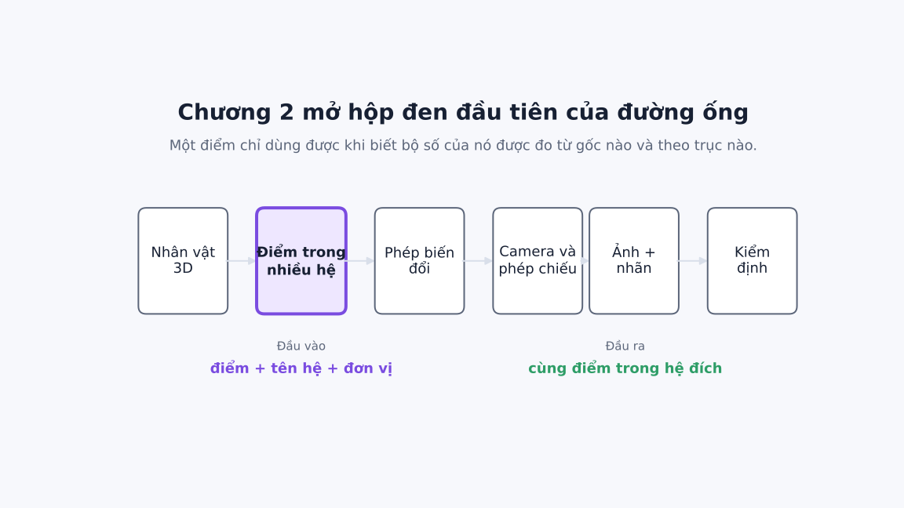
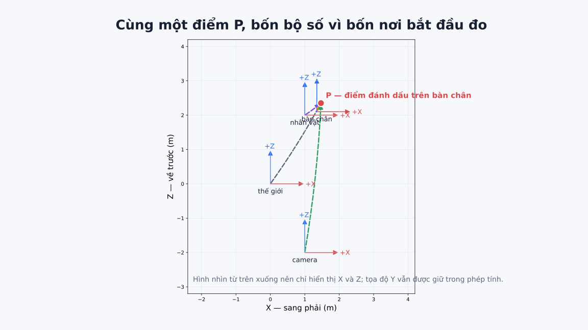
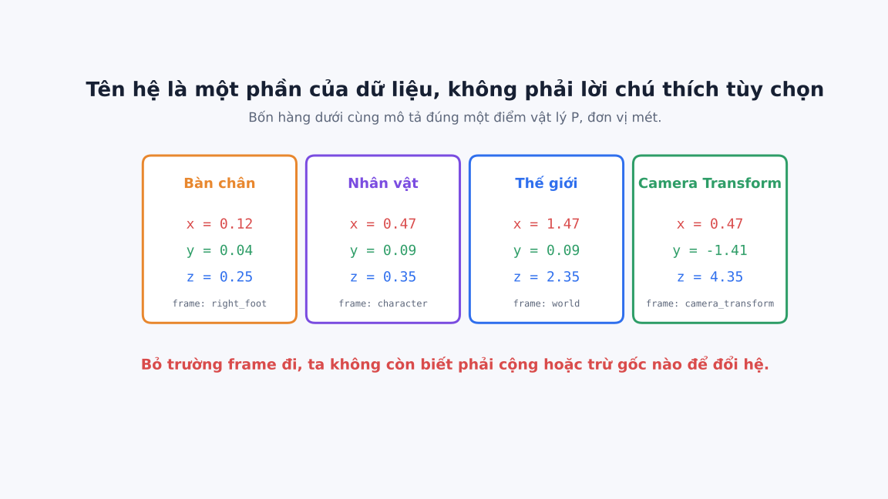
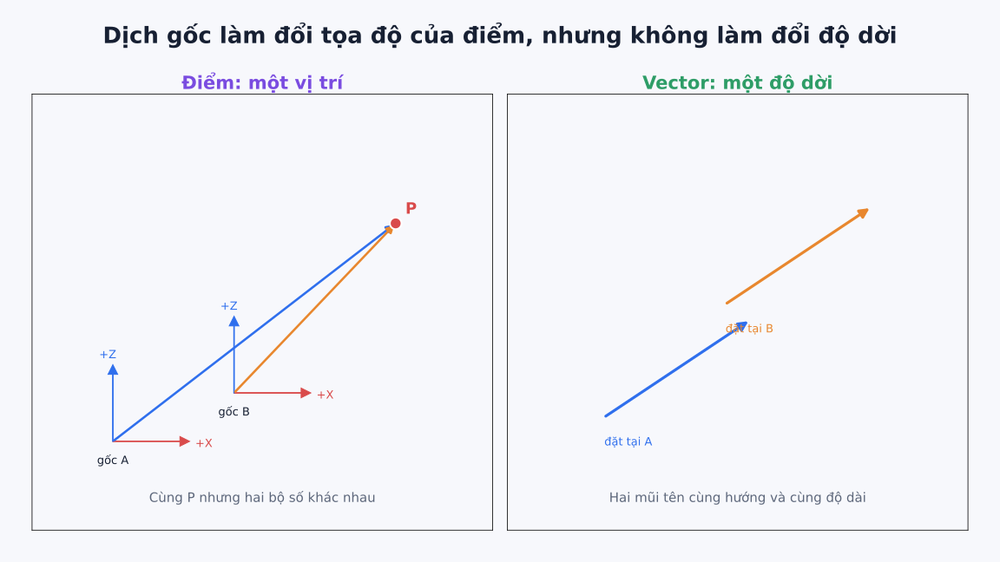
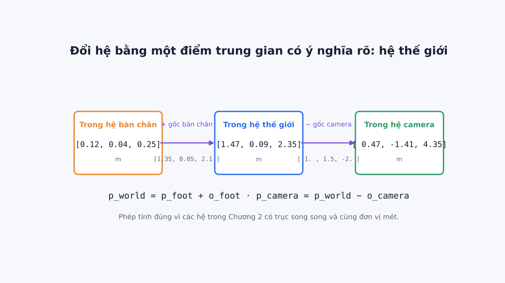
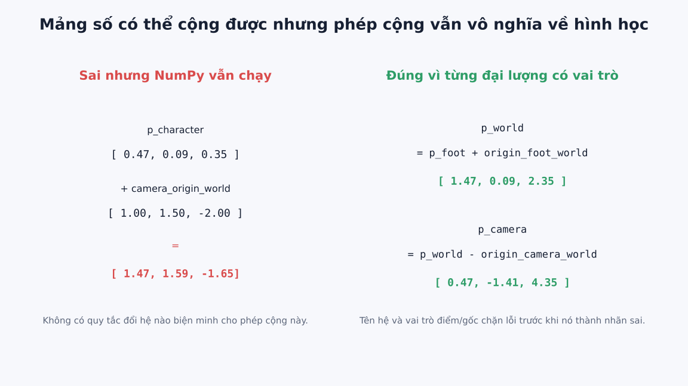
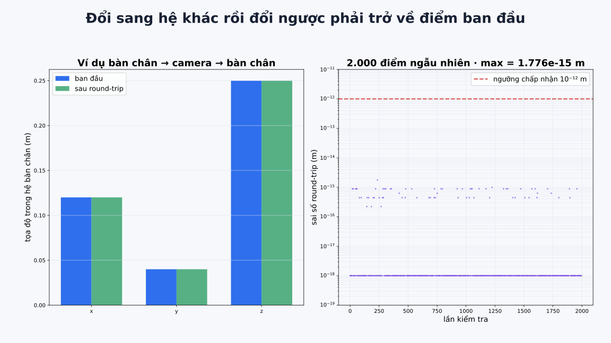
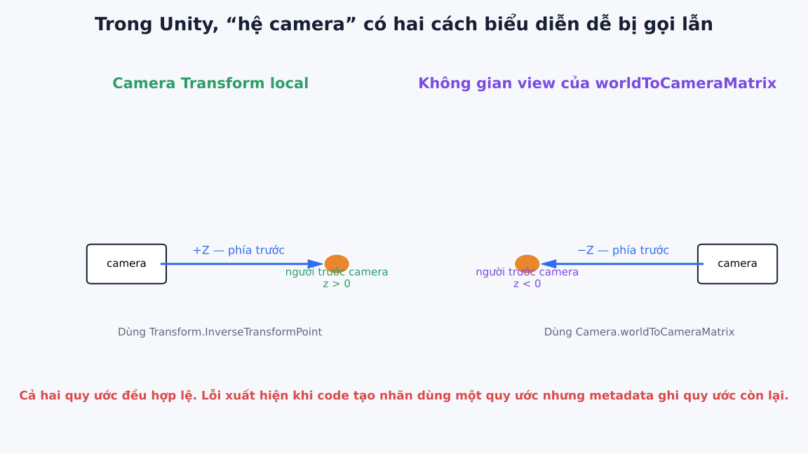

# Chương 2. Cùng một điểm cơ thể trong nhiều hệ tọa độ

> **Đầu ra cuối chương:** xây một mô-đun Python biểu diễn điểm bằng bốn thành phần bắt buộc — ba tọa độ, tên hệ tọa độ, đơn vị và vai trò điểm — rồi đổi điểm qua lại giữa hệ bàn chân, hệ nhân vật, hệ thế giới và hệ gắn với `Transform` của camera. Phép đổi đi rồi đổi ngược phải khôi phục điểm ban đầu trong sai số nhỏ hơn (10^{-12}) m. Mô-đun phải từ chối ít nhất một phép toán trộn hai hệ khác nhau.
>
> **Cần biết trước:** đọc được Python cơ bản, danh sách ba số và phép cộng trừ theo từng phần tử. Chương này không giả định người đọc đã biết đồ họa máy tính. Ta chỉ xét các hệ có trục song song, không quay và không đổi tỉ lệ; phép quay, tỉ lệ và ma trận được để sang Chương 3.

## 2.1 Ba con số chưa đủ để xác định một vị trí

Trong Chương 1, ta đã tạo một mẫu cho người đang dậm chân. Mẫu chứa ảnh, silhouette, điểm khớp và thông tin đi kèm. Bộ kiểm tra có thể phát hiện một tệp điểm bị dịch khỏi silhouette. Tuy nhiên, nó vẫn coi vị trí của mỗi điểm như ba con số đã có sẵn. Chương này mở hộp đen đầu tiên: ba con số đó thực sự có nghĩa gì?

Giả sử một điểm đánh dấu (P) nằm trên bàn chân phải. Một chương trình ghi:

```text
P = [0.12, 0.04, 0.25]
```

Ta chưa thể vẽ điểm này vào cảnh. Chưa đủ căn cứ để biết `0.12` được đo từ đâu, `0.04` đi theo hướng nào, đơn vị là mét hay centimet, và ba số có mô tả một vị trí hay một độ dời. Nếu một tệp khác ghi cùng điểm là `[1.47, 0.09, 2.35]`, hai tệp có mâu thuẫn không? Câu trả lời có thể là không: chúng có thể đo cùng một điểm từ hai nơi khác nhau.

Đây không phải lỗi chỉ xuất hiện trong bài tập toán. Trong bộ sinh dữ liệu người 3D, vị trí bàn chân có thể được lấy từ:

- `localPosition` của một `Transform`, tức là so với đối tượng cha trực tiếp;
- vị trí so với gốc của toàn nhân vật;
- vị trí trong cảnh thế giới;
- vị trí so với camera;
- hoặc một định dạng ngoài Unity dùng hướng trục và đơn vị khác.

Nếu chương trình chỉ lưu ba số mà bỏ nơi đo, một phép tính sai vẫn có thể chạy bình thường. Kết quả thậm chí có thể nằm trong khoảng số “trông hợp lý”, nên lỗi đi tiếp đến ảnh, nhãn 2D và quá trình huấn luyện. Mục tiêu của chương không phải ghi nhớ tên nhiều hệ. Mục tiêu là làm cho loại lỗi đó trở nên khó tạo ra và dễ kiểm tra.

Hình 2.1 đặt phần đang học vào toàn bộ đường ống. Ta chưa chiếu điểm lên ảnh và chưa tạo nhãn 2D. Đầu vào là một điểm đã mang tên hệ cùng đơn vị; đầu ra là cùng điểm đó nhưng được mô tả trong hệ đích.



*Hình 2.1 - Chương 2 xử lý ý nghĩa của một điểm trước khi Chương 3 ghép các phép biến đổi và Chương 5 chiếu điểm lên ảnh.*

Điều cần quan sát là khối **“Điểm trong nhiều hệ”** nằm trước camera và nhãn. Nếu tọa độ sai ngay tại đây, phép chiếu ở chương sau có thể hoàn toàn đúng về công thức nhưng vẫn cho nhãn sai. Một pipeline không thể sửa ý nghĩa đã bị mất từ đầu bằng cách thêm nhiều kiểm tra ở cuối.

## 2.2 Một nơi bắt đầu đo và ba hướng đo

Hãy tạm bỏ không gian ba chiều và tưởng tượng một tờ giấy kẻ ô. Ta chọn một điểm làm nơi bắt đầu đo. Từ điểm đó, ta chọn một hướng dương ngang và một hướng dương dọc. Muốn mô tả vị trí (P), ta nói phải đi bao xa theo từng hướng để đến (P).

Nơi bắt đầu đo được gọi là **gốc tọa độ** (*origin*). Mỗi hướng đo có chiều dương được gọi là một **trục tọa độ** (*coordinate axis*). Tập hợp gốc, các trục, hướng dương và đơn vị đo tạo thành một **hệ tọa độ** (*coordinate system*), trong chương này gọi ngắn là **hệ** khi không gây nhầm.

Trong không gian ba chiều, ta dùng ba trục (X), (Y) và (Z). Ba số ([x,y,z]) nói ta đi từ gốc bao nhiêu theo từng trục. Vì vậy, tọa độ không phải bản thân điểm vật lý. Nó là **cách biểu diễn điểm khi nhìn từ một hệ đã chọn**.

Hình 2.2 nhìn cảnh từ trên xuống và chỉ vẽ mặt phẳng (X)-(Z) để tránh hình 3D bị rối. Điểm đỏ (P) không di chuyển. Ta chỉ thay nơi bắt đầu đo: gốc thế giới, gốc nhân vật, gốc bàn chân hoặc gốc camera.



*Hình 2.2 - Bốn mũi tên nét đứt đều kết thúc tại cùng điểm (P). Chúng khác nhau vì bắt đầu ở bốn gốc khác nhau; trục (Y) bị ẩn khỏi hình nhưng vẫn có trong phép tính.*

Từ gốc bàn chân đến (P) chỉ là một đoạn ngắn. Từ gốc thế giới hoặc camera đến (P) dài hơn. Vì vậy, các bộ số khác nhau là điều phải xảy ra, không phải sai số. Sai chỉ xuất hiện khi ta lấy bộ số được đo từ gốc này nhưng lại xử lý như thể nó được đo từ gốc khác.

Một hệ tọa độ đầy đủ còn cần biết ba trục quay theo hướng nào so với các hệ khác. Trong Chương 2, ta cố ý chọn tất cả trục song song để tập trung vào tác động của việc đổi gốc. Khi hệ bị quay, ta không thể chỉ cộng hoặc trừ vị trí gốc; đó là vấn đề chính của Chương 3.

## 2.3 “Cục bộ” luôn phải trả lời: cục bộ so với ai?

Trong phần mềm 3D, từ **cục bộ** (*local*) thường có nghĩa là “được mô tả so với một đối tượng cha hoặc một khung tham chiếu gần nó”. Tuy nhiên, chỉ viết “tọa độ cục bộ” vẫn chưa đủ.

Một marker là con trực tiếp của bàn chân có thể dùng tọa độ cục bộ so với bàn chân. Bàn chân lại là con của cẳng chân. Cẳng chân là con của đùi. Toàn bộ chuỗi nằm dưới gốc nhân vật. Vì vậy, cùng từ `local` có thể chỉ những hệ khác nhau tùy đối tượng đang được hỏi.

Ta sẽ dùng bốn tên rõ ràng:

| Tên trong chương | Gốc đặt ở đâu? | Một câu hỏi mà hệ trả lời |
| --- | --- | --- |
| Hệ bàn chân `right_foot` | Gốc của bàn chân phải | Marker nằm ở đâu so với bàn chân? |
| Hệ nhân vật `character` | Gốc của toàn nhân vật | Bàn chân nằm ở đâu so với nhân vật? |
| Hệ thế giới `world` | Gốc chung của cảnh | Người và camera nằm ở đâu trong cùng cảnh? |
| Hệ camera `camera_transform` | Gốc của `Transform` camera | Điểm nằm đâu so với vị trí và các trục của camera? |

Tên `camera_transform` được viết dài có chủ đích. Trong Unity còn có một cách biểu diễn dùng `Camera.worldToCameraMatrix`, trong đó chiều nhìn về phía trước mang dấu (Z) ngược với `Transform` thông thường. Nếu cả hai đều được gọi mơ hồ là “camera space”, metadata có thể ghi một quy ước trong khi code dùng quy ước còn lại. Ta sẽ đối chiếu hai cách ở cuối chương.

Hình 2.3 trình bày bốn bộ tọa độ của cùng (P). Hãy đọc cả dòng `frame` bên dưới, không chỉ đọc ba số màu.



*Hình 2.3 - Cùng điểm (P) có bốn bộ tọa độ. Trường `frame` quyết định cách đổi mỗi bộ số sang hệ khác.*

Nếu bỏ `frame`, `[0.47, -1.41, 4.35]` chỉ còn là một mảng số. Ta không biết phải cộng gốc nào để đưa nó về thế giới, cũng không biết trục (Z) dương có thật sự là phía trước camera hay không. Vì vậy, tên hệ là dữ liệu bắt buộc trong mô-đun của chương, không phải chú thích để con người đọc cho đẹp.

## 2.4 Điểm và vector có thể cùng là ba số nhưng không cùng ý nghĩa

Ta cần tách thêm một nhầm lẫn trước khi viết công thức. Xét hai câu:

1. “Bàn chân đang ở vị trí nào?”
2. “Từ bàn chân này đi lên 20 cm theo hướng nào?”

Câu thứ nhất hỏi một nơi trong không gian. Ta gọi đối tượng toán học đó là **điểm** (*point*). Câu thứ hai hỏi một độ dời có hướng và độ lớn. Ta gọi nó là **vector**. Trong code, cả hai có thể được lưu bằng ba số, nhưng các phép toán hợp lệ khác nhau.

| Phép toán | Kết quả | Có ý nghĩa không? |
| --- | --- | --- |
| điểm + vector | điểm mới | Có: di chuyển điểm theo một độ dời |
| điểm − điểm | vector | Có: độ dời từ điểm thứ hai đến điểm thứ nhất |
| vector + vector | vector | Có: ghép hai độ dời |
| điểm + điểm | không được định nghĩa trong mô hình này | Không: đang cộng hai nơi chốn mà không nêu quy tắc |

Hình 2.4 cho thấy vì sao dịch gốc ảnh hưởng đến điểm nhưng không ảnh hưởng đến bản thân độ dời khi các trục vẫn song song. Ở ô trái, cùng (P) được nối từ hai gốc nên hai bộ tọa độ khác nhau. Ở ô phải, cùng mũi tên độ dời được đặt tại hai nơi; hướng và độ dài của nó không đổi.



*Hình 2.4 - Tọa độ điểm phụ thuộc vào gốc. Một vector biểu diễn độ dời không nhận thêm vị trí gốc khi các trục chỉ tịnh tiến.*

Trong chương này, từ **tịnh tiến** (*translation*) có nghĩa là dời gốc sang vị trí khác mà không quay trục và không thay đổi tỉ lệ. Với tịnh tiến, điểm cần cộng hoặc trừ vị trí gốc. Vector không cộng vị trí gốc, vì một độ dời không phải một nơi chốn.

Đây là lý do tài liệu chính thức của Unity tách `TransformPoint` khỏi `TransformDirection`: điểm và hướng không phải cùng một loại đại lượng, dù cả hai cùng được lưu bằng `Vector3`. Tên lớp `Vector3` trong API là kiểu chứa ba số; nó không tự bảo đảm ý nghĩa hình học của dữ liệu bên trong.

## 2.5 Quy ước của Chương 2

Trước khi tính, ta phải chốt quy ước. Đây là lựa chọn thiết kế của chương để tạo một ví dụ nhỏ có thể kiểm tra, không phải tuyên bố rằng mọi công cụ đều dùng quy ước này.

### 2.5.1 Hướng trục

Ta dùng quy ước thông thường của `Transform` trong Unity:

- (+X): sang phải;
- (+Y): hướng lên;
- (+Z): hướng về phía trước.

[Tài liệu Unity 6 về phép quay](https://docs.unity3d.com/6000.5/Documentation/Manual/class-Quaternion.html) gọi đây là một hệ tay trái. **Tính tay** (*handedness*) mô tả quan hệ định hướng giữa ba trục, đặc biệt ảnh hưởng đến chiều quay và phép tích có hướng. Chương 2 chưa dùng phép quay hay tích có hướng, nên chỉ cần ghi quy ước để dữ liệu không mơ hồ. Chương 3 sẽ cho thấy dấu sai xuất hiện thế nào khi chuyển giữa hệ tay trái và hệ tay phải.

### 2.5.2 Đơn vị

Ta chọn một đơn vị trong cảnh bằng một mét và lưu `unit: "m"`. Đây là quy ước của dự án. Nếu một asset được nhập theo centimet, phải đổi về mét trước khi đi vào mô-đun này hoặc ghi một phép đổi đơn vị rõ ràng. Không được đổi ngầm dựa trên phỏng đoán.

### 2.5.3 Cách viết bộ số

Trong công thức, tọa độ được viết thành một cột ba số:

$$
\begin{bmatrix}
x \\
y \\
z
\end{bmatrix}.
$$

Trong Python và JSON, ta lưu cùng thứ tự dưới dạng mảng một chiều `(3,)`, ví dụ `[x, y, z]`. NumPy không phân biệt vector hàng và vector cột đối với mảng một chiều. Chương này chỉ cộng trừ từng phần tử nên chưa gây khác biệt; khi nhân ma trận ở Chương 3, chiều nhân sẽ phải được khai báo lại rõ ràng.

### 2.5.4 Phạm vi cố ý bị giới hạn

Tất cả bốn hệ của ví dụ có:

- các trục song song và cùng hướng;
- cùng đơn vị mét;
- tỉ lệ bằng một;
- tọa độ hữu hạn, không chứa `NaN` hoặc vô cực.

Trong đó `NaN` là giá trị số đặc biệt biểu thị “không phải một số”, thường xuất hiện khi phép tính không hợp lệ. Một mảng chứa `NaN` có thể lan truyền qua nhiều phép tính mà không làm chương trình dừng, nên mô-đun phải từ chối từ đầu.

Nếu bất kỳ hệ nào quay hoặc có tỉ lệ khác một, công thức tịnh tiến của chương không còn đủ. Ta không “vá” trường hợp đó bằng cách thêm dấu tùy ý; ta chuyển sang mô hình phép biến đổi đầy đủ ở Chương 3.

## 2.6 Ví dụ xuyên suốt: một marker trên bàn chân phải

Ta đặt các gốc trong hệ thế giới như sau:

| Hệ | Vị trí gốc trong hệ thế giới, đơn vị mét |
| --- | --- |
| `world` | `[0.00, 0.00, 0.00]` |
| `character` | `[1.00, 0.00, 2.00]` |
| `right_foot` | `[1.35, 0.05, 2.10]` |
| `camera_transform` | `[1.00, 1.50, -2.00]` |

Marker (P) nằm tại:

$$
{}^{F}\mathbf{p}
=
\begin{bmatrix}
0.12 \\
0.04 \\
0.25
\end{bmatrix}
\text{ m}
$$

trong hệ bàn chân (F). Ký hiệu nhỏ ở trên bên trái cho biết **tọa độ đang được biểu diễn trong hệ nào**. Vì vậy, ({}^{F}\mathbf{p}) không phải một điểm khác với ({}^{W}\mathbf{p}); hai ký hiệu là hai cách ghi cùng điểm (P).

Ta ký hiệu vị trí gốc của hệ (F) khi nhìn từ hệ thế giới (W) là:

$$
{}^{W}\mathbf{o}_{F}
=
\begin{bmatrix}
1.35 \\
0.05 \\
2.10
\end{bmatrix}
\text{ m}.
$$

Chữ (mathbf{o}) nhắc rằng đây là một gốc; chỉ số dưới (F) nói gốc của hệ nào; ký hiệu trên (W) nói bộ số được đo trong hệ thế giới.

### 2.6.1 Từ bàn chân sang thế giới

Muốn biết (P) trong thế giới, ta đi từ gốc thế giới đến gốc bàn chân, rồi đi thêm đoạn từ gốc bàn chân đến (P):

$$
{}^{W}\mathbf{p}
=
{}^{W}\mathbf{o}_{F}
+
{}^{F}\mathbf{p}.
$$

Thay số:

$$
{}^{W}\mathbf{p}
=
\begin{bmatrix}
1.35 \\
0.05 \\
2.10
\end{bmatrix}
+
\begin{bmatrix}
0.12 \\
0.04 \\
0.25
\end{bmatrix}
=
\begin{bmatrix}
1.47 \\
0.09 \\
2.35
\end{bmatrix}
\text{ m}.
$$

Kiểm tra nhanh theo từng trục:

- (X): gốc bàn chân ở bên phải gốc thế giới (1.35) m; marker còn lệch phải (0.12) m, nên tổng là (1.47) m.
- (Y): gốc bàn chân cao (0.05) m; marker cao thêm (0.04) m, nên tổng là (0.09) m.
- (Z): gốc bàn chân ở trước (2.10) m; marker ở trước thêm (0.25) m, nên tổng là (2.35) m.

Đơn vị ở hai vế đều là mét. Nếu một số hạng là centimet, phép cộng về mặt phần mềm vẫn chạy nhưng kết quả không còn cùng đơn vị; đó là một ca sai mà kiểu `float` không tự bắt được.

### 2.6.2 Từ thế giới sang nhân vật

Gốc nhân vật có tọa độ thế giới:

$$
{}^{W}\mathbf{o}_{C}
=
\begin{bmatrix}
1.00 \\
0.00 \\
2.00
\end{bmatrix}
\text{ m}.
$$

Để mô tả (P) từ gốc nhân vật, ta lấy tọa độ thế giới của (P) trừ vị trí gốc nhân vật:

$$
{}^{C}\mathbf{p}
=
{}^{W}\mathbf{p}
-
{}^{W}\mathbf{o}_{C}
=
\begin{bmatrix}
1.47 \\
0.09 \\
2.35
\end{bmatrix}
-
\begin{bmatrix}
1.00 \\
0.00 \\
2.00
\end{bmatrix}
=
\begin{bmatrix}
0.47 \\
0.09 \\
0.35
\end{bmatrix}
\text{ m}.
$$

Kết quả nói marker nằm bên phải gốc nhân vật (0.47) m, cao hơn (0.09) m và ở trước (0.35) m. Ta không cần biết gốc thế giới nằm ở đâu để hiểu quan hệ nội bộ giữa nhân vật và marker, nhưng cần hệ thế giới làm nơi trung gian khi nhiều đối tượng độc lập phải chia sẻ cùng cảnh.

### 2.6.3 Từ thế giới sang camera

Gốc camera có tọa độ thế giới:

$$
{}^{W}\mathbf{o}_{K}
=
\begin{bmatrix}
1.00 \\
1.50 \\
-2.00
\end{bmatrix}
\text{ m}.
$$

Trong ví dụ, trục camera được giữ song song với trục thế giới và dùng (+Z) là phía trước theo `Transform` của Unity. Ta tính:

$$
{}^{K}\mathbf{p}
=
{}^{W}\mathbf{p}
-
{}^{W}\mathbf{o}_{K}
=
\begin{bmatrix}
1.47 \\
0.09 \\
2.35
\end{bmatrix}
-
\begin{bmatrix}
1.00 \\
1.50 \\
-2.00
\end{bmatrix}
=
\begin{bmatrix}
0.47 \\
-1.41 \\
4.35
\end{bmatrix}
\text{ m}.
$$

Ở đây (Y=-1.41) m nghĩa là marker thấp hơn camera. (Z=4.35) m nghĩa là marker nằm phía trước camera theo quy ước `Transform` đang dùng. Ta chưa thể suy ra marker trở thành pixel nào; việc đó còn cần hướng quay camera, mô hình chiếu và thông số ảnh ở các chương sau.

Hình 2.5 gom hai bước đổi hệ vào một chuỗi. Hệ thế giới không phải hệ “đúng hơn” về mặt vật lý. Nó hữu ích vì các gốc khác đều đã được khai báo trong cùng hệ này.



*Hình 2.5 - Cộng vị trí gốc nguồn để đi về thế giới, sau đó trừ vị trí gốc đích để đi vào hệ đích.*

Điểm quan trọng không phải học thuộc “cộng rồi trừ”. Ta phải biết mỗi số hạng đại diện cho gì. Nếu hệ có quay, ({}^{F}\mathbf{p}) không thể cộng trực tiếp với ({}^{W}\mathbf{o}_{F}) trước khi đổi hướng trục. Công thức hiện tại đúng vì ta đã nêu rõ điều kiện trục song song.

## 2.7 Công thức tổng quát cho các hệ chỉ lệch gốc

Giả sử điểm (P) đang được biểu diễn trong hệ nguồn (A), và ta muốn đổi sang hệ đích (B). Vị trí hai gốc trong thế giới lần lượt là ({}^{W}\mathbf{o}_{A}) và ({}^{W}\mathbf{o}_{B}).

Trước hết đi từ hệ nguồn về thế giới:

$$
{}^{W}\mathbf{p}
=
{}^{W}\mathbf{o}_{A}
+
{}^{A}\mathbf{p}.
$$

Sau đó đi từ thế giới sang hệ đích:

$$
{}^{B}\mathbf{p}
=
{}^{W}\mathbf{p}
-
{}^{W}\mathbf{o}_{B}.
$$

Ghép hai bước:

$$
{}^{B}\mathbf{p}
=
{}^{A}\mathbf{p}
+
{}^{W}\mathbf{o}_{A}
-
{}^{W}\mathbf{o}_{B}.
$$

Mỗi đại lượng là một cột ba số, nên kích thước hai vế đều là (3\times1). Mọi số hạng đều dùng mét. Phép tính chỉ hợp lệ khi trục của (A), (B) và (W) song song, cùng hướng và cùng tỉ lệ.

### 2.7.1 Kiểm tra đổi ngược

Một phép đổi hệ đáng tin phải có phép kiểm tra ngược. Đổi từ (A) sang (B), rồi dùng cùng quy tắc đổi từ (B) về (A):

$$
{}^{A}\widehat{\mathbf{p}}
=
{}^{B}\mathbf{p}
+
{}^{W}\mathbf{o}_{B}
-
{}^{W}\mathbf{o}_{A}.
$$

Dấu mũ trên (widehat{\mathbf{p}}) chỉ giá trị được khôi phục bằng tính toán. Nếu mọi thứ đúng, ({}^{A}\widehat{\mathbf{p}}) phải bằng ({}^{A}\mathbf{p}), ngoại trừ sai số rất nhỏ do máy tính lưu số thực hữu hạn.

Ta đo sai số bằng độ dài của hiệu:

$$
e
=
\left\|
{}^{A}\widehat{\mathbf{p}}
-
{}^{A}\mathbf{p}
\right\|_2.
$$

Ký hiệu (|\cdot\|_2) nghĩa là độ dài Euclid của vector ba chiều. Nếu hiệu là ([d_x,d_y,d_z]), ta tính:

$$
e = \sqrt{d_x^2+d_y^2+d_z^2}.
$$

Với ví dụ bàn chân (
ightarrow) camera (
ightarrow) bàn chân, code cho (e=4.641\times10^{-16}) m. Đây không phải sai lệch có ý nghĩa trong cảnh; nó là sai số số học nhỏ hơn rất nhiều ngưỡng (10^{-12}) m mà chương chọn.

Ngưỡng (10^{-12}) m là lựa chọn kiểm thử cho phép cộng trừ `float64` trong NumPy, không phải yêu cầu đo đạc thực tế. Trong Unity, `Vector3` thường dùng `float` 32 bit và sai số có thể lớn hơn; đoạn C# cuối chương dùng ngưỡng (10^{-5}) m. Ngưỡng phải phù hợp kiểu số, độ lớn tọa độ và mục tiêu kiểm tra.

## 2.8 Ca sai bắt buộc: mảng số không biết nó thuộc hệ nào

NumPy có thể cộng hai mảng cùng kích thước:

```python
import numpy as np

p_character = np.array([0.47, 0.09, 0.35])
camera_origin_world = np.array([1.00, 1.50, -2.00])
wrong = p_character + camera_origin_world

print(wrong)
# [ 1.47  1.59 -1.65]
```

Chương trình không báo lỗi vì về mặt dữ liệu thô, đây chỉ là phép cộng hai mảng `(3,)`. Nhưng một mảng là tọa độ điểm trong hệ nhân vật; mảng còn lại là vị trí gốc camera trong hệ thế giới. Không có chuỗi đổi hệ nào biện minh cho phép cộng đó.

Hình 2.6 đặt phép cộng sai cạnh phép đổi đúng. Kết quả sai vẫn gồm ba số hữu hạn, không quá lớn và không chứa dấu hiệu kỹ thuật bất thường. Vì vậy, chỉ kiểm tra “có ba số” hoặc “không có `NaN`” không đủ.



*Hình 2.6 - NumPy thực hiện đúng phép cộng số học được yêu cầu, nhưng chương trình của người dùng đã yêu cầu một phép toán không có nghĩa hình học.*

Đây là ranh giới giữa **đúng về số học** và **đúng về mô hình**. Thư viện số học không biết quy ước dữ liệu của dự án. Ta phải đưa tên hệ, đơn vị và vai trò điểm/vector vào cấu trúc dữ liệu hoặc vào các kiểm tra bao quanh thư viện.

Một lỗi khác dễ gặp là cộng hai điểm. Ví dụ, “vị trí bàn chân + vị trí camera” không tự tạo ra một vị trí có nghĩa. Muốn tìm độ dời từ camera đến bàn chân, phải đổi cả hai điểm về cùng hệ rồi lấy **bàn chân trừ camera**. Thứ tự trừ xác định hướng của vector.

## 2.9 Triển khai tối thiểu có tên hệ và đơn vị

Mã đầy đủ nằm trong `code/chapter_02_coordinate_frames.py`. Phần cốt lõi dùng ba cấu trúc:

- `Frame3D`: tên hệ và vị trí gốc của nó trong thế giới;
- `Point3D`: ba tọa độ, tên hệ và đơn vị;
- `Vector3D`: ba thành phần độ dời, tên hệ và đơn vị.

Trong chương này, `xyz` có hình dạng `(3,)`; thứ tự là (x,y,z). `frames` là một bảng tra cứu từ tên hệ đến `Frame3D`.

### 2.9.1 Chặn đầu vào không hợp lệ

Hàm `_xyz` biến đầu vào thành mảng `float64`, sau đó kiểm tra hình dạng và giá trị hữu hạn:

```python
def _xyz(values):
    array = np.asarray(values, dtype=np.float64)
    if array.shape != (3,):
        raise ValueError(f"expected shape (3,), got {array.shape}")
    if not np.isfinite(array).all():
        raise ValueError("coordinates must be finite")
    return array.copy()
```

Kiểm tra này bắt mảng thiếu trục, thừa trục, `NaN` và vô cực. Nó chưa biết điểm có hợp lý đối với cơ thể người hay không; chẳng hạn chân cao 100 m vẫn là số hữu hạn. Kiểm tra hình học và phân bố mạnh hơn sẽ xuất hiện ở Phần VII.

### 2.9.2 Đổi điểm qua hệ thế giới

Hàm chính phản ánh đúng hai bước trong Hình 2.5:

```python
def convert_point(point, destination, frames):
    if point.frame not in frames:
        raise KeyError(f"unknown source frame: {point.frame}")
    if destination not in frames:
        raise KeyError(f"unknown destination frame: {destination}")

    source = frames[point.frame]
    target = frames[destination]
    if point.unit != source.unit or source.unit != target.unit:
        raise ValueError("point and frames must use the same unit")

    point_world = point.xyz + source.origin_in_world_m
    point_destination = point_world - target.origin_in_world_m
    return Point3D(point_destination, destination, point.unit)
```

Hàm không nhận trực tiếp hai mảng trần. Nó cần một `Point3D`, nên luôn đọc được tên hệ nguồn. Hệ đích phải tồn tại trong bảng. Đơn vị của điểm, hệ nguồn và hệ đích phải giống nhau.

Giới hạn vẫn được viết ngay trong mô tả lớp `Frame3D`: đây là hệ chỉ tịnh tiến. Nếu ai đó đưa một hệ đã quay nhưng chỉ ghi vị trí gốc, code vẫn không thể biết dữ liệu thiếu. Chương 3 sẽ thay cấu trúc này bằng phép biến đổi có cả hướng quay và tỉ lệ.

### 2.9.3 Chỉ cộng điểm với độ dời cùng hệ

Hàm di chuyển điểm kiểm tra tên hệ trước khi cộng:

```python
def translate_point(point, displacement):
    if point.frame != displacement.frame:
        raise ValueError(
            f"cannot combine frame {point.frame!r} "
            f"with {displacement.frame!r}"
        )
    if point.unit != displacement.unit:
        raise ValueError("point and displacement must use the same unit")
    return Point3D(
        point.xyz + displacement.xyz,
        point.frame,
        point.unit,
    )
```

Nếu muốn nâng điểm thế giới lên (0.20) m, ta tạo `Vector3D([0.0, 0.2, 0.0], "world")`. Nếu vô tình dùng điểm trong hệ bàn chân với vector trong hệ thế giới, hàm từ chối thay vì âm thầm cộng.

Đây chưa phải hệ kiểu hoàn hảo. Người dùng vẫn có thể lấy `.xyz` ra rồi tự cộng sai. Mục tiêu là tạo một đường dùng đúng rõ ràng và một chỗ tập trung để kiểm tra, không khẳng định Python có thể ngăn mọi hành vi sai.

## 2.10 Thí nghiệm: đổi hệ rồi đổi ngược trên 2.000 điểm

Một ví dụ tính tay chỉ kiểm tra một trường hợp. Để tìm lỗi dấu hoặc lỗi dùng nhầm gốc, chương trình tạo 2.000 điểm ngẫu nhiên trong khoảng ([-10,10]) m trên mỗi trục. Với mỗi điểm:

1. chọn ngẫu nhiên hệ nguồn và hệ đích;
2. đổi điểm từ nguồn sang đích;
3. đổi kết quả ngược về nguồn;
4. đo độ dài hiệu so với điểm ban đầu;
5. yêu cầu sai số nhỏ hơn (10^{-12}) m.

Seed được cố định là `20260829`, nên lần chạy lại dùng cùng dãy trường hợp. Seed giúp tái tạo phép thử trong cùng môi trường; nó không tự bảo đảm tái tạo giữa mọi phiên bản thư viện và phần cứng.

Lần chạy đã kiểm tra dùng Python `3.12.13`, NumPy `2.3.5` và Matplotlib `3.10.8`. NumPy thực hiện phép tính; Matplotlib chỉ tạo hình. Các phiên bản này được ghi để có thể điều tra nếu output số hoặc cách kết xuất hình thay đổi ở môi trường khác.

Hình 2.7 cho thấy cả ví dụ cụ thể và toàn bộ phép thử. Hai cột tọa độ bên trái chồng khít. Các điểm sai số bên phải đều thấp hơn đường đỏ biểu diễn ngưỡng.



*Hình 2.7 - Sai số lớn nhất trong 2.000 phép đổi đi–về là (1.776\times10^{-15}) m, thấp hơn ngưỡng (10^{-12}) m.*

Một số phép thử có sai số đúng bằng 0, nhất là khi hệ nguồn và hệ đích trùng nhau hoặc các phép cộng trừ triệt tiêu chính xác trong biểu diễn nhị phân. Trên đồ thị logarit, code hiển thị các số 0 ở mức (10^{-18}) chỉ để chúng nhìn thấy được. Đây là quy ước hiển thị; tệp CSV vẫn lưu giá trị thật.

Lần chạy dùng để tạo chương cho output:

```text
PASS four named coordinate frames use metres and parallel Unity-style axes
PASS the foot marker matches all four hand-calculated coordinates
PASS foot -> camera -> foot error = 4.641e-16 m
PASS mixed-frame point/vector operation was rejected
PASS NaN and unknown-frame inputs were rejected
PASS 2000 random round-trips; max error = 1.776e-15 m < 1.000e-12 m
PASS generated 8 chapter figures at 1600x900
CHAPTER_02_COORDINATE_FRAMES_OK
```

Dòng cuối chỉ xuất hiện khi toàn bộ phép kiểm tra trước đó đã qua. Báo cáo có cấu trúc được lưu tại `demo-output/chapter_02_report.json`; sai số từng lần nằm trong `demo-output/round_trip_errors.csv`.

Kết quả này chứng minh hàm tịnh tiến được triển khai nhất quán với ví dụ của chương. Nó không chứng minh code xử lý đúng hệ quay, scale khác một, camera render hoặc rig thực tế trong Unity.

## 2.11 Đối chiếu với Unity mà không để API che mất ý nghĩa

[Tài liệu `Transform.TransformPoint` của Unity 6](https://docs.unity3d.com/6000.5/Documentation/ScriptReference/Transform.TransformPoint.html) cung cấp các phép đổi điểm giữa hệ cục bộ và hệ thế giới:

- `Transform.TransformPoint`: từ cục bộ của `Transform` sang thế giới;
- `Transform.InverseTransformPoint`: từ thế giới về cục bộ của `Transform`;
- thuộc tính `Transform.position`: vị trí thế giới;
- thuộc tính `Transform.localPosition`: vị trí so với đối tượng cha trực tiếp.

Đoạn `code/Chapter02CoordinateCheck.cs` dùng một marker là con trực tiếp của bàn chân. Nếu marker không phải con trực tiếp, `footMarker.localPosition` sẽ được đo so với đối tượng cha khác và tên “hệ bàn chân” trở thành sai.

Phần chính của script:

```csharp
Vector3 pointInFoot = footMarker.localPosition;
Vector3 pointInWorld = footMarker.position;

Vector3 pointInCharacter =
    characterRoot.InverseTransformPoint(pointInWorld);

Vector3 pointInCameraTransform =
    captureCamera.transform.InverseTransformPoint(pointInWorld);

Vector3 recoveredWorld =
    characterRoot.TransformPoint(pointInCharacter);

float roundTripError =
    Vector3.Distance(pointInWorld, recoveredWorld);
```

`pointInCharacter` không được lấy bằng `footMarker.localPosition`, vì marker không nhất thiết là con trực tiếp của `characterRoot`. Ta đi qua tọa độ thế giới để hỏi rõ: “Điểm thế giới này có tọa độ bao nhiêu khi nhìn từ gốc nhân vật?”

Script kiểm tra `roundTripError <= 1e-5f`. Ngưỡng lớn hơn bản NumPy vì `Vector3` dùng số thực 32 bit, trong khi bản Python dùng `float64`. Nếu cảnh có tọa độ rất lớn, sai số tuyệt đối có thể tăng; khi đó cần kiểm tra cả quy mô cảnh thay vì chỉ nới ngưỡng để test qua.

### 2.11.1 Một Unity unit có phải luôn là một mét không?

Unity không gắn một nhãn đơn vị vật lý vào mọi tọa độ trong scene. Dự án thường chọn quy ước một unit bằng một mét để tương thích kích thước nhân vật và mô phỏng vật lý, nhưng asset có thể được nhập với hệ số khác. Vì vậy, metadata của dataset phải ghi đơn vị theo **quy ước dự án đã kiểm tra**, không suy ra chỉ từ việc giá trị đến từ `Vector3`.

Trong mini-lab, ta yêu cầu scale của `characterRoot`, bàn chân và camera đều là `(1,1,1)`. Tài liệu Unity ghi `TransformPoint` bị ảnh hưởng bởi scale. Nếu một cha có scale khác một, công thức cộng trừ gốc của Chương 2 không còn tương đương đầy đủ với API. Đây là lý do phép tỉ lệ không được giấu trong một lưu ý nhỏ; nó là phần của Chương 3.

### 2.11.2 Đoạn C# đã được kiểm thử đến đâu?

Môi trường tạo chương không có Unity Editor và `UnityEngine`, nên đoạn C# chưa được biên dịch hoặc chạy trong scene thật ở đây. Bản Python, dữ liệu số, tám hình và các phép kiểm tra đã được chạy. Khi đưa C# vào dự án Unity, cổng hoàn thành yêu cầu gắn đúng ba tham chiếu, chạy scene và lưu Console log có sai số round-trip.

Việc ghi rõ giới hạn này quan trọng hơn một tuyên bố “code chắc chắn chạy”. API được dùng theo tài liệu Unity 6, nhưng prefab, hierarchy, scale và phiên bản dự án của người đọc vẫn là dữ kiện cần kiểm tra tại chỗ.

## 2.12 Hai “hệ camera” trong Unity không dùng cùng dấu (Z)

Một người đứng trước camera thường có (Z>0) khi ta gọi:

```csharp
captureCamera.transform.InverseTransformPoint(pointInWorld)
```

Đây là hệ cục bộ của `Transform` camera, dùng (+Z) là phía trước như các `Transform` khác trong Unity.

Tuy nhiên, [tài liệu `Camera.worldToCameraMatrix`](https://docs.unity3d.com/6000.5/Documentation/ScriptReference/Camera-worldToCameraMatrix.html) nói không gian camera dùng bởi ma trận này theo quy ước kiểu OpenGL: phía trước camera là `-Z`. Vì vậy, cùng điểm trước camera có thể cho `Z < 0` khi ta gọi:

```csharp
Vector3 pointInView =
    captureCamera.worldToCameraMatrix.MultiplyPoint(pointInWorld);
```

Hình 2.8 đặt hai quy ước cạnh nhau. Hai kết quả không mâu thuẫn; chúng dùng hai cách đặt trục khác nhau.



*Hình 2.8 - Hệ cục bộ của Camera Transform dùng (+Z) phía trước, trong khi `worldToCameraMatrix` dùng (-Z) phía trước.*

Lỗi xảy ra khi code tạo nhãn dùng `worldToCameraMatrix` nhưng metadata chỉ ghi `frame: "camera"` và người đọc sau đó giả định (+Z) phía trước. Cách phòng tránh là đặt tên đủ cụ thể, chẳng hạn:

```json
{
  "frame": "camera_view_unity_opengl_convention",
  "forward_axis": "-Z",
  "up_axis": "+Y",
  "right_axis": "+X",
  "unit": "m"
}
```

Tên dài hơn nhưng rẻ hơn việc phát hiện sau khi hàng triệu nhãn 3D đã được xuất. Ở Chương 5, ta sẽ chọn một biểu diễn camera chuẩn cho pipeline chiếu ảnh và viết test đối chiếu với Unity.

## 2.13 Trường hợp biên và bẫy thường gặp

### 2.13.1 Hệ nguồn và hệ đích là một

Nếu `source == destination`, điểm phải giữ nguyên. Hàm hiện tại đi qua thế giới rồi trừ lại cùng gốc. Kết quả có thể bằng chính xác hoặc lệch ở mức số học rất nhỏ. Đây là ca hợp lệ, không phải lý do báo lỗi.

Một phiên bản tối ưu có thể trả lại bản sao ngay khi hai hệ trùng nhau. Tuy nhiên, tối ưu đó không được thay đổi tên hệ, đơn vị hoặc bỏ kiểm tra đầu vào.

### 2.13.2 Hai hệ có cùng gốc

Hai hệ có thể cùng gốc nhưng khác hướng trục. Trong phạm vi Chương 2, các trục bị giả định song song nên chúng sẽ cho cùng tọa độ. Ngoài phạm vi này, cùng gốc **không đủ** để kết luận cùng hệ. Chương 3 sẽ thêm hướng quay vào mô tả.

### 2.13.3 Centimet bị ghi như mét

Điểm `[12, 4, 25]` cm và `[0.12, 0.04, 0.25]` m là cùng một vị trí tương đối. Nếu tệp ghi `unit: "m"` cho bộ số centimet, kiểm tra “đơn vị hai bên giống nhau” vẫn cho qua vì metadata đã sai từ nguồn. Cần kiểm tra thêm kích thước hợp lý của cơ thể hoặc đối chiếu với asset khi nhập.

### 2.13.4 `localPosition` so với cha trực tiếp, không phải gốc tùy chọn

Trong hierarchy sâu, `rightFoot.localPosition` thường là vị trí bàn chân so với khớp cha, không phải so với gốc nhân vật. Muốn tọa độ trong hệ nhân vật, dùng `characterRoot.InverseTransformPoint(rightFoot.position)` hoặc phép biến đổi tương đương.

### 2.13.5 Scale âm hoặc scale không đều

Scale âm có thể đảo một trục; scale không đều làm độ dài theo mỗi trục thay đổi khác nhau. Cả hai phá giả định của Chương 2. Không được so sánh bản cộng trừ gốc với `TransformPoint` trong một hierarchy như vậy rồi kết luận NumPy sai. Mô hình NumPy đang thiếu thông tin scale.

### 2.13.6 Camera đã quay nhưng ví dụ vẫn trừ vị trí

Trong scene thật, camera thường hướng vào nhân vật. Chỉ lấy `pointWorld - cameraPosition` vẫn cho một vector trong hướng trục thế giới, không phải tọa độ theo trục camera đã quay. Ví dụ chương giữ camera song song để tách riêng tác động của gốc. Dùng công thức đó cho camera quay là lỗi phạm vi, không phải xấp xỉ chấp nhận được.

### 2.13.7 Tọa độ quá lớn

Số thực 32 bit mất dần độ chính xác khi giá trị tuyệt đối tăng. Một marker nhỏ trên bàn chân có thể dao động hoặc sai round-trip nếu cảnh được đặt rất xa gốc thế giới. Với dataset người trong một khu vực nhỏ, ta nên giữ quy mô và gốc hợp lý; nếu cần tọa độ địa lý lớn, phải thiết kế lại cách biểu diễn và ngưỡng kiểm tra.

### 2.13.8 Đổi trái/phải không phải lỗi hệ tọa độ duy nhất

Một điểm `left_ankle` bị gắn nhầm tên `right_ankle` có thể vẫn đổi hệ hoàn hảo và round-trip bằng 0. Test chương chỉ kiểm tra phép đổi tọa độ, không kiểm tra lược đồ khớp. Ánh xạ tên và cấu trúc bộ xương được xử lý ở Chương 4 và Chương 9.

### 2.13.9 Round-trip có thể qua dù cả hai chiều cùng sai

Nếu hàm đi và hàm về dùng cùng một quy ước sai đối xứng, chúng có thể triệt tiêu nhau và cho sai số 0. Vì vậy, round-trip là điều kiện cần nhưng chưa đủ. Chương còn đối chiếu với ví dụ tính tay có giá trị tuyệt đối đã biết. Trong hệ thống thật, cần thêm “mẫu vàng” từ engine hoặc một nguồn độc lập.

## 2.14 Chương này đã chứng minh điều gì và chưa chứng minh điều gì?

### Đã được kiểm chứng trong môi trường của chương

- Bốn hệ có tên, gốc thế giới và cùng đơn vị mét được tạo thành công.
- Marker bàn chân khớp với bốn bộ tọa độ tính tay trong hệ bàn chân, nhân vật, thế giới và Camera Transform.
- Phép đổi bàn chân (
ightarrow) camera (
ightarrow) bàn chân có sai số (4.641\times10^{-16}) m.
- 2.000 phép đổi đi–về ngẫu nhiên có sai số lớn nhất (1.776\times10^{-15}) m, thấp hơn ngưỡng (10^{-12}) m.
- Mô-đun từ chối phép cộng điểm/vector khác hệ, tọa độ chứa `NaN` và tên hệ không tồn tại.
- Tám hình của chương được tạo bằng code ở kích thước `1600 × 900` và đã được kiểm tra tỉ lệ hiển thị.

### Chưa đủ căn cứ để kết luận

- Hàm tịnh tiến xử lý đúng hệ quay, scale khác một hoặc hierarchy Unity bất kỳ.
- Đoạn C# đã chạy trong project Unity của người đọc.
- Tọa độ camera hiện tại có thể chiếu trực tiếp thành pixel.
- Điểm mang đúng tên khớp giải phẫu hoặc đúng người trong cảnh nhiều người.
- Sai số (10^{-12}) m là ngưỡng phù hợp cho Unity `float`, video thật hoặc mọi quy mô cảnh.
- Đổi hệ đúng làm nhãn 2D đúng; còn nhiều bước camera, crop, resize và đồng bộ thời gian chưa được mở.

Sự phân biệt này ngăn ta biến một phép test nhỏ thành kết luận quá rộng. Sản phẩm của Chương 2 là nền để làm hình học đúng hơn, không phải bằng chứng về chất lượng toàn dataset.

## 2.15 Tóm tắt

- Ba số chỉ trở thành tọa độ có nghĩa khi đi cùng gốc, hướng trục, đơn vị và tên hệ.
- Cùng một điểm vật lý có thể có nhiều bộ tọa độ đúng; khác số không đồng nghĩa với khác điểm.
- Điểm mô tả một vị trí, vector mô tả một độ dời. Điểm cộng vector và điểm trừ điểm có nghĩa; điểm cộng điểm không có nghĩa trong mô hình của chương.
- Với các hệ chỉ lệch gốc và có trục song song, đổi điểm từ (A) sang (B) bằng cách cộng gốc (A) trong thế giới rồi trừ gốc (B) trong thế giới.
- Mảng NumPy không biết hệ tọa độ. Cấu trúc dữ liệu phải mang tên hệ và đơn vị, đồng thời kiểm tra phép toán trước khi cộng trừ.
- Round-trip kiểm tra tính nhất quán của hai chiều đổi hệ, nhưng vẫn phải đối chiếu với ví dụ tuyệt đối để tránh hai lỗi đối xứng tự triệt tiêu.
- Trong Unity, `Transform` camera dùng (+Z) phía trước, còn `Camera.worldToCameraMatrix` dùng (-Z) phía trước. Metadata phải nói rõ đang dùng cách nào.
- Phép quay, tỉ lệ, thứ tự ghép và chuyển hệ tay trái/phải không nằm trong công thức tịnh tiến của chương; chúng là mục tiêu của Chương 3.

## 2.16 Bài tập

### Bài 1 - Kiểm tra hiểu mà không chạy code

Một marker có tọa độ `[0.2, 0.1, -0.3]` m trong hệ bàn tay. Gốc bàn tay ở `[1.0, 1.4, 2.0]` m trong hệ thế giới. Các trục song song.

1. Tính tọa độ thế giới của marker.
2. Nếu gốc nhân vật ở `[0.7, 0.0, 1.5]` m, tính tọa độ marker trong hệ nhân vật.
3. Nêu rõ ý nghĩa của dấu âm ở thành phần (Z) ban đầu.
4. Chỉ ra điều kiện nào làm phép cộng trực tiếp không còn hợp lệ.

### Bài 2 - Phân biệt điểm và vector

Cho hai điểm thế giới:

```text
camera = [1.0, 1.5, -2.0] m
foot   = [1.47, 0.09, 2.35] m
```

1. Tính vector từ camera đến bàn chân.
2. Tính vector từ bàn chân đến camera.
3. Hai vector liên hệ thế nào?
4. Vì sao `camera + foot` không trả lời bất kỳ câu nào trong ba câu trên?

### Bài 3 - Làm hỏng ca đúng có chủ đích

Mở `chapter_02_coordinate_frames.py` và thay dòng đổi sang hệ đích từ phép trừ thành phép cộng:

```python
point_destination = point_world + target.origin_in_world_m
```

1. Test tính tay nào thất bại trước?
2. Sai số round-trip có nhất thiết thất bại không nếu bạn cũng sửa hàm ngược theo một cách đối xứng?
3. Viết một `assert` dùng giá trị tuyệt đối đã biết để chặn lỗi đó.

### Bài 4 - Thêm chuyển đổi đơn vị rõ ràng

Không nới `Frame3D` để âm thầm chấp nhận mọi đơn vị. Hãy viết một hàm riêng:

```python
convert_unit(point, destination_unit)
```

Hàm chỉ chấp nhận `m`, `cm` và `mm`, trả về điểm cùng hệ nhưng đơn vị mới. Viết test cho:

- (0.12) m thành (12) cm;
- round-trip m (
ightarrow) cm (
ightarrow) m;
- đơn vị không biết;
- giá trị rất lớn gây nguy cơ mất chính xác khi dùng `float32`.

### Bài 5 - Chạy đối chiếu trong Unity

1. Tạo một Empty GameObject làm `footMarker` và đặt nó là con trực tiếp của bàn chân phải.
2. Gắn `Chapter02CoordinateCheck.cs` vào một GameObject kiểm tra.
3. Gán `characterRoot`, `footMarker` và `captureCamera` trong Inspector.
4. Đặt scale của các đối tượng liên quan là `(1,1,1)`.
5. Chạy scene, lưu năm dòng tọa độ và sai số round-trip.
6. Xoay camera 30 độ nhưng vẫn thử công thức chỉ trừ vị trí trong Python. Giải thích vì sao kết quả lệch với `InverseTransformPoint` mà không sửa code bằng dấu tùy ý.

### Bài 6 - Thiết kế metadata chống nhập nhằng

Thiết kế một đoạn JSON cho `keypoints_3d` chứa tối thiểu:

- tên hệ;
- hướng trục phải, lên và trước;
- tính tay;
- đơn vị;
- kiểu số;
- đối tượng làm gốc;
- phiên bản quy ước.

Sau đó viết hai validator:

1. từ chối trường `frame` mơ hồ như `"camera"`;
2. từ chối dữ liệu ghi `forward_axis: "+Z"` nhưng `convention` lại nói `worldToCameraMatrix`.

## 2.17 Cổng hoàn thành

Chỉ coi Chương 2 đã hoàn thành khi tất cả mục sau đều đạt:

- [ ] Giải thích được vì sao cùng một điểm có thể mang nhiều bộ tọa độ đúng.
- [ ] Phân biệt được điểm, vector, gốc tọa độ, trục tọa độ và hệ tọa độ bằng ví dụ riêng.
- [ ] Ghi được đầy đủ quy ước (+X), (+Y), (+Z), đơn vị và phạm vi trục song song của mini-lab.
- [ ] Tính tay đúng bốn tọa độ của marker trong hệ bàn chân, nhân vật, thế giới và Camera Transform.
- [ ] Chạy `python3 code/chapter_02_coordinate_frames.py` và nhận `CHAPTER_02_COORDINATE_FRAMES_OK`.
- [ ] Mở `demo-output/chapter_02_report.json` và xác nhận sai số round-trip nhỏ hơn (10^{-12}) m.
- [ ] Mô-đun từ chối ít nhất một phép toán trộn hai hệ khác nhau.
- [ ] Giải thích được vì sao round-trip bằng 0 chưa đủ nếu cả hai chiều cùng dùng một quy ước sai.
- [ ] Phân biệt được Camera Transform local với không gian của `worldToCameraMatrix` trong Unity.
- [ ] Nếu có Unity, chạy `Chapter02CoordinateCheck.cs` với scale `(1,1,1)` và lưu Console log; nếu chưa có môi trường Unity, ghi rõ mục này chưa được xác minh thay vì tự đánh dấu đạt.

## 2.18 Hộp đen sẽ được mở tiếp theo

Chương 2 cố ý giữ các trục song song. Trong cảnh thật, bàn chân quay theo cẳng chân, nhân vật quay trong thế giới và camera hướng về người. Khi đó, chỉ cộng và trừ gốc không còn đúng. Ta cần biểu diễn phép dịch, quay và tỉ lệ, rồi ghép chúng theo đúng thứ tự mà vẫn giữ được chiều đổi hệ.

Chương 3 sẽ xây `Transform3D`, kiểm tra phép nghịch đảo và cho thấy ba lỗi có thể tạo ảnh “gần đúng” nhưng nhãn sai: đổi thứ tự quay–dịch, nhầm độ với radian và đổi dấu sai khi đi giữa các quy ước trục.

## Nguồn

1. Unity Technologies, [*Transform.TransformPoint — Unity 6.5 Scripting API*](https://docs.unity3d.com/6000.5/Documentation/ScriptReference/Transform.TransformPoint.html). Nguồn chính thức cho phép đổi vị trí từ hệ cục bộ sang hệ thế giới, phép ngược `InverseTransformPoint` và phân biệt với đổi hướng.
2. Unity Technologies, [*Controlling rotation with the Quaternion class — Unity 6.5 Manual*](https://docs.unity3d.com/6000.5/Documentation/Manual/class-Quaternion.html). Nguồn chính thức cho quy ước hệ tay trái của Unity: (+X) sang phải, (+Y) lên và (+Z) phía trước.
3. Unity Technologies, [*Camera.worldToCameraMatrix — Unity 6.5 Scripting API*](https://docs.unity3d.com/6000.5/Documentation/ScriptReference/Camera-worldToCameraMatrix.html). Nguồn chính thức cho quy ước không gian view có phía trước camera là (-Z), khác với `Transform` thông thường.
4. Aston Zhang, Zachary C. Lipton, Mu Li, Alexander J. Smola, *Dive into Deep Learning*, bản PyTorch, 2022. Nguồn tham khảo cách tổ chức trực giác → công thức → code → output → bài tập; nội dung hình học của chương không được suy ra từ sách này.

