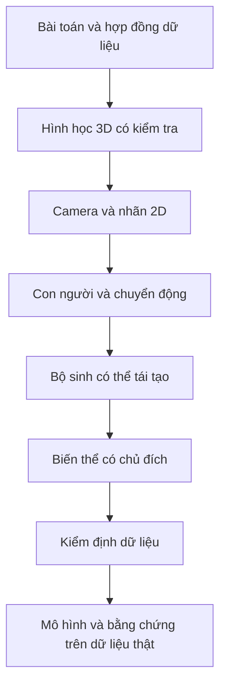

# Kiến trúc toàn sách — Synthetic Data for Human-Centric Computer Vision

> **Kết luận kiến trúc:** sách gồm **26 chương chính**, chia thành **8 phần**, kèm **5 phụ lục tra cứu**. **Phần giới thiệu không tính là một chương.** Chương 1 đã hoàn thành; Chương 2 là điểm bắt đầu mở hộp đen hình học.

## 1. Mục đích không được thay đổi

Cuốn sách phải đưa một người đã đọc và sửa được Python, nhưng chưa cần biết đồ họa 3D, từ chỗ chỉ nhìn thấy “ảnh người được dựng bằng máy” đến chỗ có thể:

1. biến một bài toán thị giác về con người thành yêu cầu dữ liệu có thể kiểm tra;
2. xây một bộ sinh ảnh, video và nhãn có kiểm soát;
3. chứng minh ảnh, nhãn, chuyển động và thông tin nguồn gốc khớp nhau;
4. thiết kế biến thể theo phân bố có chủ đích thay vì thay đổi ngẫu nhiên vô hướng;
5. huấn luyện và đánh giá mô hình theo một quy trình không làm rò rỉ dữ liệu;
6. dùng dữ liệu thật được giữ riêng để kết luận dữ liệu tổng hợp có ích, vô ích hay chỉ có ích trong một điều kiện cụ thể.

Sản phẩm cuối không phải một bộ ảnh đẹp. Sản phẩm cuối là **một lập luận thực nghiệm có thể tái tạo**: vấn đề dữ liệu nào được nêu ra, yếu tố nào đã được tạo, nhãn được kiểm tra thế nào, mô hình được huấn luyện ra sao và hiệu quả trên dữ liệu thật thay đổi bao nhiêu.

## 2. Những điều sách cố ý không trở thành

- Không phải giáo trình Unity từ cơ bản đến nâng cao. Unity là một triển khai thực tế của các cơ chế độc lập với công cụ.
- Không phải giáo trình đồ họa máy tính đầy đủ. Chỉ học phần hình học, camera và kết xuất cần để tạo và kiểm tra nhãn.
- Không phải giáo trình deep learning đầy đủ. Kiến trúc mô hình chỉ được giải thích đến mức đủ để thiết kế thí nghiệm dữ liệu.
- Không phải danh mục các bộ dữ liệu hoặc paper về người tổng hợp.
- Không mặc định ảnh càng chân thực thì dữ liệu càng hữu ích.
- Không mặc định dữ liệu tổng hợp thay thế được dữ liệu thật.
- Không biến SMPL, Unity, COCO hay một mô hình ước lượng tư thế cụ thể thành chân lý duy nhất. Mỗi công cụ đều phải đi sau hợp đồng biểu diễn và phép kiểm tra.

## 3. Dự án xuyên suốt

Ví dụ chính bắt đầu bằng **một người thực hiện động tác dậm chân**. Cùng một trường hợp này được mở rộng dần thành:

1. một khung hình có ảnh, silhouette, điểm khớp và metadata;
2. một người có bộ xương, bề mặt cơ thể và chuyển động trong không gian 3D;
3. nhiều góc camera, trong đó có camera cố định và camera chuyển động;
4. RGB, silhouette, depth, phân vùng, điểm khớp 2D/3D, góc khớp, pha động tác và trạng thái tiếp xúc;
5. nhiều hình dạng cơ thể, trang phục, ánh sáng, nền và vật che khuất;
6. các biến thể đúng và sai được tạo có chủ đích;
7. một bộ dữ liệu được kiểm tra ở mức mẫu, chuỗi và toàn tập;
8. thí nghiệm synthetic-only, real-only, trộn dữ liệu và pretrain rồi fine-tune;
9. đánh giá trên video thật được giữ riêng;
10. mở rộng cuối sách sang đi đều và đi nghiêm.

Nhờ vậy, mỗi chương bổ sung một khả năng vào cùng hệ thống thay vì thay ví dụ liên tục.

## 4. Tóm tắt tám phần

| Phần | Chương | Khả năng đạt được khi kết thúc phần |
|---|---:|---|
| I. Nhìn thấy toàn bộ hệ thống | 1 | Xác định được một mẫu dữ liệu tối thiểu và bắt được một nhãn lệch. |
| II. Giữ một cơ thể nhất quán trong không gian 3D | 2–4 | Biểu diễn, biến đổi và kiểm tra được điểm cùng bộ xương qua nhiều hệ tọa độ. |
| III. Biến cảnh 3D thành ảnh và nhãn | 5–8 | Chiếu người lên ảnh và tạo các nhãn 2D/3D khớp nhau, kể cả che khuất và crop/resize. |
| IV. Biểu diễn con người và chuyển động | 9–12 | Chọn đúng biểu diễn cơ thể, điều khiển hình dạng, chuyển động và nhãn thời gian. |
| V. Lắp ráp một bộ sinh có thể tái tạo | 13–16 | Sinh đồng bộ ảnh, video, nhãn và metadata ở quy mô lớn, có thể dừng rồi chạy tiếp. |
| VI. Thiết kế biến thể thay vì tạo hỗn loạn | 17–19 | Xác định phân bố mục tiêu, lấy mẫu có ràng buộc và thiết kế phép thử về khoảng cách mô phỏng–thực tế. |
| VII. Kiểm định dữ liệu như kiểm định phần mềm | 20–22 | Phát hiện lỗi ở mức mẫu, chuỗi và toàn tập; tạo báo cáo chất lượng trước huấn luyện. |
| VIII. Chứng minh tác dụng trên dữ liệu thật | 23–26 | Chạy baseline, so sánh chiến lược dùng synthetic data, làm ablation và hoàn tất capstone nghiên cứu. |

## 5. Mục lục chi tiết

## Phần I — Nhìn thấy toàn bộ hệ thống trước khi mở từng hộp đen

### Chương 1. Từ bài toán thị giác đến một mẫu dữ liệu có thể kiểm chứng — đã hoàn thành

- **Câu hỏi trung tâm:** Vì sao ảnh trông đúng vẫn có thể là dữ liệu hỏng?
- **Sản phẩm:** Một mẫu gồm ảnh, silhouette, điểm khớp và metadata; chương trình nhận mẫu đúng và từ chối nhãn bị dịch.
- **Cổng:** Phân biệt được tệp hợp lệ, tính nhất quán nội bộ, độ bao phủ và bằng chứng về tác dụng trên dữ liệu thật.
- **Mở sang chương sau:** Cùng một điểm trên cơ thể mang những bộ số khác nhau khi đổi nơi đo như thế nào?

## Phần II — Giữ một cơ thể nhất quán trong không gian 3D

### Chương 2. Cùng một điểm cơ thể trong nhiều hệ tọa độ

- **Câu hỏi trung tâm:** Vị trí bàn chân được mô tả so với bàn chân, nhân vật, thế giới và camera khác nhau ra sao?
- **Khái niệm mới:** điểm và vector; gốc tọa độ; trục; hệ tọa độ cục bộ, nhân vật, thế giới và camera; đơn vị đo.
- **Sản phẩm:** Một mô-đun nhỏ biểu diễn điểm có tên hệ tọa độ và chuyển điểm qua lại giữa hai hệ.
- **Ca sai bắt buộc:** Cộng hai tọa độ thuộc hai hệ khác nhau nhưng chương trình vẫn chạy.
- **Cổng:** Đổi hệ rồi đổi ngược phải khôi phục điểm ban đầu trong sai số số học đã định trước.

### Chương 3. Ghép phép dịch, quay và tỉ lệ mà không làm mất dấu quy ước

- **Câu hỏi trung tâm:** Vì sao đúng ba con số nhưng sai thứ tự phép biến đổi vẫn đặt khớp sai vị trí?
- **Khái niệm mới:** ma trận biến đổi đồng nhất; phép hợp thành; nghịch đảo; thứ tự nhân; quay theo trục, ma trận quay và quaternion ở mức cần dùng; hệ trục trái/phải.
- **Sản phẩm:** `Transform3D` có phép ghép, nghịch đảo và bộ kiểm thử round-trip.
- **Ca sai bắt buộc:** Đổi thứ tự quay–dịch; nhầm độ với radian; đổi dấu một trục khi đi giữa Unity và NumPy.
- **Cổng:** Chương trình giải thích được từng bước biến một điểm cục bộ thành điểm thế giới, không chỉ gọi API.

### Chương 4. Từ các phép biến đổi riêng lẻ đến một bộ xương chuyển động

- **Câu hỏi trung tâm:** Vì sao quay khớp hông làm cả chân di chuyển nhưng quay cổ chân không được kéo ngược phần thân trên?
- **Khái niệm mới:** cây cha–con; pose nghỉ; pose cục bộ; động học thuận; chiều dài xương; bậc tự do.
- **Sản phẩm:** Một bộ xương tối giản của động tác dậm chân, tính được vị trí khớp thế giới từ các phép quay cục bộ.
- **Ca sai bắt buộc:** Chu trình trong cây khớp, sai parent, chiều dài xương thay đổi ngoài chủ đích.
- **Cổng:** Bộ kiểm tra phát hiện ít nhất một lỗi cây khớp và xác nhận chiều dài xương bất biến trong chuyển động cứng.

## Phần III — Biến cảnh 3D thành ảnh và nhãn

### Chương 5. Camera lỗ kim: từ điểm 3D đến điểm ảnh 2D

- **Câu hỏi trung tâm:** Một khớp ở trước camera trở thành pixel nào trên ảnh?
- **Khái niệm mới:** hệ tọa độ camera; tham số ngoài; tham số trong; tiêu cự theo pixel; tâm ảnh; phép chia phối cảnh.
- **Sản phẩm:** Hàm chiếu từ khớp 3D sang điểm 2D, có ví dụ số tính tay và đối chiếu với công cụ thực tế.
- **Ca sai bắt buộc:** Điểm nằm sau camera, độ sâu bằng không, nhầm trục nhìn và nhầm chiều dọc ảnh.
- **Cổng:** Kết quả chiếu thủ công và kết quả từ engine khớp nhau trong ngưỡng đã định.

### Chương 6. Từ ảnh render đến ảnh mô hình thật sự nhìn thấy

- **Câu hỏi trung tâm:** Vì sao nhãn đúng trên ảnh gốc lại lệch sau crop, resize, pad hoặc hiệu chỉnh ống kính?
- **Khái niệm mới:** độ phân giải; tỉ lệ khung; crop; resize; letterbox; tọa độ chuẩn hóa; méo xuyên tâm và tiếp tuyến ở mức cần thiết.
- **Sản phẩm:** Một chuỗi biến đổi ảnh–nhãn dùng chung cho keypoint, box và mask.
- **Ca sai bắt buộc:** Resize ảnh nhưng không resize nhãn; quy ước pixel-center khác nhau; làm tròn quá sớm.
- **Cổng:** Overlay sau toàn bộ chuỗi tiền xử lý vẫn trùng với ảnh và có test cho các trường hợp biên.

### Chương 7. Nhìn thấy, bị che và nằm ngoài khung không phải cùng một trạng thái

- **Câu hỏi trung tâm:** Một khớp chiếu vào ảnh nhưng bị cánh tay khác che thì nhãn nên ghi thế nào?
- **Khái niệm mới:** tia nhìn; bề mặt gần nhất; depth buffer; tự che khuất; che bởi vật khác; ngoài khung; quy ước visibility.
- **Sản phẩm:** Bộ phân loại trạng thái điểm khớp `visible`, `occluded`, `outside` dựa trên hình học và depth.
- **Ca sai bắt buộc:** Chỉ kiểm tra tọa độ có nằm trong khung; so sánh depth sai đơn vị; vật liệu trong suốt.
- **Cổng:** Các trạng thái hiển thị trên overlay và khớp với ba cảnh kiểm thử cố ý.

### Chương 8. Sinh nhiều loại nhãn từ cùng một trạng thái cảnh

- **Câu hỏi trung tâm:** Làm sao bảo đảm RGB, silhouette, phân vùng, depth, box và keypoint cùng mô tả một thời điểm?
- **Khái niệm mới:** ground truth từ trạng thái ẩn của cảnh; semantic/instance segmentation; depth; 2D/3D box; keypoint; normal và optical flow ở mức giới thiệu.
- **Sản phẩm:** Một gói nhãn đa phương thức của cùng một khung hình cùng các phép kiểm tra chéo.
- **Ca sai bắt buộc:** Box không bao mask; keypoint thuộc người A ghép vào người B; depth và camera dùng hai thời điểm khác nhau.
- **Cổng:** Bộ kiểm tra chứng minh các tệp có cùng `sample_id`, `frame_index`, camera và trạng thái cảnh.

## Phần IV — Biểu diễn con người và chuyển động

### Chương 9. Bộ xương, bề mặt, tư thế và hình dạng trả lời những câu hỏi khác nhau

- **Câu hỏi trung tâm:** Khi nào chỉ cần khớp, khi nào cần mesh và khi nào cần tham số cơ thể?
- **Khái niệm mới:** skeleton; joint convention; mesh; topology; pose; shape; identity; correspondence.
- **Sản phẩm:** `joint_schema.json` và bảng ánh xạ giữa rig của asset, nhãn dự án và định dạng mô hình.
- **Ca sai bắt buộc:** Hai khớp cùng tên nhưng khác vị trí giải phẫu; số thứ tự khớp thay đổi; trái/phải bị đảo.
- **Cổng:** Một clip đi qua hai quy ước khớp rồi đổi ngược mà không tráo tên hoặc phía cơ thể.

### Chương 10. Từ bộ xương đến hình dạng cơ thể có thể điều khiển

- **Câu hỏi trung tâm:** Làm sao bề mặt đi theo xương và vì sao đổi hình dạng có thể làm vị trí khớp thay đổi?
- **Khái niệm mới:** linear blend skinning; trọng số da; biến dạng theo pose; mô hình cơ thể tham số; SMPL/SMPL-X như một trường hợp cụ thể, không phải định nghĩa duy nhất.
- **Sản phẩm:** Một ví dụ skinning tối giản; sau đó là bộ nạp model thực tế nếu giấy phép và asset cho phép; đặc tả quần thể hình dạng/ngoại hình.
- **Ca sai bắt buộc:** Trọng số không tổng thành một; mesh xuyên hoặc gãy; thay identity giữa các frame; dùng tham số ngoài miền hợp lý.
- **Cổng:** Cùng motion chạy trên nhiều hình dạng nhưng giữ nguyên identity trong toàn clip và không phá ánh xạ khớp.

### Chương 11. Đưa chuyển động vào nhân vật mà không phá không gian và thời gian

- **Câu hỏi trung tâm:** Một clip mocap khác rig, khác tốc độ khung hình và khác hướng gốc được đưa vào nhân vật thế nào?
- **Khái niệm mới:** motion clip; root motion; retargeting; resampling; nội suy quay; pose canonical; contact.
- **Sản phẩm:** Một clip dậm chân được retarget, đổi tốc độ khung hình và xuất lại vị trí khớp 3D.
- **Ca sai bắt buộc:** Trượt chân; nhảy gốc; đổi pha do resample; nội suy Euler qua điểm gián đoạn.
- **Cổng:** Độ dài xương, thời lượng, hướng gốc và các mốc tiếp xúc vượt qua kiểm tra.

### Chương 12. Biến chuyển động thành nhãn pha, góc khớp và lỗi thực hiện

- **Câu hỏi trung tâm:** Làm sao tạo một biến thể “sai” có ý nghĩa thay vì chỉ thêm nhiễu vào khớp?
- **Khái niệm mới:** pha động tác; sự kiện; góc khớp; đặc trưng theo thời gian; ràng buộc động học; can thiệp có chủ đích.
- **Sản phẩm:** Một cặp chuyển động đúng/sai chỉ khác một yếu tố được ghi trong metadata; nhãn pha, góc và tiếp xúc đồng bộ với video.
- **Ca sai bắt buộc:** Nhãn chất lượng suy ra từ chính đặc trưng mà mô hình được đánh giá; thay nhiều lỗi cùng lúc; sai nhưng không còn khả thi về cơ học.
- **Cổng:** Có thể chỉ ra chính xác biến nào gây khác biệt và tái tạo cùng biến thể từ cấu hình.

## Phần V — Lắp ráp một bộ sinh có thể tái tạo

### Chương 13. Mô tả một cảnh bằng công thức có phiên bản

- **Câu hỏi trung tâm:** Muốn tạo lại đúng một mẫu sau nhiều tháng, cần lưu những gì ngoài seed?
- **Khái niệm mới:** scene recipe; cấu hình; seed theo nguồn ngẫu nhiên; asset manifest; phiên bản schema; provenance.
- **Sản phẩm:** Một tệp cấu hình xác định nhân vật, motion, camera, ánh sáng, nền và đầu ra; một run manifest ghi phiên bản code và asset.
- **Ca sai bắt buộc:** Cùng seed nhưng asset hoặc thứ tự gọi ngẫu nhiên đã đổi; thiếu đơn vị; tham số bị engine tự sửa.
- **Cổng:** Chạy lại trên cùng môi trường tạo ra cùng trạng thái cảnh và checksum đầu ra theo mức tái tạo đã cam kết.

### Chương 14. Dựng camera, ánh sáng, bối cảnh và vật che theo tham số

- **Câu hỏi trung tâm:** Làm sao biến một cảnh cố định thành một họ cảnh vẫn có ý nghĩa đối với nhiệm vụ?
- **Khái niệm mới:** camera rig; quỹ đạo camera; bố cục; nguồn sáng; vật liệu; nền; occluder; nhiều người; va chạm và tính hợp lý của cảnh.
- **Sản phẩm:** Một cảnh điều khiển được với 12 góc camera và các nhóm tham số tách biệt.
- **Ca sai bắt buộc:** Camera cắt mất người ngoài chủ đích; người xuyên nền; bóng không khớp; camera chuyển động nhưng metadata vẫn giả định camera tĩnh.
- **Cổng:** Mỗi thay đổi cấu hình chỉ làm thay đổi nhóm yếu tố dự kiến và được ghi lại.

### Chương 15. Chụp đồng bộ ảnh, video, nhãn và metadata

- **Câu hỏi trung tâm:** Tại thời điểm nào trạng thái được khóa và từng loại đầu ra được ghi?
- **Khái niệm mới:** tick mô phỏng; frame render; timestamp; buffer; capture barrier; định danh clip/frame; atomic sample.
- **Sản phẩm:** Bộ xuất đồng bộ RGB, silhouette, depth, segmentation, keypoint 2D/3D, camera và motion metadata.
- **Ca sai bắt buộc:** Off-by-one frame; readback GPU trễ; tên tệp đụng nhau; video có frame nhưng JSON bị thiếu.
- **Cổng:** Một phép kiểm tra cố ý làm lệch một frame phải bị phát hiện.

### Chương 16. Sinh theo lô, dừng rồi chạy tiếp mà không làm hỏng tập dữ liệu

- **Câu hỏi trung tâm:** Làm sao tăng quy mô mà vẫn biết mẫu nào đã tạo, lỗi ở đâu và có thể chạy lại phần nào?
- **Khái niệm mới:** headless batch; phân mảnh công việc; idempotence; retry; checkpoint; checksum; log có cấu trúc; quản lý dung lượng.
- **Sản phẩm:** Một lần chạy nhiều worker có thể dừng, tiếp tục và hợp nhất manifest mà không trùng hoặc mất mẫu.
- **Ca sai bắt buộc:** Hai worker ghi cùng ID; retry tạo bản khác nhưng giữ tên cũ; ổ đĩa đầy giữa mẫu; phiên bản code đổi giữa các shard.
- **Cổng:** Sau một lần cố ý ngắt, pipeline tiếp tục và báo cáo chính xác số mẫu thành công, thất bại, bỏ qua.

## Phần VI — Thiết kế biến thể thay vì tạo hỗn loạn

### Chương 17. Từ điều kiện triển khai đến phân bố dữ liệu mục tiêu

- **Câu hỏi trung tâm:** Ta cần đa dạng ở biến nào, trong khoảng nào và theo quan hệ nào?
- **Khái niệm mới:** biến liên quan đến nhiệm vụ; biến gây nhiễu; biến ẩn; phân bố biên và có điều kiện; tương quan; phạm vi hỗ trợ.
- **Sản phẩm:** Một bản đặc tả phân bố cho người, motion, camera và bối cảnh dựa trên điều kiện sử dụng thật.
- **Ca sai bắt buộc:** Lấy mẫu độc lập những biến ngoài đời phụ thuộc nhau; tạo trường hợp vật lý không thể xảy ra; bỏ sót nhóm hiếm quan trọng.
- **Cổng:** Mỗi tham số sinh phải có lý do, miền, đơn vị, quan hệ ràng buộc và phép đo độ bao phủ.

### Chương 18. Lấy mẫu có ràng buộc và đo độ bao phủ

- **Câu hỏi trung tâm:** Với ngân sách hữu hạn, chọn những tổ hợp nào thay vì bốc ngẫu nhiên vô hạn?
- **Khái niệm mới:** one-factor-at-a-time; thiết kế nhân tố; lấy mẫu phân tầng; cân bằng; lấy mẫu có điều kiện; trường hợp hiếm; phép đo coverage.
- **Sản phẩm:** Một sampling plan có ngân sách, seed, bảng các tổ hợp và biểu đồ coverage trước khi render.
- **Ca sai bắt buộc:** Nhiều mẫu nhưng đều tập trung ở vùng dễ; cân bằng nhãn làm sai phân bố cần triển khai; split sau khi sinh gây rò rỉ identity.
- **Cổng:** Có thể giải thích mẫu nào được tạo để trả lời câu hỏi nào và khoảng trống nào vẫn còn.

### Chương 19. Khoảng cách mô phỏng–thực tế: chân thực, đa dạng và chiến lược chuyển miền

- **Câu hỏi trung tâm:** Khi nào nên tăng chân thực, khi nào nên tăng biến thiên và khi nào cần dữ liệu thật hướng dẫn?
- **Khái niệm mới:** domain gap; domain randomization; randomization có hướng dẫn; compositing; adaptation; dữ liệu sinh bằng mô hình tạo ảnh như một nhánh bổ sung có nhãn kém chắc chắn hơn.
- **Sản phẩm:** Ba cấu hình dữ liệu chỉ khác chiến lược thu hẹp khoảng cách và một thiết kế ablation để so sánh.
- **Ca sai bắt buộc:** Đánh giá độ đẹp bằng mắt rồi suy ra hiệu quả; thay đồng thời chất lượng asset, camera và số lượng mẫu; dùng ảnh thật của tập kiểm tra để chỉnh generator.
- **Cổng:** Chưa được tuyên bố chiến lược nào tốt hơn cho đến khi Chương 25 đo trên cùng protocol.

## Phần VII — Kiểm định dữ liệu như kiểm định phần mềm

### Chương 20. Kiểm tra một mẫu trước khi tin nó

- **Câu hỏi trung tâm:** Mẫu này có đầy đủ, đúng schema, đúng hình học và nhất quán giữa các nhãn không?
- **Khái niệm mới:** schema validation; invariant; tolerance; overlay; kiểm tra chéo giữa modality; golden sample.
- **Sản phẩm:** Bộ validator nhận một thư mục mẫu và trả báo cáo lỗi có vị trí, nguyên nhân và ảnh chẩn đoán.
- **Ca sai bắt buộc:** NaN/Inf; nhãn ngoài ảnh; box không bao mask; keypoint không khớp depth; checksum sai.
- **Cổng:** Bộ test có cả mẫu đúng lẫn các mutant được cố ý làm hỏng và bắt được từng loại lỗi.

### Chương 21. Kiểm tra một chuỗi chuyển động và camera theo thời gian

- **Câu hỏi trung tâm:** Mỗi frame có thể đúng riêng lẻ nhưng cả video sai bằng cách nào?
- **Khái niệm mới:** continuity; vận tốc/gia tốc; jerk ở mức chẩn đoán; contact; timestamp; camera motion; world-coordinate consistency.
- **Sản phẩm:** Báo cáo chuỗi phát hiện frame thiếu, lệch thời gian, trượt chân, nhảy khớp, đổi identity và sai camera pose.
- **Ca sai bắt buộc:** Hoán đổi hai frame gần nhau; lặp frame; metadata camera trễ một nhịp; world coordinate bị reset.
- **Cổng:** Phát hiện được lỗi cố ý mà overlay từng frame không đủ để nhìn ra.

### Chương 22. Kiểm tra toàn tập: độ bao phủ, trùng lặp, thiên lệch và rò rỉ

- **Câu hỏi trung tâm:** Một triệu mẫu đúng riêng lẻ có thể vẫn là một dataset tệ như thế nào?
- **Khái niệm mới:** phân bố; duplicate/near-duplicate; leakage; group split; long tail; bias; dataset card; so sánh synthetic–real.
- **Sản phẩm:** Báo cáo QA toàn tập với thống kê, biểu đồ, danh sách khoảng trống và split theo identity–motion–scene.
- **Ca sai bắt buộc:** Cùng motion/identity xuất hiện ở train và test; 12 góc nhưng phần lớn mẫu ở một góc; mẫu hiếm chỉ có trong synthetic.
- **Cổng:** Không bắt đầu huấn luyện cho đến khi các lỗi chặn và quyết định chấp nhận rủi ro được ghi rõ.

## Phần VIII — Chứng minh tác dụng trên dữ liệu thật

### Chương 23. Xây baseline và tập đánh giá thật trước khi thêm synthetic data

- **Câu hỏi trung tâm:** Nếu chưa biết real-only baseline, ta so sánh synthetic data với điều gì?
- **Khái niệm mới:** train/validation/test; held-out real test; metric theo nhiệm vụ; data loader; baseline; ngân sách dữ liệu và tính toán.
- **Sản phẩm:** Một pipeline huấn luyện tối thiểu và kết quả real-only có log, seed và checkpoint.
- **Ca sai bắt buộc:** Chọn test sau khi xem kết quả; thay kiến trúc mô hình giữa các chế độ dữ liệu; metric không phản ánh lỗi triển khai.
- **Cổng:** Có một protocol cố định trước khi chạy thí nghiệm synthetic.

### Chương 24. Bốn cách dùng synthetic data và cách so sánh công bằng

- **Câu hỏi trung tâm:** Synthetic-only, trộn trực tiếp, pretrain–fine-tune và curriculum khác nhau ở đâu?
- **Khái niệm mới:** transfer learning ở mức cần dùng; sampling ratio; curriculum; fine-tuning; budget-matched comparison.
- **Sản phẩm:** Bốn run dùng cùng model, metric, test set và ngân sách được ghi rõ.
- **Ca sai bắt buộc:** Một run được train lâu hơn; thay augmentation; tune trên test; số lần thử khác nhau nhưng chỉ báo kết quả tốt nhất.
- **Cổng:** Bảng kết quả có điều kiện so sánh, sai số giữa seed và toàn bộ cấu hình.

### Chương 25. Ablation, phân tích lỗi và quyết định dữ liệu nào thật sự có ích

- **Câu hỏi trung tâm:** Cải thiện đến từ số lượng, loại biến thể, nhãn mới hay một thay đổi ngoài ý muốn?
- **Khái niệm mới:** ablation; scaling curve; confidence interval; effect size; subgroup/error slice; uncertainty; cost–benefit.
- **Sản phẩm:** Một báo cáo tách đóng góp của camera, body, motion, bối cảnh và chiến lược chuyển miền; kèm failure gallery.
- **Ca sai bắt buộc:** Kết luận từ một seed; thử nhiều cấu hình rồi chỉ báo cấu hình thắng; cải thiện trung bình nhưng giảm mạnh ở nhóm quan trọng.
- **Cổng:** Kết luận phải ở dạng có điều kiện: yếu tố nào giúp, trên metric và nhóm nào, với chi phí nào, còn bất định gì.

### Chương 26. Capstone: từ động tác dậm chân đến một nghiên cứu đánh giá kỹ năng

- **Câu hỏi trung tâm:** Toàn bộ chuỗi kiến thức có tạo ra bằng chứng đáng tin cậy cho bài toán thực tế ban đầu không?
- **Phạm vi:** Dậm chân là đường chạy bắt buộc; đi đều và đi nghiêm là hai mở rộng. Dữ liệu gồm 12 góc camera, biến thể cơ thể, chuyển động đúng/sai và đầu ra ưu tiên quyền riêng tư như silhouette.
- **Sản phẩm:** Bộ sinh có phiên bản; dataset card; báo cáo QA; baseline; thí nghiệm synthetic/real; ablation; failure cases; kết luận nghiên cứu; gói tái tạo.
- **Ca sai bắt buộc:** Silhouette được mặc định là vô danh tuyệt đối; điểm số tổng hợp không có định nghĩa; synthetic test được dùng thay real test; model mạnh hơn nhưng protocol cũng đổi.
- **Cổng cuối sách:** Một người khác có thể dùng tài liệu, cấu hình và code để tái tạo dataset nhỏ, chạy validator, huấn luyện baseline và kiểm tra kết luận chính.

## 6. Năm phụ lục không tính là chương

### Phụ lục A. Toán vừa đủ dùng

Vector, ma trận, đạo hàm cần thiết, xác suất lấy mẫu và sai số số học; được liên kết đúng lúc từ chương chính, không ép người đọc học lại cả môn.

### Phụ lục B. Bảng quy ước và chuyển đổi

Hệ trục trái/phải, hàng/cột, độ/radian, mét/centimet, pixel-center, NDC, quaternion, thứ tự khớp và quy tắc đặt tên.

### Phụ lục C. Ánh xạ từ khái niệm sang công cụ

Unity là triển khai chính. Blender, NumPy, PyTorch/PyTorch3D hoặc công cụ khác chỉ xuất hiện để đối chiếu khi có ích. Thông tin phiên bản dễ thay đổi nằm ở đây để không làm các chương khái niệm nhanh lỗi thời.

### Phụ lục D. Schema, định dạng và giấy phép

COCO keypoints/segmentation, tệp depth, camera metadata, SMPL/SMPL-X, asset manifest, giấy phép dữ liệu, giấy phép mô hình và yêu cầu phân phối.

### Phụ lục E. Từ điển và chỉ mục lỗi

Mỗi thuật ngữ có định nghĩa đầu tiên, ký hiệu, chương gốc, các tên tương đương cần tránh nhầm và liên kết tới ca lỗi liên quan.

## 7. Quy tắc viết áp dụng cho cả 26 chương

Mỗi chương bắt buộc có:

1. một lỗi hoặc câu hỏi có hậu quả quan sát được;
2. bản đồ vị trí của chương trong pipeline;
3. hình trực giác trước công thức;
4. định nghĩa trước khi dùng thuật ngữ sâu;
5. một ví dụ số đủ nhỏ để kiểm tra bằng tay;
6. một triển khai tối thiểu từ đầu;
7. một triển khai bằng công cụ thực tế;
8. output thật từ code đã chạy;
9. ít nhất một ca đúng, một ca sai và một trường hợp biên;
10. kiểm tra tự động hoặc kiểm tra ngược;
11. tóm tắt, bài tập và cổng hoàn thành;
12. đầu ra được tái sử dụng ở chương sau.

Mỗi chương dự kiến có khoảng **5–9 hình có nhiệm vụ rõ ràng**, bao gồm sơ đồ, phép chiếu chồng nhãn, biểu đồ hoặc failure case. Đây không phải chỉ tiêu trang trí; hình không giúp trả lời một câu hỏi hoặc kiểm tra một kết luận phải bị loại.

## 8. Nhịp triển khai toàn sách

Không viết đồng thời nhiều chương chưa được duyệt. Mỗi phần đi qua bốn bước:

1. chốt mục tiêu phần, bản đồ phụ thuộc, thuật ngữ và storyboard hình;
2. viết từng chương, chạy code và tạo output thật;
3. kiểm tra đối kháng về toán, code, hình, kết luận và ca biên;
4. xuất bản lên website, đọc ngược lại, cập nhật tiến độ trong Notion và chỉ mở phần kế tiếp sau khi phần hiện tại được duyệt.

Thứ tự tiếp theo sau khi kiến trúc này được duyệt là **Chương 2 — Cùng một điểm cơ thể trong nhiều hệ tọa độ**.

## 9. Vì sao kiến trúc này đủ bao phủ mục tiêu nhưng không vượt phạm vi

- SURREAL cho thấy một pipeline người tổng hợp có thể sinh đồng thời ảnh, pose, depth và segmentation; điều này đòi hỏi mạch camera–nhãn trong Phần III.
- SMPL và AMASS cho thấy hình dạng, pose, rig và motion cần một biểu diễn nhất quán; điều này tạo Phần IV.
- PeopleSansPeople và Unity Perception cho thấy generator phải có camera/ánh sáng được tham số hóa, nhiều labeler và metadata; điều này tạo Phần V.
- Domain randomization không tự chứng minh khả năng chuyển sang thực tế; vì vậy thiết kế biến thể được tách khỏi đánh giá ở Phần VI và VIII.
- AGORA, BEDLAM và BEDLAM 2.0 cho thấy crowd, che khuất, quần áo, chuyển động camera và tọa độ thế giới là các yếu tố không thể bỏ qua trong human-centric data; chúng xuất hiện ở Chương 7, 10, 14, 21 và 22.
- Phần VII đứng riêng vì một dataset có thể đúng ở từng tệp nhưng sai theo thời gian hoặc sai phân bố toàn tập.
- Phần VIII bắt buộc có real-only baseline và real held-out test để ngăn việc đánh giá synthetic data bằng chính thế giới đã tạo ra nó.

## 10. Nguồn nền để kiểm tra phạm vi

1. Aston Zhang et al., [*Dive into Deep Learning*](https://d2l.ai/) — tham khảo cơ chế dạy bằng code chạy được và đầu ra quan sát được.
2. Gül Varol et al., [*Learning from Synthetic Humans*](https://www.di.ens.fr/willow/research/surreal/) — pipeline người tổng hợp với pose, depth và segmentation.
3. Matthew Loper et al., [*SMPL: A Skinned Multi-Person Linear Model*](https://smpl.is.tue.mpg.de/) — mô hình cơ thể có pose, shape và skinning.
4. Naureen Mahmood et al., [*AMASS: Archive of Motion Capture as Surface Shapes*](https://amass.is.tue.mpg.de/) — biểu diễn thống nhất nhiều nguồn motion capture bằng mô hình cơ thể có rig.
5. Salehe Erfanian Ebadi et al., [*PeopleSansPeople*](https://arxiv.org/abs/2112.09290) — bộ sinh human-centric có camera, ánh sáng, asset và nhiều loại nhãn.
6. Steven Borkman et al., [*Unity Perception*](https://arxiv.org/abs/2107.04259) — công cụ labeler và domain randomization cho synthetic data.
7. Josh Tobin et al., [*Domain Randomization for Transferring Deep Neural Networks from Simulation to the Real World*](https://arxiv.org/abs/1703.06907) — một chiến lược sim-to-real cần được kiểm tra theo nhiệm vụ cụ thể.
8. Priyanka Patel et al., [*AGORA*](https://arxiv.org/abs/2104.14643) — người đa dạng, crowd, che khuất và tham chiếu 3D chi tiết.
9. Michael J. Black et al., [*BEDLAM*](https://arxiv.org/abs/2306.16940) — hình dạng, motion, quần áo, tóc, cảnh, ánh sáng và camera đa dạng.
10. Joachim Tesch et al., [*BEDLAM 2.0*](https://papers.neurips.cc/paper_files/paper/2025/hash/459284de95cf45c8070aa9ef72d0085c-Abstract-Datasets_and_Benchmarks_Track.html) — nhấn mạnh camera chuyển động và ước lượng trong tọa độ thế giới.

## 11. Quyết định cần giữ cố định sau khi duyệt

- Tổng số chương chính: **26**.
- Phần giới thiệu không được đánh số như Phần I.
- Chương 1 giữ nguyên vị trí và vai trò hiện tại.
- Dậm chân là ví dụ xuyên suốt bắt buộc; đi đều và đi nghiêm chỉ mở rộng ở capstone.
- Unity là triển khai thực tế chính nhưng không quyết định thứ tự khái niệm.
- Real held-out test là điều kiện bắt buộc để kết luận tác dụng của synthetic data.
- Một thay đổi lớn về số phần, số chương hoặc mục tiêu phải cập nhật cả bản kiến trúc này và mục lục website, không được sửa rời rạc trong một chương.
